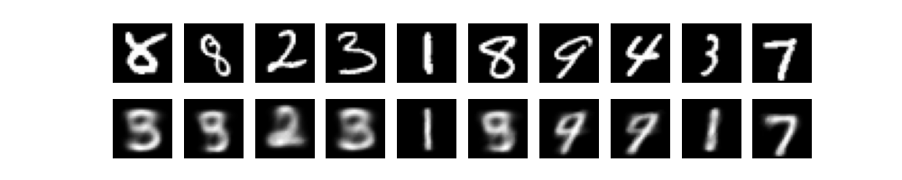
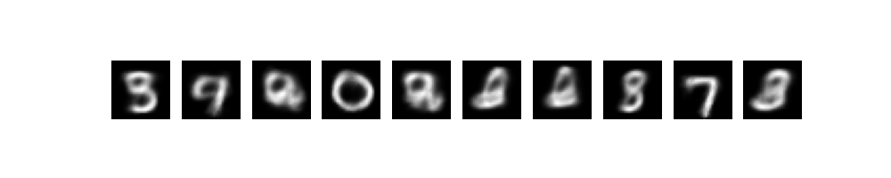
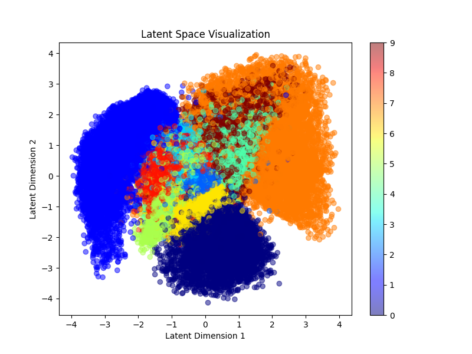

Ruben Valdez  
CSEC 5311 | Big Data Analysis and Security  
Prof. Hossain, Tamjid  
Assignment 4: ML and MapRedcuce  
Due. Mar. 6, 2025   

# Part-A: Machine Learning 

***Objective***

Deep learning has revolutionized data generation and decision-making using models like Autoencoders, VAEs, GANs, and Reinforcement Learning. In this part, you will implement one generative model to showcase your understanding. 

***Option 1: Implement a Variational Autoencoder (VAE)***

- Train a VAE on the MNIST dataset (MNIST Dataset: https://www.kaggle.com/datasets/hojjatk/mnist-dataset/data).

1. Start thru end of program:

    

2. Show an original image, reconstructed image, and generated samples.

     

    - Generated Sample

        

3. Visualize the latent space interpolations. 

    

4.  Explain challenges faced while training.

        Training a Variational Autoencoder (VAE) on the MNIST dataset comes with several challenges that affect how well the model learns, how stable the training process is, and the quality of the generated images. Below are some common issues and how they can be addressed.

        1. Balancing Reconstruction Loss and KL Divergence
            The loss function in VAEs consists of two parts:

            Binary Cross-Entropy (BCE) Loss, which helps the model generate images that look similar to the original inputs.
            Kullback-Leibler Divergence (KLD), which helps organize the learned representations in a structured way.
            If BCE is too strong, the model simply memorizes images but doesn't learn a useful latent space. If KLD is too strong, the generated images may look blurry or meaningless. A way to fix this is by adjusting the balance between the two losses using a β-VAE, which introduces a tunable parameter (beta) to control how much weight is given to KLD (OpenAI, 2025).

        2. Training Stability and Limited Output Variety
            Sometimes, the model might struggle to train properly and could end up generating only a few different images instead of a wide range. This is known as mode collapse, where the latent space is too restricted, making the model produce repetitive outputs.

            To solve this, increasing the latent dimension (latent_dim > 2) can give the model more flexibility to learn meaningful patterns. Also, using a different activation function, such as LeakyReLU instead of ReLU, can improve training by allowing more gradient flow (OpenAI, 2025).

        3. Understanding the Latent Space
            The latent space is where the model stores its compressed understanding of the images. If the latent space has too few dimensions (latent_dim=2), it might not capture enough details. On the other hand, if it's too high (latent_dim=10 or more), it can be hard to visualize or interpret.

            A good approach is to set latent_dim=5-10 for a balance between learning and interpretability. If the latent space becomes too large, Principal Component Analysis (PCA) or t-SNE can help visualize how the model organizes different numbers (OpenAI, 2025).

        4. Blurry or Low-Quality Images

            Since VAEs try to predict the probability distribution of images rather than exact pixel values, their outputs can sometimes look blurry or noisy. This happens because the model averages over possible outputs instead of choosing one sharp solution.

            A possible solution is to increase the number of neurons in the encoder and decoder to help the model learn more complex details. Switching to a Convolutional VAE (CVAE), which replaces fully connected layers with convolutional layers, can also improve image sharpness (OpenAI, 2025).

        5. Choosing the Right Learning Rate

            The learning rate determines how quickly the model updates its weights during training. If it's too high (>1e-3), training can become unstable, with the loss jumping up and down. If it's too low (<1e-5), the model learns too slowly and might get stuck in a bad state.

            A useful technique is to apply learning rate scheduling, which adjusts the learning rate automatically over time. This prevents the model from making drastic updates at the beginning while allowing finer adjustments later in training. Some optimizers, such as AdamW, also help by handling weight decay better than the standard Adam optimizer (OpenAI, 2025).

        6. Running Out of Memory (GPU/CPU Constraints)

            Training VAEs can be slow on a CPU, and using large batch sizes on a GPU can lead to out-of-memory (OOM) errors. When this happens, the model crashes or slows down significantly.

            To avoid this, reducing the batch size (batch_size=32 instead of 64) can help manage memory usage better. If using a GPU, the command torch.cuda.empty_cache() can free up unused memory to prevent crashes (OpenAI, 2025).

        Conclusion:

        Training a VAE on MNIST requires adjusting hyperparameters, balancing loss functions, and choosing the right model settings to avoid common issues like blurry outputs, unstable training, and memory errors. By carefully tuning these factors, the model can generate high-quality and diverse images while learning a meaningful latent space.    

  

# Part-B: MapReduce 

***Objective***

You are given a web server log file (web_log_large.txt) containing 5000 records in Common Log Format (CLF). Your task is to implement two MapReduce programs in Python using mrjob to analyze this log data. 

## Q-1: Identify the Top 10 Most Frequent HTTP Status Codes and Their Counts

Task: 

- Extract all HTTP status codes from the log file. 
- ount the occurrences of each status code. 
- Sort the results in descending order based on frequency. 
- Output only the top 10 most frequent HTTP status codes and their counts. 

## Q-2: Identify the Top 5 IP Addresses Generating the Most Errors (4xx and 5xx Status 
Codes)

Task: 

1. Identify IP addresses that made requests resulting in client (4xx) or server (5xx) errors. 
2. Count the total number of error requests made by each IP. 
3. Sort the results in descending order based on the number of errors. 
4. Output only the top 5 IPs generating the most errors.

---

References:

Doersch, C. (2016). Tutorial on variational autoencoders. arXiv preprint arXiv:1606.05908.

Higgins, I., Matthey, L., Pal, A., Burgess, C., Glorot, X., Botvinick, M., ... & Lerchner, A. (2017, February). beta-vae: Learning basic visual concepts with a constrained variational framework. In International conference on learning representations.

Hojjat, K. (2023). MNIST dataset. Kaggle. Retrieved from https://www.kaggle.com/datasets/hojjatk/mnist-dataset

OpenAI. (2025). ChatGPT-generated response on Variational Autoencoder (VAE) training challenges. Retrieved from March 2, 2025.

