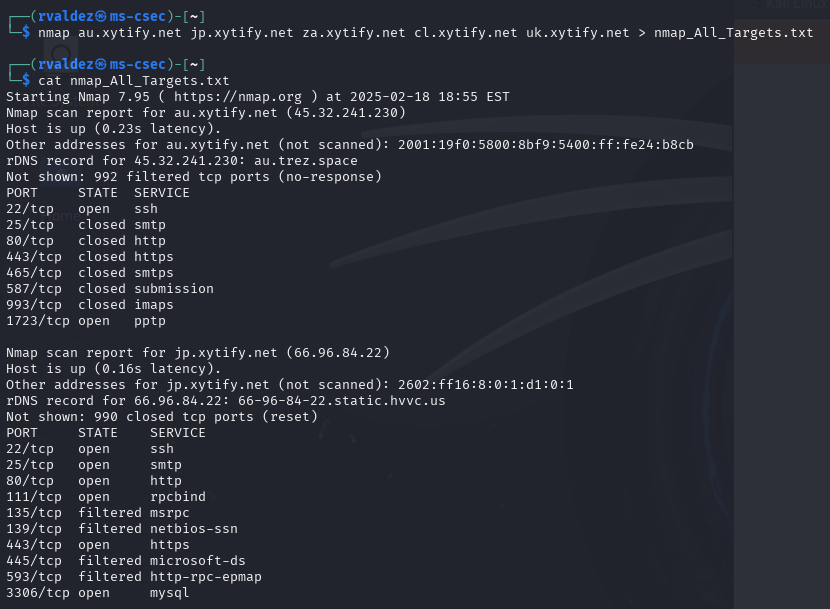
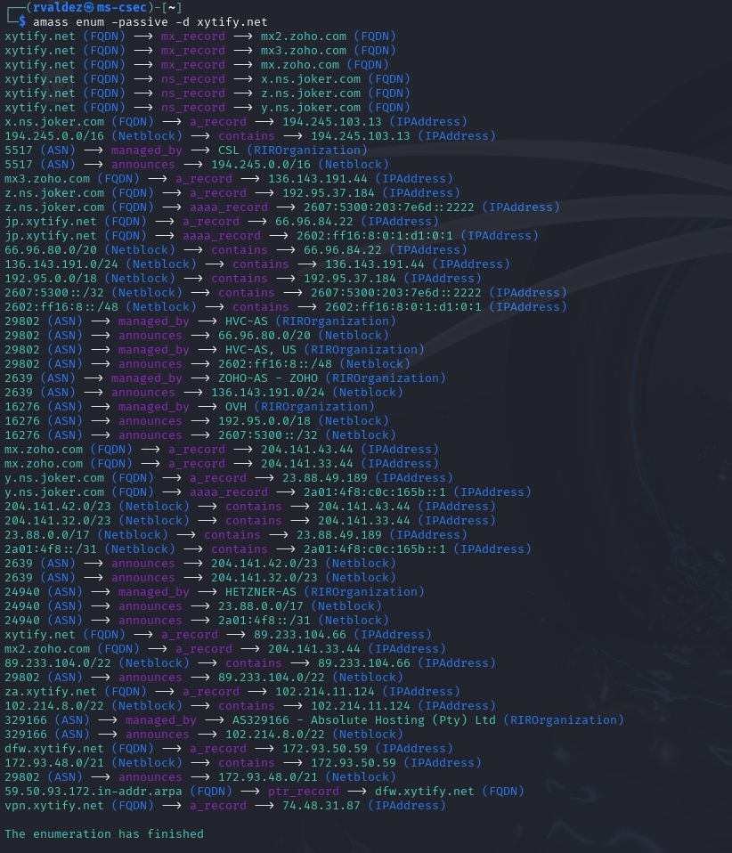

Ruben Valdez  
Intrusion Detection and Hacker Exploits | CSEC 5350  
Prof. Robert Jones  
Assignment: The Case of the Compromised Network  
Due: Feb. 20, 2025  

---

 

# Part 1: External Network Recon & Vulnerability Analysis

  

# ***Recon***

## 1. Nmap

1. Created a txt file adding the list of domains:

        au.xytify.net (Australia)           45.32.241.230
        jp.xytify.net (Japan)               66.96.84.22
        za.xytify.net (South Africa)        102.214.11.124
        cl.xytify.net (Chile)               186.64.123.161
        uk.xytify.net (United Kingdom)      37.220.0.40

2.  Completed a few scans using the the following nmap rules:

    Nmap scan using a target file

        nmap -sV -T4 -Pn -iL domains.txt -oN nmap_all_results.txt

    Scripted Scan for Vulnerability Detection:

        nmap -sC -sV -T4 -Pn -iL domains.txt -oN nmap_script_all_results.txt

 

1-4 whois
5-15 nmap
16-17 amass

 

## 2. Enumerating for subdomains:

1. Used `amass` to enumerate each domain name in search for subdomains:

        - xytify.net

            - dfw.xytify.net        172.93.50.59
            - jp.xytify.net         66.96.84.22 
            - za.xytify.net         102.214.11.124
            - vpn.xytify.net        74.48.31.87

        - au.xytify.net (Australia)           45.32.241.230
        - jp.xytify.net (Japan)               NO RESULTS
        - za.xytify.net (South Africa)        NO RESULTS
        - cl.xytify.net (Chile)               NO RESULTS
        - uk.xytify.net (United Kingdom)      NO RESULTS

     

2. Another enumeration application used was `subfinder` to locate subdomains for `xytify.net`:

        dfw.xytify.net
        jp.xytify.net
        za.xytify.net
        vpn.xytify.net

  

## 3. Shodan

## 4. Censys

# ***Vulnerability Analysis***

Using Greenbone OpenVAS

## ***Exploitation***

   

# ***Part 2: Internal Network Analysis on a Personal Network***

## Map the Network & Identify Assets

## Analyze Network Security & Vulnerabilities

## Attempt Controlled Exploits

   

# Deliverable: Penetration Testing Report

