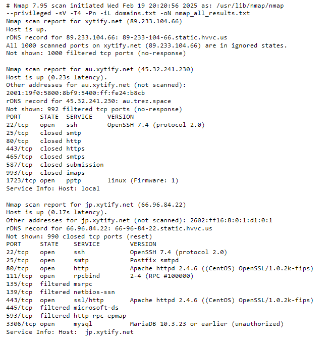
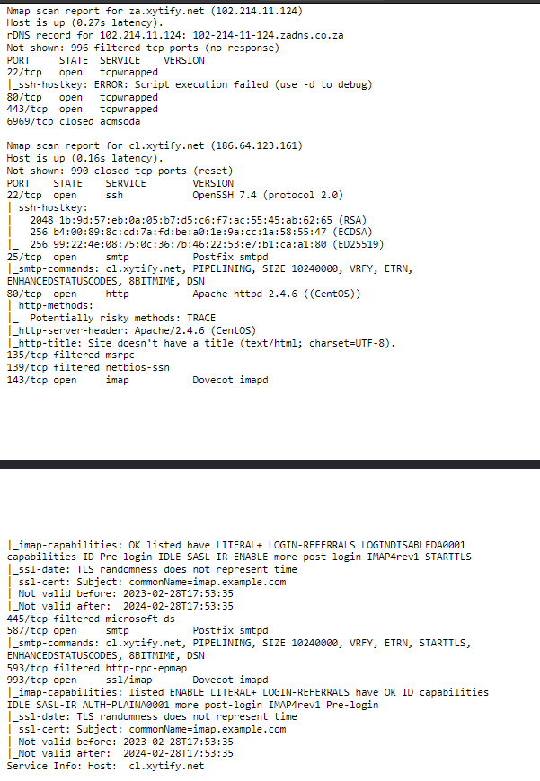
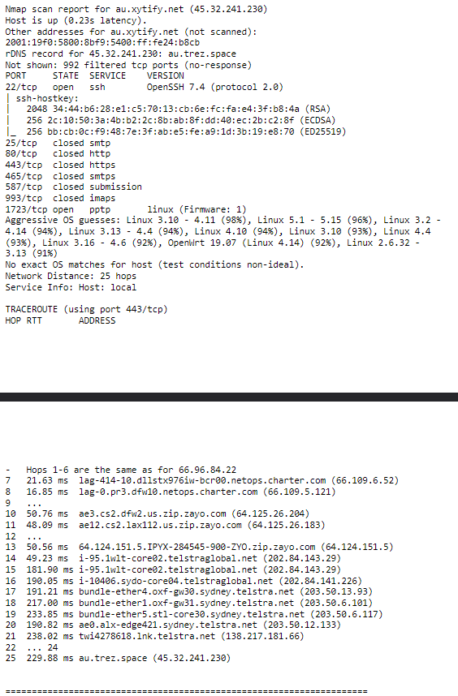

Ruben Valdez  
Intrusion Detection and Hacker Exploits | CSEC 5350  
Prof. Robert Jones  
Assignment: The Case of the Compromised Network  
Due: Feb. 20, 2025  
---

 

# Part 1: External Network Recon & Vulnerability Analysis

I'll be completing tasks that include some recon, vulnerability analysis, and at a minimum level exploitation on the following servers:

        xytify.net                          89.233.104.66
        au.xytify.net (Australia)           45.32.241.230
        jp.xytify.net (Japan)               66.96.84.22
        za.xytify.net (South Africa)        102.214.11.124
        cl.xytify.net (Chile)               186.64.123.161
        uk.xytify.net (United Kingdom)      37.220.0.40

## ***1. Recon***

### ***- Whois***

1. Created `domains.txt` file adding all the domains to the file.

    ***Examples of whois printout***
      

### ***- Nmap***

1. Ran the following nmap scans using the same text file containing the all the dommains to use in the nmap scans:

        nmap -sV -T4 -Pn -iL domains.txt -oN nmap_all_results.txt
        nmap ‐sC ‐sV ‐T4 ‐Pn ‐iL domains.txt ‐oN nmap_script_all_results.txt
        nmap ‐A ‐sC ‐sV ‐O ‐T4 ‐Pn ‐iL domains.txt ‐oN script_os_all_results.txt

    Note:   Each scan provides different views that may broaden the information presented.

    Optional flags used throughout the scans:

    - -sV:  probing open ports to find the service/version
    - -T4:  setting the timing template to level 4 'aggressive'
    - -Pn:  all treat all hosts as online
    - -iL domains.txt:   inputs data from the txt file
    - -oN nmap_all_results.txt: outputs the results to the txt file
    - -sC:  uses the default set of nmap scripts
    - -O:   enables OS detection
    - -A:   enables OS detection, version detection, script scanning, and traceroute

    ***`nmap -sV -T4 -Pn -iL domains.txt -oN nmap_all_results.txt`***

    

    ***`nmap ‐sC ‐sV ‐T4 ‐Pn ‐iL domains.txt ‐oN nmap_script_all_results.txt`***

    

    ***`nmap ‐A ‐sC ‐sV ‐O ‐T4 ‐Pn ‐iL domains.txt ‐oN script_os_all_results.txt`***
    
    

### ***- amass***

Used `amass` enumerate the domains further for any subdomains.

Ran each scan individually as the following:

    amass enum -passive -d xytify.net
    amass enum -passive -d au.xytify.net
    amass enum -passive -d jp.xytify.net
    amass enum -passive -d za.xytify.net
    amass enum -passive -d cl.xytify.net
    amass enum -passive -d uk.xytify.net

   

## ***2. Vulnerability Assessment using Greenbone OpenVAS***

Using `Greenbone OpenVAS` instead of `Nessus` because when I attempted to register for the free trial, I received an error that the school has already used enough registrations for my school email I used.  

Here is a quick view of the report tabs scanning the file created for `whois` and `nmap` containing all the domains for xytify.net:

- Information     

- Results         
    
    The largest vulnerabilities are attributed to a HIGH severity for `Operating System (OS) End of Life (EOL) Detection` for the `centos` OS.
    
    

- Hosts

    The host's we can see all five hosts jp, za, uk, cl, au

    - `jp, za, uk, cl` are listed as 10 HIGH severity

    - `au` is listed at 5.3 MEDIUM severity

        

- Ports           

- Applications    

- OS              

- CVEs            

- Closed CVEs     

- TLS Certificates    

- Error Messages      

- User Tags           

## ***Exploitation***

Couldn't complete or know how to really perform this task.

## Part 2:  

### Nmap

### Greenbone OpenVAS - Vulnerability Assessment 

See results on next page.   

