Ruben Valdez  
CSEC 5311 | Big Data Analysis and Security  
Prof. Hossain, Tamjid  
Assignment 5: Federated Learning for Big Data Using US Census Data  
Due. April 3, 2025   

# Objective
This project implements a custom Federated Learning (FL) pipeline using PyTorch to collaboratively train a logistic regression model on the UCI Adult Income dataset without centralizing the training data. The goal is to simulate decentralized learning across five non-IID clients, evaluating model accuracy and training loss over communication rounds.

# Environment Setup

Initially attempted to run the program using Python 3.13.2 but kept running multiple errors.  Using ChatGPT, I was able to determine downgrading Python to 3.11.7 and install the pip modules for `torch` and `pandas`.

1. Downloaded and installed Python 3.11.7 from https://www.python.org/downloads/release/python-3117/

2. Created my Virtual Environments.  Created `Flower` with the intentions of using this module but found that this was difficult for me because of the module errors I was getting.  After creating this venv I decided to instead use the `PyTorch` modules.

        cd C:\Users\rubva\GitHub\MS-CSEC
        python -m venv flwr_env

3. Installed the needed modules in the venv:

        pip install torch torchvision torchaudio
        pip install pandas numpy matplotlib scikit-learn

# Dataset Prep

The dataset is read using the `adult.data.txt` file and processed by:

- Dropping missing values.
- label-encoding Categorical features 
- Standardizing `StandardScaler` with Numerical features 

    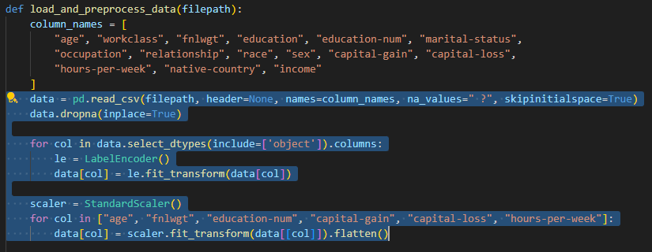

The cleaned dataset is then split into five non-IID subsets using age quantiles to simulate real-world decentralized data.

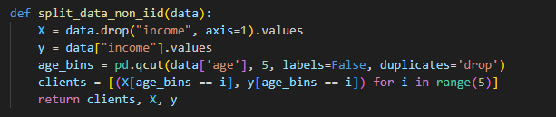

# Model Design

Used basic logistic regression model, implemented in `PyTorch` with a single Linear layer and a sigmoid activation function to output binary predictions.

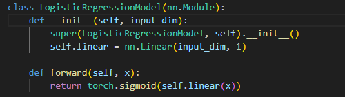

# Federated Learning Process

Each client performs local training, and the global model is updated using federated averaging:

- Local training /per client

    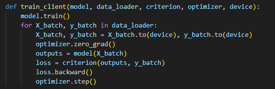

- Federated averaging function

    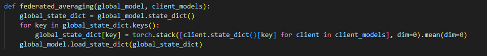

# Evaluation

After each round:

- The global model is evaluated on a hold-out test set 
- Accuracy and loss are recorded
- Performance of client-specific accuracy is tracked 

    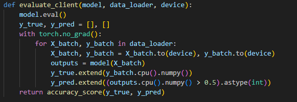

# Visualization and Output

Performance is visualized after each communication round:

- Accuracy vs. Communication Rounds:

    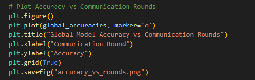

    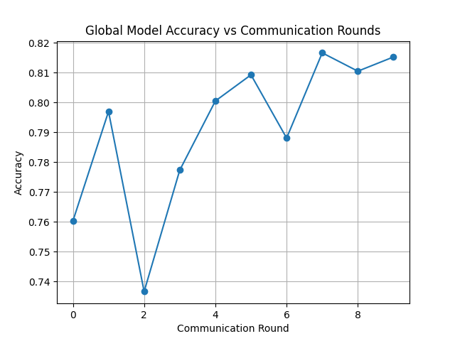

- Loss vs. Communication Rounds:

    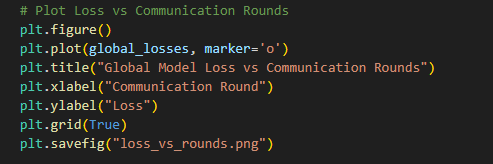

    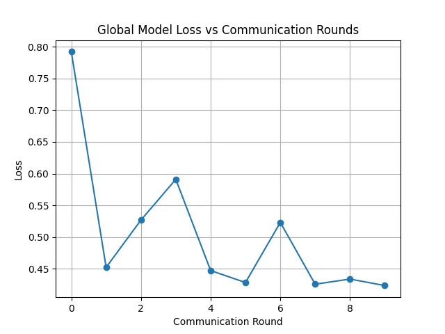

- Client Accuracy Table:

    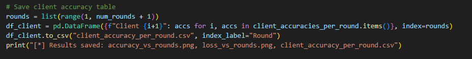

    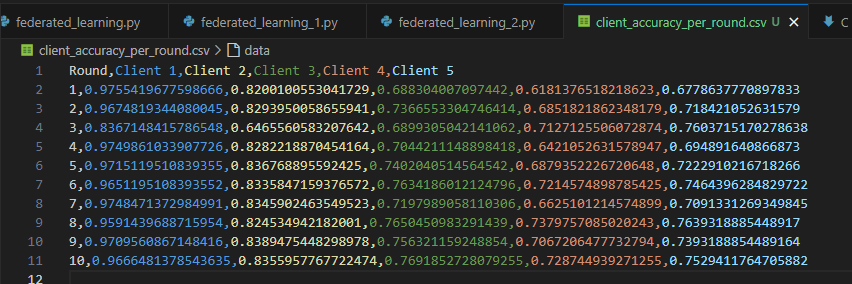

# Conclusion

This project demonstrates a complete Federated Learning pipeline using real-world data, simulating decentralized environments through non-IID partitioning. It highlights the effectiveness of federated averaging and the importance of tracking per-client performance in federated settings. The pipeline is fully reproducible in Python 3.11.7 using a virtual environment and common machine learning libraries.

# Reference

OpenAI. (2023). ChatGPT (March 28 version) [Large language model]. https://chat.openai.com

    Note: ChatGPT was used to assist with code explanations, refactoring, documentation writing, and clarifying Federated Learning concepts for this report.

