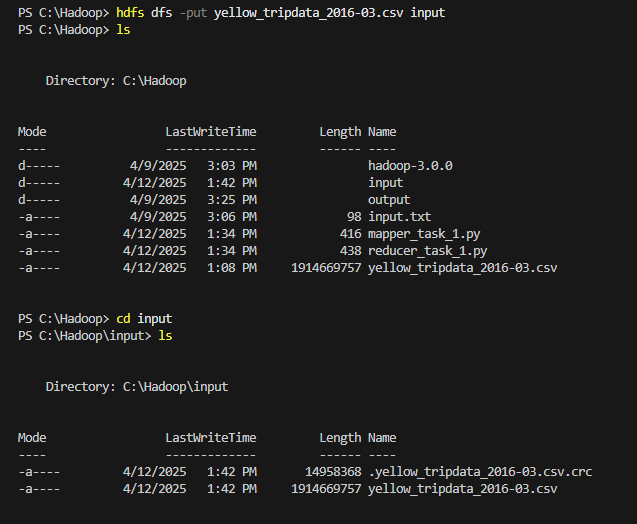

Ruben Valdez  
CSEC 5311 | Big Data Analysis and Security  
Prof. Hossain, Tamjid  
Assignment 6: Hadoop  
Due. April 17, 2025   

C:\Users\rubva\OneDrive - Texas A&M University-San Antonio\TAMUSA\MS CyberSecurity\5 _ Spring 2025\Big Data Analysis and Security _ CSEC 5311\Assignments\Assignment 6 _ Hadoop\yellow_tripdata_2016-03.csv

# Task 1: Number of Trips per Hour of Day

%HADOOP_HOME%\share\hadoop\tools\lib\hadoop-streaming-3.0.0.jar

C:\Hadoop\hadoop-3.0.0\share\hadoop\tools\lib\hadoop-streaming-3.0.0.jar

# Task 2: Most Popular Pickup Location (Zone ID or Coordinates)

# Task 3: Average Fare per Passenger Count 

