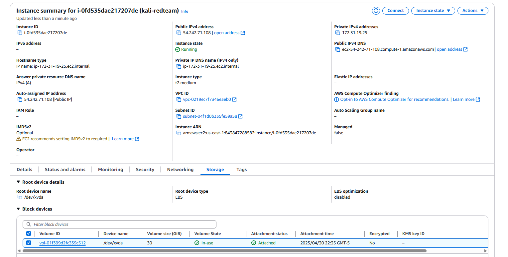
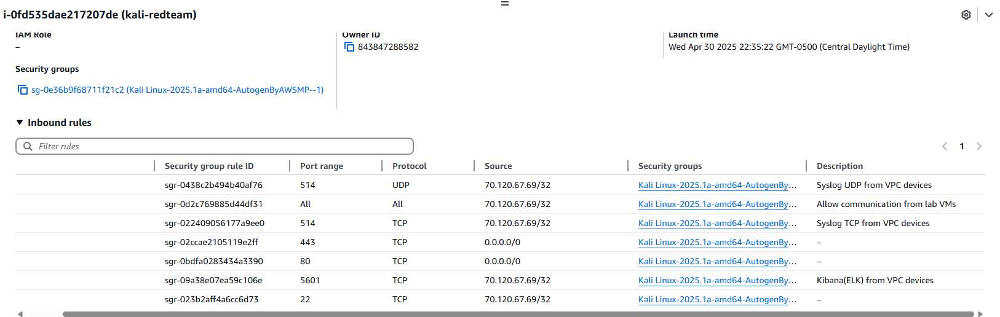
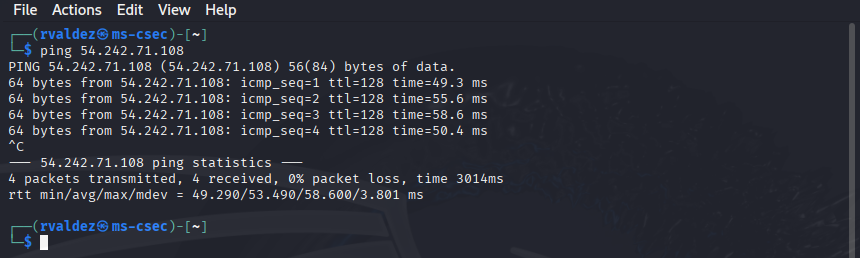
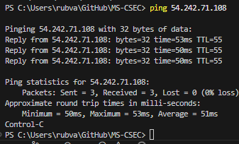

# Module 1. Creating an AWS Kali (attacker/redteam) Linux instance:

***NOTE:*** Throughout the notes and walk-through I'll be referring interchangeably the aws instance as kali, instance, or kali-redteam.

1. Create a new Kali Linux instance name `kali-redteam`, public IP `54.242.71.108`:

    

2. Using VScode, I SSH into the kali-redteam instance using the downloaded .pem key.

    - changed permissions to .pem file
    
            icacls kali-redteam.pem /inheritance:r /grant:r "rubva:R"

    - ssh into the instance

            ssh -i kali-redteam.pem kali@54.242.71.108

3. Added new inbound rules to the security group:

    - While initially creating the instance I already allowed http and https from `anywhere` and I allowed SSH from `my IP`.

    - I added inbound rules for `tcp 514, udp 514 for syslog, tcp 5601 for kibana, and tcp/udp all traffic from 'my IP'`.

    

    - VPC ID: `vpc-0219ec7f7346e3eb0` 

4. Kali tools install

    - sudo apt update && sudo apt upgrade -y

    - sudo apt install -y nmap metasploit-framework net-tools curl git python3-pip

    - sudo apt install -y apache2 ftp ssh openssh-server

5. Network `ping` test from VMware Kali machine and local pc inbound to the kali instance.  Success not loss of packets.

        

    - Unfortunately, I wasn't able to ping outbound from the instance since I have not created the outbound rule for this just yet. 

   

