Ruben Valdez  
CSEC 5306 _ Computer Networks and Security  
Prof. Alsmadi  
Assignment: Lab 10 - OMNet++   

---

# Lab Setup using Ubuntu 24.04

1. Update Ubuntu
        
        sudo apt update && sudo apt upgrade -y

2. Download OMNet++

    Downloaded `https://omnetpp.org/download/`, 6.1.0.

        https://omnetpp.org/download/#omnetpp-61_linux.aarch64
        
    Create a new OMNetpp directory

        cd ~/
        mkdir OMNetpp
        cd OMNetpp

    Move download to new OMNetpp directory and unpack

        mv /Downloads/omnetpp-6.1.0-linux-x86_64.tgz ~/OMNetpp

        tar xvf omnetpp-6.1.0-linux-x86_64.tgz

        cd omnetpp-6.1

3. Configure Environment

    Run the environment setup script

            . setenv

            ./configure

    The following commands were completed after cycling through the config script, `. setenv` and `./configure`.  After each cycle I would receive an error and these are the commands I implemented till I wouldn't receive an error anymore:

            sudo apt install -y build-essential

            sudo apt install -y pkg-config

            sudo apt install -y bison

            sudo apt install -y flex

            sudo apt install python3.12-venv

            python3 -m venv .venv
            
            source .venv/bin/activate

            python3 -m pip install --upgrade pip

            python3 -m pip install -r python/requirements.txt

            sudo apt install -y python3-dev

            sudo apt install -y libdw-dev

            sudo apt install -y ccache

            make clean
            . setenv
            ./configure

    I continued to receive a number of difference errors when i would cycle through the `make -j$(nproc)`, so I used the assist of ChatGPT to help with resolving errors.
    
    Configuration COMPLETE

4. Time to compile

        make -j$(nproc)

5. Launch `OMNet++

        ./bin/omnetpp

    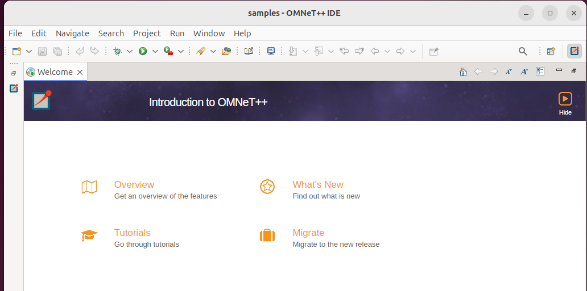

  

# Example - Tictoc

Started the example tictoc using 

    ./tictoc -c Tictoc9

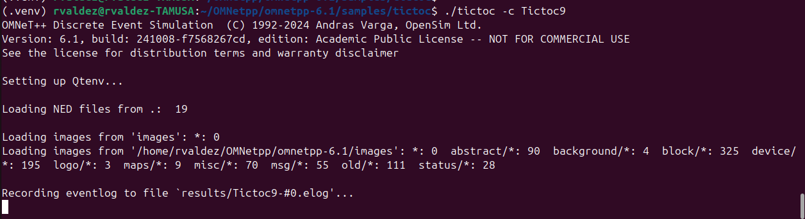

After executing the command example, I ran the the simulation and was provided the result

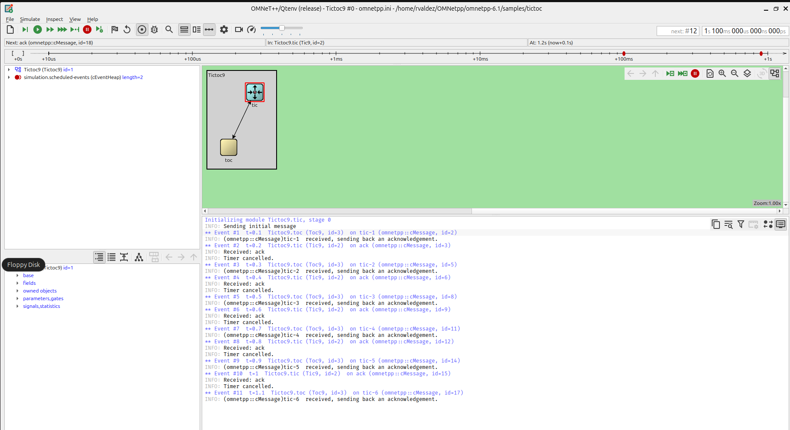

My first attemp, the result output file was a .sca and not a .elog.  After take the steps below, I was finally able to access a .elog result file. Steps took to access the chart; `right click the .elog > Open With > OMNet++ Sequence Chart`.  Another option to view a different chart, `OMNet++ Even Log Table`.

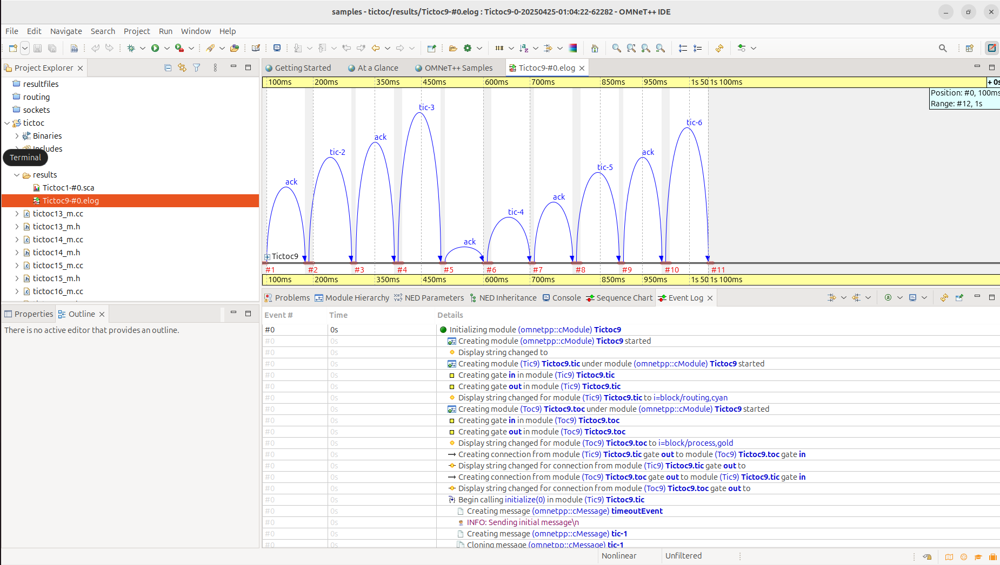  

Because of my first attempt running this example didn't populate a .elog result record, I used ChatGPT to assist in troubleshooting this matter.  The result was that I needed to update the `omnetpp.ini` file by entering `record-eventlog = true` for each Tictoc I intended to run, so in this case, I entered `record-eventlog = true` up till Tictoc9

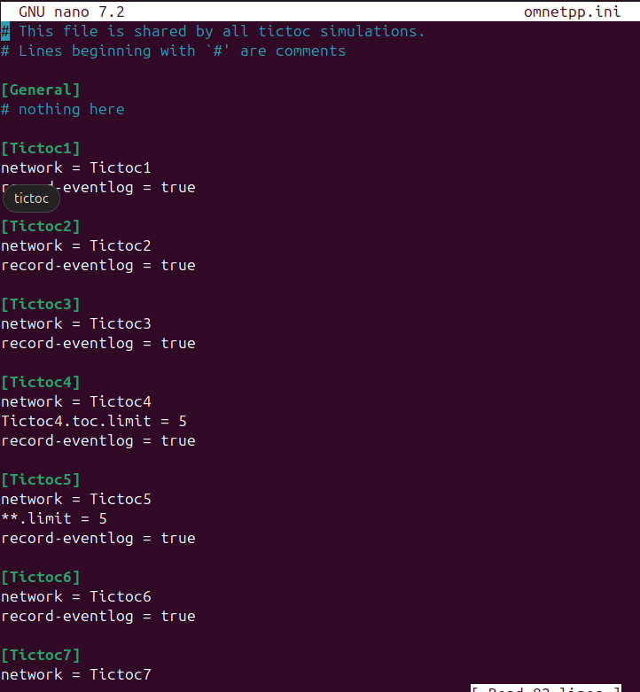

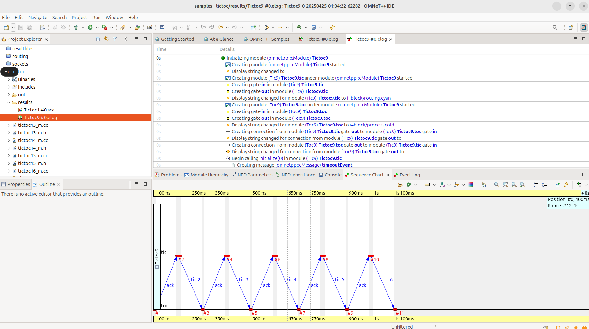

  

# Example - FIFO

To ensure I don't run in the issues as I did above, i'll be updating the `omnetpp.ini` file to ensure I have enabled Event Logging

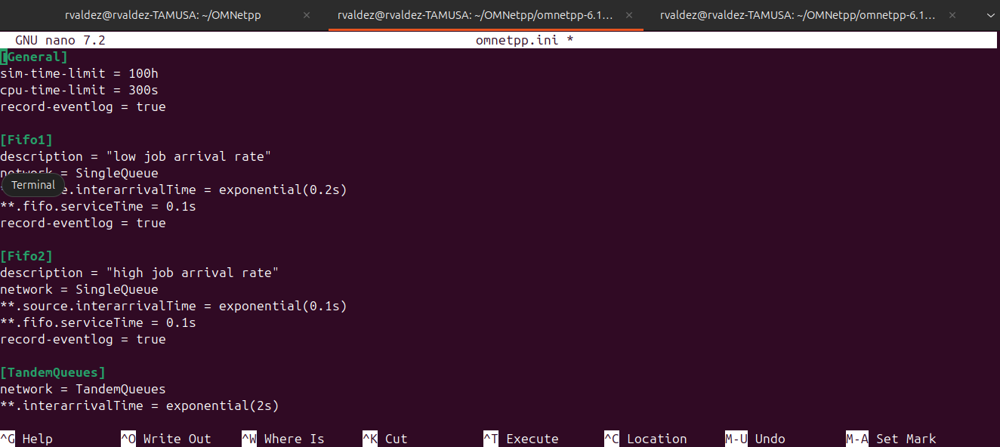

Running the commange `./fifo` opens the simulator

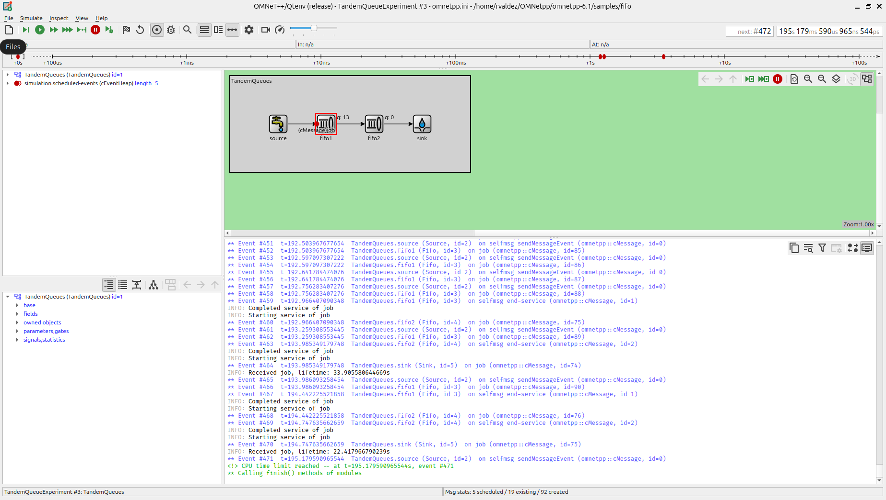

In this example we can view the `Event Log` at the bottom of the image documents all events and the upper image documents the network traffic using a `Sequence Chart`.

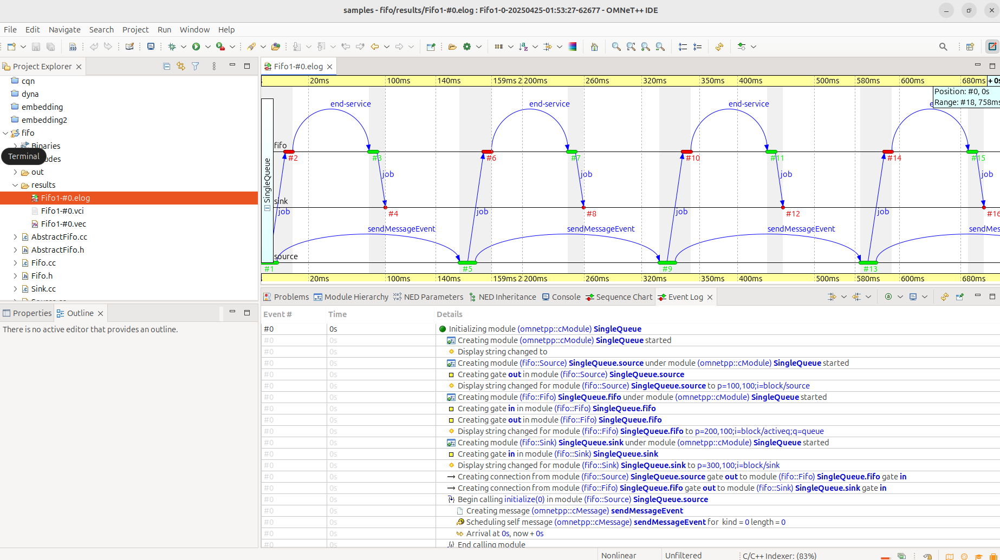

2nd Attempt using a different configuration

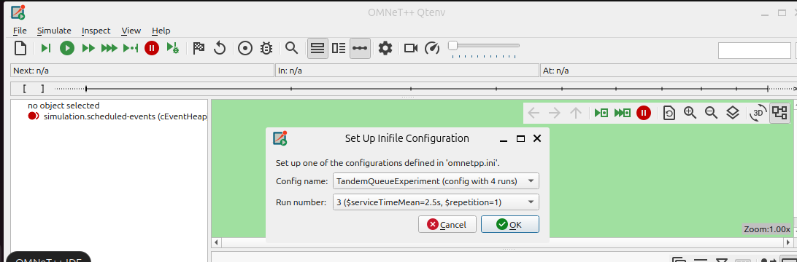

Here we can see the Sequence Chart at the top of the image and the Event Log at the bottom of the image.

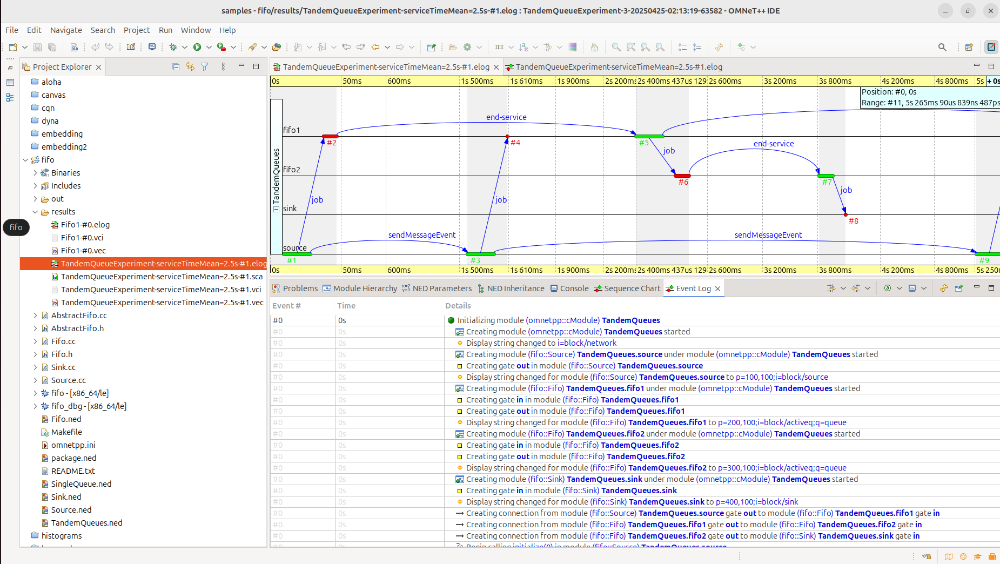

Overall this lab for sure gave me issues.  And after not being able to resolve the problem myself, I had to resort to ChatGPT to troubleshoot OMNetPP install and configuration.  That Step was the complete time suck.  But in the end I was finally able to figure it out and complete the two examples using the published guide.  Also, using ChatGPT to realize I needed to update and configure the ini files for each example.   It was definitely a humbling experience.