Ruben Valdez  
CSEC 5306 _ Computer Networks and Security  
Prof. Alsmadi  
Assignment: Lab 9 - Wireshark Tutorial: Identifying Hosts and Users   

---

***PCAP Used: `Wireshark-tutorial-identifying-hosts-and-users-1-of-5.pcap`***

# Host Information from Dynamic Host Configuration Protocol (DHCP) Traffic

1. Identifying basic web traffic to and from the ethernet address at `f8:ff:c2:04:a5:7b` using the filter `(http.request or tls.handshake.type eq 1) and !(ssdp)`

    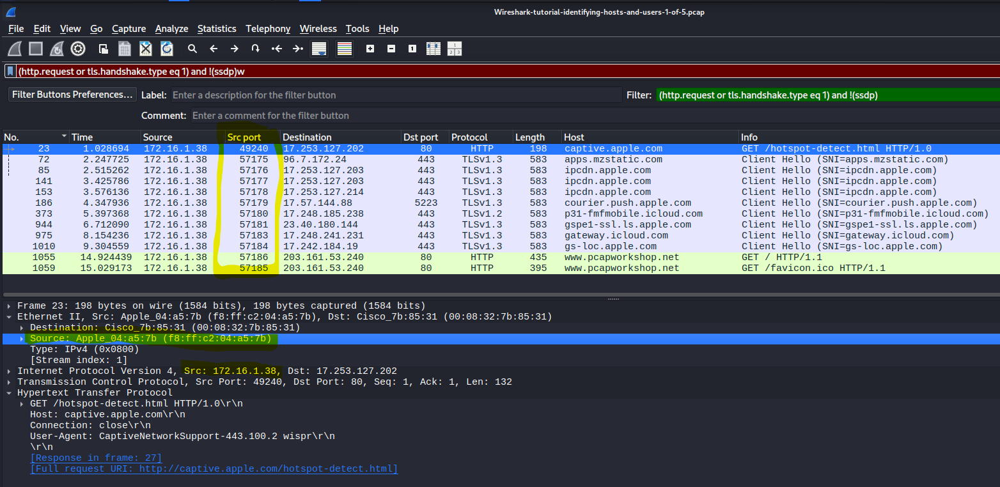

2. Filtering `DHCP` traffic to view the hostname using the IP address

    `Option: (50) Requested IP Address` and `Option: (12) Host Name`

    This reveals the client’s MAC address at `f8:ff:c2:04:a5:7b` with hostname `jeremiahs-MBP` and a requested IP address of `172.16.1.38`.

    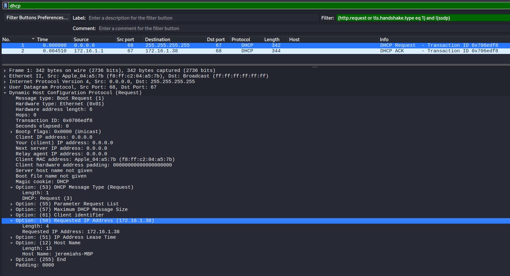
    

# Host Information from NetBIOS Name Service (NBNS) Traffic

1. Here we examine the `nbns (NetBIOS Name Service)` filter as an alternate method to view host information if DHCP lease has not been renewed.  Using this filter the hostname `jeremiahs-MBP` still is recorded.

    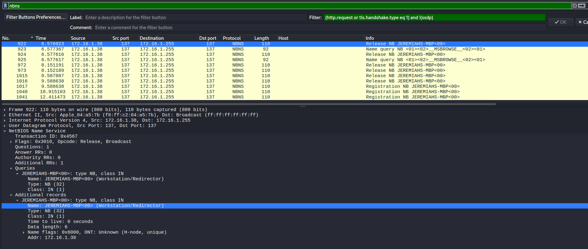

2. Now switching the pcap, `Wireshark-tutorial-identifying-hosts-and-users-2-of-5.pcap` to view traffic from a Windows host, filtering for `nbns`

    Here we can correlate the hostname `Name: DESKTOP-HVKYP4S<20> (Server service)`, `Source Address: 172.16.1.101`, and the MAC address `Source: 78:c2:3b:b8:93:e8 (78:c2:3b:b8:93:e8)`

    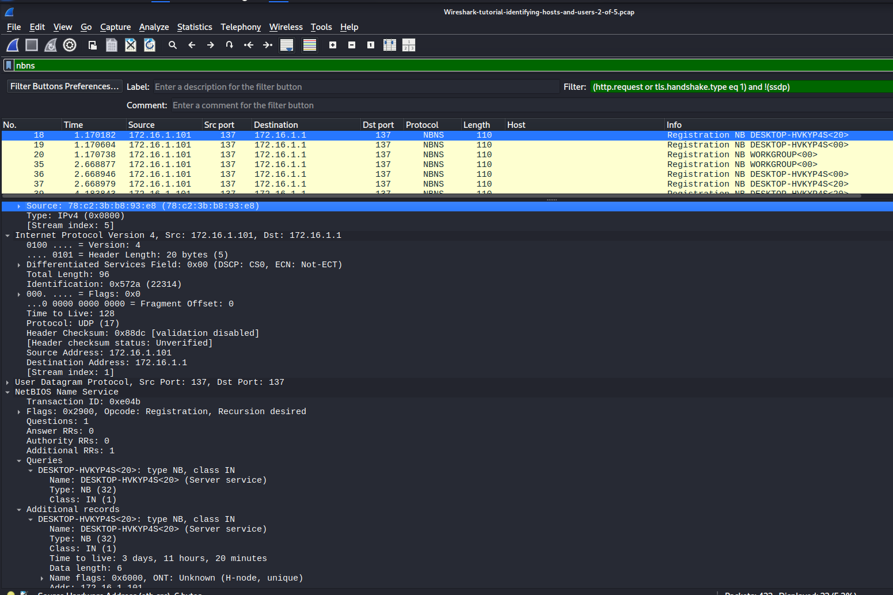

# Device Models and Operating System (OS) from HTTP Traffic

For this section, we use the pcap third pcap: `Wireshark-tutorial-identifying-hosts-and-users-3-of-5.pcap`

1. Revealing all HTTP request with an `Accept-Language` using the filter `http.accept_language`.

2. The clear result is that there were unencrypted HTTP GET request to `outdoornebraska.gov` over TCP 80.

    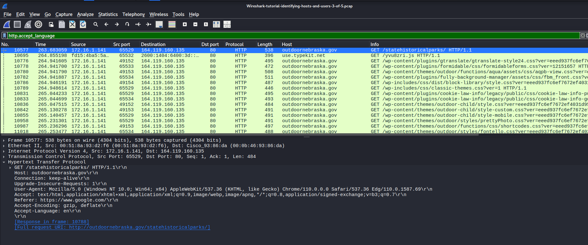

3. Following the tcp stream, we can infer that the user-agent string was generated by Microsoft Edge web browser.  Another note within the stream is that `(Windows NT 10.0; Win64; x64)` might represent either Windows 10 or 11.  

    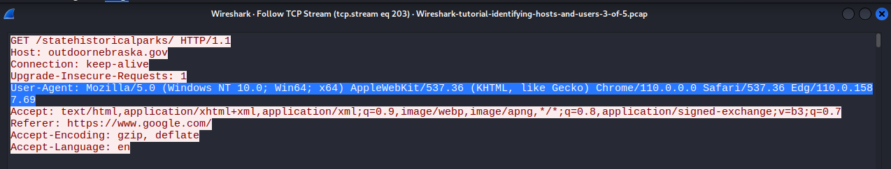

4. Changing the pcap to `Wireshark-tutorial-identifying-hosts-and-users-4-of-5.pcap` 

5. Now we'll investigate the first HTTP GET request for www.pcapworkshop.net and follow the TCP stream

6. Here as we follow the stream we can confirm the activitiy was captured from an Android Pixel phone that runs off a linux distro.

    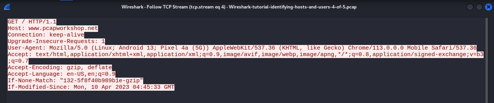

7. Switching to the last pcap now using the same basic web filter and following the TCP stream, here we can conclude that this activity was captured from an iPhone runing iOS 16.4.1 using mobile Safari.

    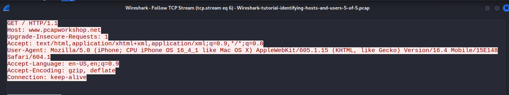

# Identifying Users in an Active Directory (AD) Environment

For this section, we use the pcap third pcap: `Wireshark-tutorial-identifying-hosts-and-users-3-of-5.pcap`

1. Determining the user associated with an infected host.  We can filter for `kerberos.CNameString` and see that `rene.mccollum` is in traffic between the domain controller at 172.16.1.16 and the Windows client at 172.16.1.141

    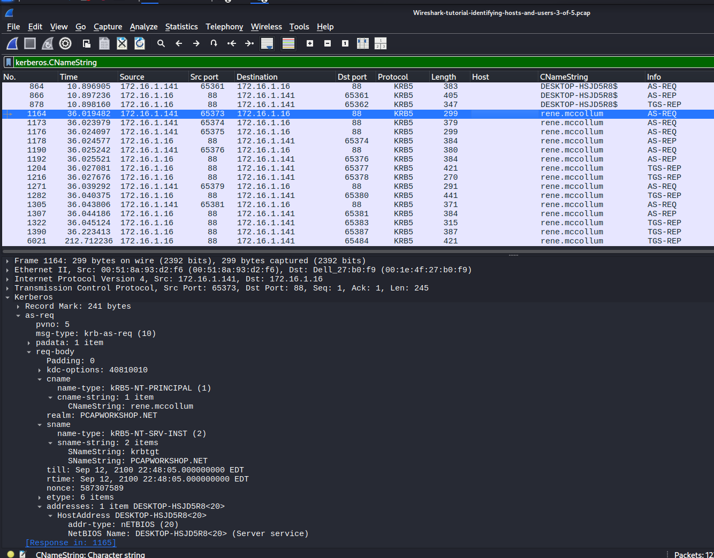

2. Aside from using Kerberos we can filter to use LDAP `ldap contains "CN=Users"`

    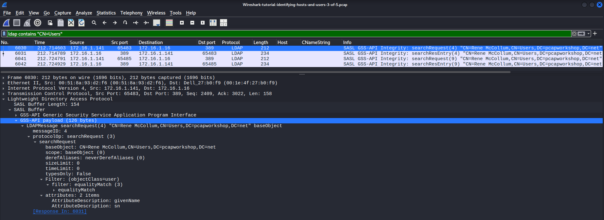

# Default Windows Hostnames

1. We can now search and filter for `ip contains "DESKTOP-"` to find the defualt windows hostname.

    - Note this filter finds and name in text containing "DESKTOP-".

        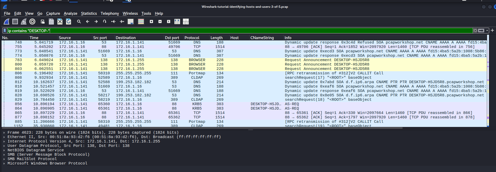

2. Another cool way to identify a host is by manually finding it using the edit tab > and clicking the find packet.

    - Note: Whats neat about this feature is that your able to click on the find button and locate the highlighted result each time your ready to skip to the new result.  

    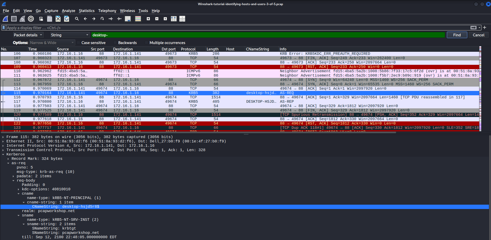

# Conclusion

This was a great opportunity to explore five different PCAPS using Wireshark.  One neat feature I didn't know so much was finding results using deeper filters and the search packets using finder.  

Apologies for the late submission.  I had a home emergency that my main electrical panel box was faulty and sparking and shutting of all my power.  Having to wait for an electrician to arrive was the challenge.   Hence the late submission.  