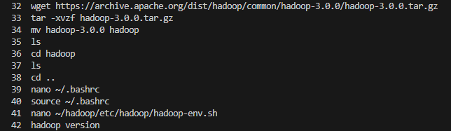
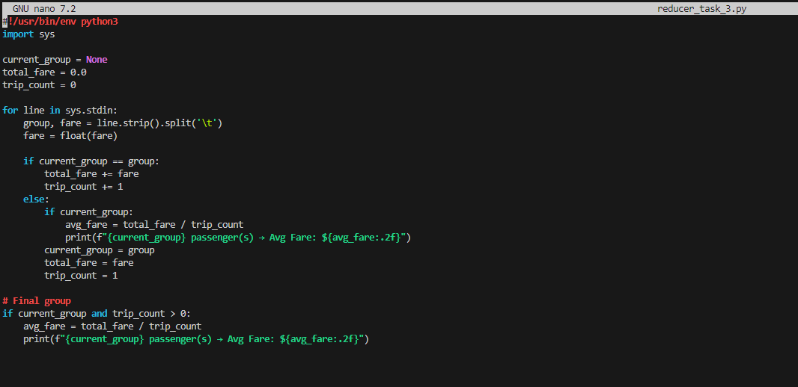

Ruben Valdez  
CSEC 5311 | Big Data Analysis and Security  
Prof. Hossain, Tamjid  
Assignment 6: Hadoop  
Due. April 17, 2025   

# Lab Setup

I attempted to use the provided Lab PDF instructions to complete the install successfully, but when attempting to complete the assignment, I was encountering a few errors along the way that prevented me from successfully completing the assignment.  Just not as comfortable using `Windows` as much as I am using `Linux`.  In the admin space and programming I predominately use `VScode` and instead of using a virtual machine I decided to try `WSL` to complete this assignment. This decision comes after reviewing an article on `medium.com` installing `WSL` and using `VScode` where I can also clone my `Github` repository.  The following are steps I took to install `WSL` and the `Ubuntu-24.04` distro, and not as much showing what my repo API was or is for security purposes.  

Article used for the assist to complete the steps:  https://medium.com/@farimomoh/installing-ubuntu-on-wsl-and-working-with-vscode-on-windows-f5ab7f286f13

 

1. WSL and Ubuntu 24.04 Install

    - Install `wsl`

            wsl --install

            Note:  By default `linux` is installed.

    - Look up linux distros to install

            wsl --list --online

    - Downloading the `Ubuntu-24.04`

            wsl --install -d Ubuntu-24.04

    - List state of any current stopped or running containers

            wsl -l -v

            Note: Noticed by default all disros are in a stopped state.

    - Set `Ubuntu-24.04` as the default WSL distro and started the distro.  After starting the distro I was also presented to create a username and password (see 2nd screenshot)

            wsl --set-default Ubuntu-24.04

            wsl -d Ubuntu-24.04
        
          

    - Update and Upgrade your ubuntu distro using `sudo apt update && sudo apt upgrade -y`

    - Make sure to enable `systemd` as it provides support for manating features managing processes and services. As a note, `systemd` was already enabled true on my distro.

            sudo nano /etc/wsl.confi
            
            #Add these lines to your file.
            [boot]
            systemd=true

    - Reboot `Ubuntu`.  ***NOTE:*** DO not run this command in the Ubuntu terminal.  Rather, use Powershell or Commandline.

            wsl --shutdown

 

2. VScode

    - Open `Extensions` and install `Remote Developement`

    - I went to my GitHub and created a new repository `WSL_Ubuntu_20.04`

        - Also, while I was in Github, I needed to create and generate a personal access token (PAT) to be able to clone my repository in the ubuntu distro.

    - In the WSL Ubuntu distro, clone using HTTPS with PAT

            git clone https://github.com/Cyb3rZ3d/WSL_Ubuntu_20.04.git

            Note: when promped I used my Github username and pasted my PAT

        ***SUCCESS*** I have access to my repo.

        

 

3.  Install and configure Ubuntu for JAVA

    - Installing Java 8 JDK

            sudo apt install openjdk-8-jdk -y

    - Confirm the java install

            java -version

    - Add exceptions to the the `.bachrc` file

            echo "export JAVA_HOME=$(readlink -f /usr/bin/java | sed 's:bin/java::')" >> ~/.bashrc
            echo "export PATH=\$PATH:\$JAVA_HOME/bin" >> ~/.bashrc
            source ~/.bashrc

    - Confirm the config file was updated by opening the file and looking for the exceptions and add the note above the exceptions to note listing them as Java.

            nano ~/.bashrc

    ***NOTE:*** Missed out taking screenshots of majority of all administrative commands to setup this lab because the terminal wouldn't allow me to scroll up as it would stop after scrolling up a bit.  I'm relying on command `history` to show my commands ran.

    

4. Hadoop install

    - Completed the following commands to install Hadoop

            wget https://archive.apache.org/dist/hadoop/common/hadoop-3.0.0/hadoop-3.0.0.tar.gz
            
            tar -xvzf hadoop-3.0.0.tar.gz
            
            mv hadoop-3.0.0 hadoop
            
            hadoop version

            nano ~/.bashrc
           
            nano ~/hadoop/etc/hadoop/hadoop-env.sh

        

        - Added the `export JAVA_HOME=/usr/lib/jvm/java-8-openjdk-amd64` to the bash fiel `/home/rubva/hadoop/etc/hadoop/hadoop-env.sh `
        
            

        - Added and confirmed the Hadoop exceptions were added

            

5. Kaggle CSV download

    - Installed Python3, and created a virtualized environment.

    - pip install kaggle

    - Retrieved Kaggle account API key `kaggle.json`

    - Completed the following commands to place the API key

            mkdir -p ~/.kaggle

            Downloaded the API key from PC to Ubuntu:
            cp /mnt/c/Users/rubva/Downloads/kaggle.json ~/.kaggle/

            chmod 600 ~/.kaggle/kaggle.json

            cd ~/Hadoop-Assignment

            kaggle datasets download -d elemento/nyc-yellow-taxi-trip-data

            sudo apt install unzip

            unzip nyc-yellow-taxi-trip-data.zip yellow_tripdata_2016-03.csv

          

  

# Task 1: Number of Trips per Hour of Day

Brief overview, the goal is to count how many trips started at each hour of the day using the `tpep_pickup_datetime` column.  Mapper, `mapper_task_1.py`, reads each CSV row, skips the header, extrans the hour from the `tpep_pickup_datetime` string, and emites the hour in HH:00 formate and the number 1; whereas, the reducer, `reducer_task_1.py`, aggregates the count of the trips for each hours, sums up all the 1's for the same hour, and prints the total number of trips per hour.

1. Created the mapper and reducer script; 

    - mapper_task_1.py  
        
        

    - reducer_task_1.py

        

2. Running the the following command:

        hadoop jar ~/hadoop/share/hadoop/tools/lib/hadoop-streaming-3.0.0.jar \
        -input yellow_tripdata_2016-03.csv \
        -output task_1_output \
        -mapper mapper_task_1.py \
        -reducer reducer_task_1.py \
        -file mapper_task_1.py \
        -file reducer_task_1.py

    - Output:

        

  

# Task 2: Most Popular Pickup Location (Zone ID or Coordinates)

Finding the most frequent pickup location using GPS coordinates (pickup_longitude, pickup_latitude).  The mapper, `mapper_task_2.py`, reads the CSV rows, skips the header, Extracts pickup_longitude, and pickup_latitude; whereas, the reducer, `reducer_task_2.py`, aggregates counts for each unique coordinate, tracks the one with the highest count as it processes input, and then outputs the coordinate with the most trips.

1. Created the mapper and reducer script; 
    
    - mapper_task_1.py 

        

    - reducer_task_1.py
        

    - Change permission to executable

            chmod +x mapper_task_2.py reducer_task_2.py

        

    - Running the the following command:

            hadoop jar ~/hadoop/share/hadoop/tools/lib/hadoop-streaming-3.0.0.jar \
            -input yellow_tripdata_2016-03.csv \
            -output task_2_output \
            -mapper mapper_task_2.py \
            -reducer reducer_task_2.py \
            -file mapper_task_2.py \
            -file reducer_task_2.py

    - Running `cat` to review the output I wasn't sure if this was correct, so I attempted to create another script for mapper and reducer and modifying the script

        

2. Modified scripts to compare results using longitude and latitude

    - mapper_task_2-1.py

        

    - reducer_task_2-1.py

        

    - Running the following command: 

            hadoop jar ~/hadoop/share/hadoop/tools/lib/hadoop-streaming-3.0.0.jar \
            -input yellow_tripdata_2016-03.csv \
            -output task_2-1_output \
            -mapper mapper_task_2-1.py \
            -reducer reducer_task_2-1.py \
            -file mapper_task_2-1.py \
            -file reducer_task_2-1.py

    - Output and results

        

 
Not a 100% confident in identifying the correct results.  But I would have to say it's within the first output result for `task_2_output`.  But I attempted both scripts because I wanted to test and gain further expereince in coding.   

  

# Task 3: Average Fare per Passenger Count 

In this task I Calculate the average `fare_amount` for each group of trips based on `passenger_count`.  In the Mapper, `mapper_task_3.py`, the script reads each CSV row, skips the header, extracts the `passenger_count` and the `fare_amount`, and emits the `passenger_count > fare_amount`; whereas, the reducer, `reducer_task_3.py`, groups all fare amounts by passenger_count, calculates total fare and number of trips and average fare, and then outputs the average fare by group.

1. Created mapper and reducer python scripts

    - mapper_task_3.py

        

    - reducer_task_3.py

        

    - Changed permissions of the scripts to be executable

            chmod +x mapper_task_3.py reducer_task_3.py

        

2. Running the the following command:

        hadoop jar ~/hadoop/share/hadoop/tools/lib/hadoop-streaming-3.0.0.jar \
        -input yellow_tripdata_2016-03.csv \
        -output task_3_output \
        -mapper mapper_task_3.py \
        -reducer reducer_task_3.py \
        -file mapper_task_3.py \
        -file reducer_task_3.py

    - Running `cat` to review the output 

        

