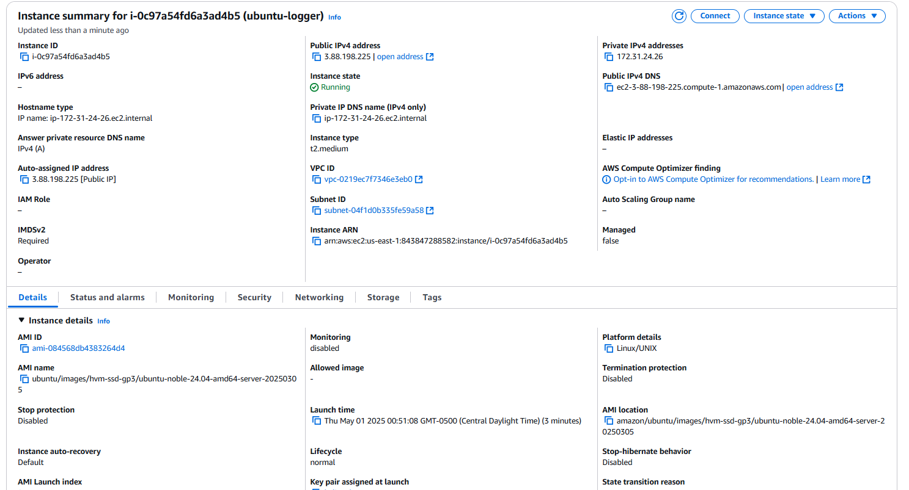
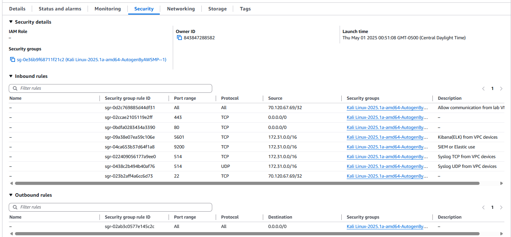
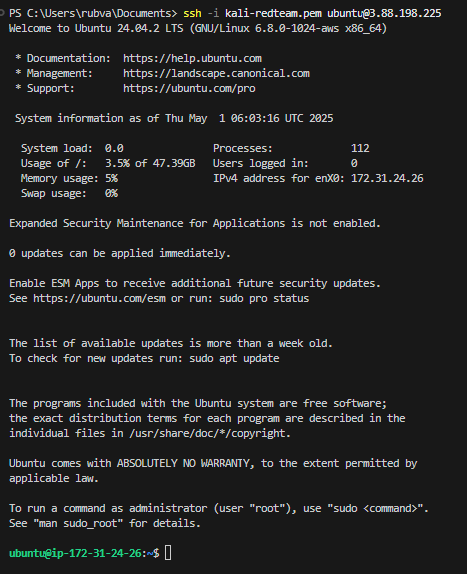
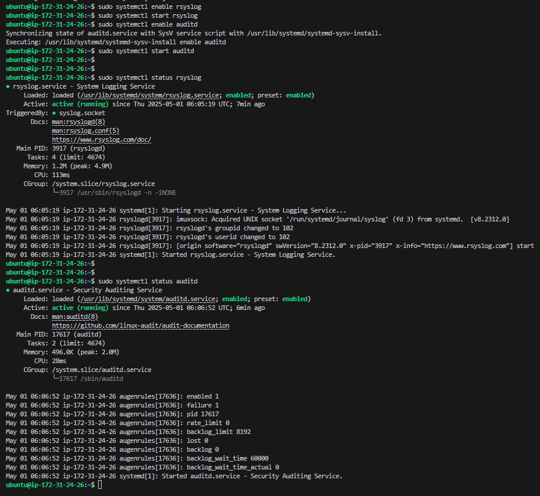
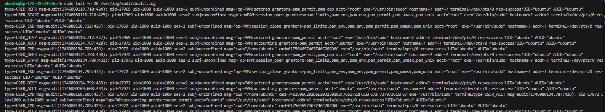
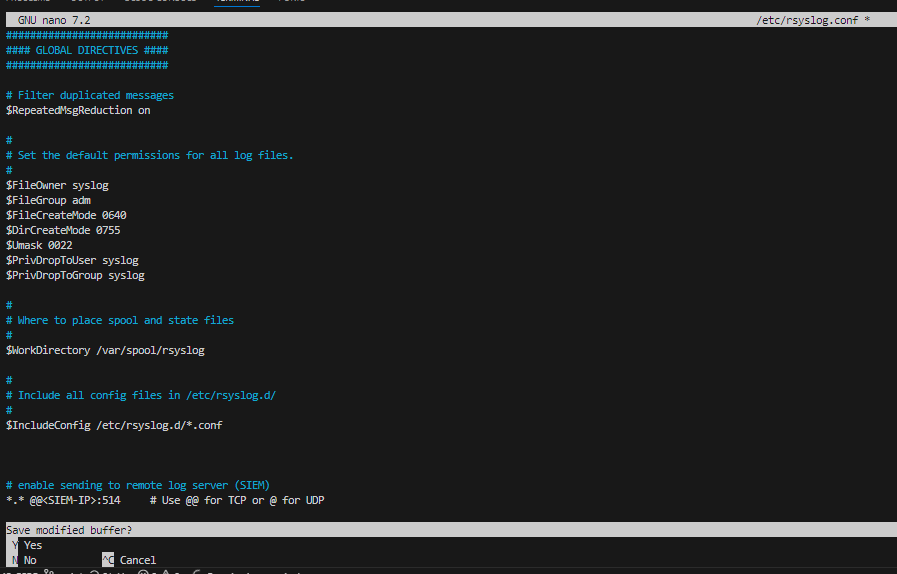

# Module 2: Create an Ubuntu EC2 Logging Server with Syslog

1. This is the ubuntu-logger instance summary page.

        

    - THe following are the firewalls I added as an anticipation of using TCP 9200 for SIEM

        

2. SSH into the instance

        ssh -i kali-redteam.pem ubuntu@3.88.198.225

    

3. Update and install logging tools

        sudo apt update && sudo apt upgrade -y
        sudo apt install rsyslog auditd -y

    - rsyslog: system logging daemon (used by default)

    - auditd: collects audit logs (great for detecting system-level events)

4.  Step 4: Enable & Verify Logging Services

    - Start and enable both services:

            sudo systemctl enable rsyslog
            sudo systemctl start rsyslog

            sudo systemctl enable auditd
            sudo systemctl start auditd

        - Check their status:

                sudo systemctl status rsyslog
                sudo systemctl status auditd

    

5. Test log generation

        sudo logger "This is a test log from ubuntu-logger"
        sudo auditctl -l   # Shows auditd rules (should be empty for now)

    - Check `/var/log/syslog` or `/var/log/audit/audit.log`:

            sudo tail -n 20 /var/log/syslog
            sudo tail -n 20 /var/log/audit/audit.log

    - Generating some log entries we can see the logger is logging as in `syslog` logged "This is a test log from ubuntu-logger":

        

        - Nothing was logged or found in the the audit.log

            

6.  Prepare rsyslog for Remote Forwarding (Preview for Module 3)

    - Edit the rsyslog config file

            sudo nano /etc/rsyslog.conf

    - Uncomment or add:

            # enable sending to remote log server (SIEM)
            *.* @@<SIEM-IP>:514     # Use @@ for TCP or @ for UDP
        
        ***NOTE:*** Don’t set SIEM IP yet unless Module 3 is done. Leave it commented for now if not ready.   
            
        

    - Restart rsyslog

            sudo systemctl restart rsyslog

   

Restart rsyslog:

sudo systemctl restart rsyslog

