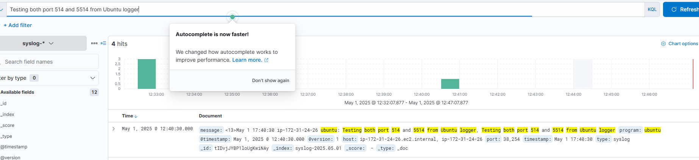

   

# Module 3: Deploy a SIEM to Collect Logs

Setting up a SIEM (Security Information and Event Management) platform to:

    - Ingest and analyze logs from both Kali and Ubuntu-logger EC2s

    - Detect attacks, monitor events, and visualize alerts

 

1. Created and launched an EC2 for SIEM (Ubuntu) named `siem-server` using the same configurations as the previous 3 EC2 instance creations.

      

 

2. SSH into the EC2 `siem-server`

        ssh -i kali-redteam.pem ubuntu@3.93.195.37

 

3. Configure the server and add the appropriate applications to run ELK

        sudo apt update && sudo apt install -y openjdk-11-jdk
        java -version

    

 

4. Add Elastic Repo and Install ELK

        wget -qO - https://artifacts.elastic.co/GPG-KEY-elasticsearch | sudo apt-key add -
        sudo apt install apt-transport-https
        echo "deb https://artifacts.elastic.co/packages/7.x/apt stable main" | sudo tee -a /etc/apt/sources.list.d/elastic-7.x.list
        sudo apt update

       

    - Install components

            sudo apt install elasticsearch logstash kibana -y

 

5.  Configure Elasticsearch

    - Edit the .yml file

        sudo nano /etc/elasticsearch/elasticsearch.yml

        - modified and added the following in the .yml file:

                # Allow external connections
                network.host: 0.0.0.0

                # Single-node cluster for standalone operation
                discovery.type: single-node

    - Restart Elasticsearch

            sudo systemctl restart elasticsearch

    - Afte about 20-30 seconds run `curl http://localhost:9200`

        ***NOTE:*** The output should be a JSON response with cluster name, version, and status

        

    - As a precaution, since I didn't see the status in the JSON output, I'm checking to see if Elasticsearch is listening:

            sudo netstat -tuln | grep 9200

 

6. Configure and Start Kibana

    - Edit the kibana.yml file and add:

            server.host: "0.0.0.0"

    - Run to enable and start kibana

            sudo systemctl enable kibana
            sudo systemctl start kibana

        

    - Using the browser open `http://3.93.195.37:5601`
    
        

 

7. Configure Logstash for Syslog Ingestion

    - Create a config file `syslog.config`

            sudo nano /etc/logstash/conf.d/syslog.conf

        

    - Start logstach

            sudo systemctl enable logstash
            sudo systemctl start logstash

 

8. Point Ubuntu-Logger to ELK

    - A brief loop back from `Module 3` we briefly entered an empty field for the rsyslog.  Now, I enter the SIEM IP.

        -  Update the rsyslog.config file:

                # enable sending to remote log server (SIEM)
                # Use @@ for TCP or @ for UDP
                *.* @@172.31.27.218:514

        

 

9.  Verify Logs in Kibana
    Go to Kibana at: http://<SIEM-PUBLIC-IP>:5601

    Click: Stack Management → Index Patterns

    Click Create Index Pattern

    Enter: syslog-*

    Choose: @timestamp as the time field

    Save

    Then go to Discover tab — you should see incoming logs from your Ubuntu logger.

 

10.  Send test logs to SIEM from `ubuntu-logger`

            logger "Testing both port 514 and 5514 from Ubuntu logger"

        Confirmed SIEM picked up the log

        

