***Ruben Valdez***  
CSCI/CSEC 5372 | Cloud Computing | Thursdays @ 4pm 
Prof. Yang, Jeong  
Lab Assignment 4  
Due by midnight, Sunday, September 28

---

  

# ***Lab 1: Cloud Storage: Qwik Start  - Cloud Console***

https://www.cloudskillsboost.google/focuses/1760?parent=catalog

- Task 1: 'Test completed task' and 'Test your understanding'
    
    

- Task 2: Test completed task' and 'Test your understanding'

    
    
    

    
    
    https://storage.googleapis.com/qwiklabs-gcp-03-c107b00009f7/kitten.png
    

- Task 3:  Any image presented, rather than kitten.png, from the publicly shared URL

    
    
    

  

# ***Lab 2: Cloud SQL for MySQL: Qwik Start***

https://www.cloudskillsboost.google/focuses/936?parent=catalog

- Task 1: 'Test completed task' and 'Test your understanding'

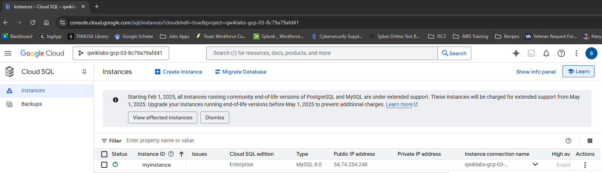    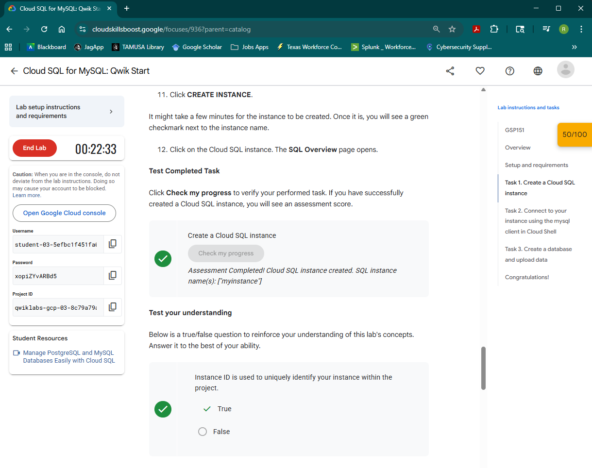

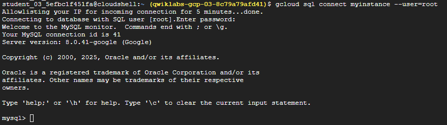

- Task 3:  'Test completed task', and one more 'insert' statement inserting your name and retrieve the data showing your name from entries.

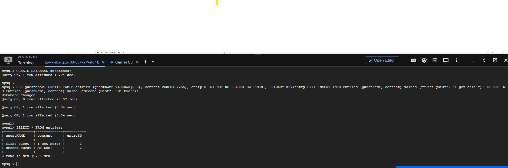
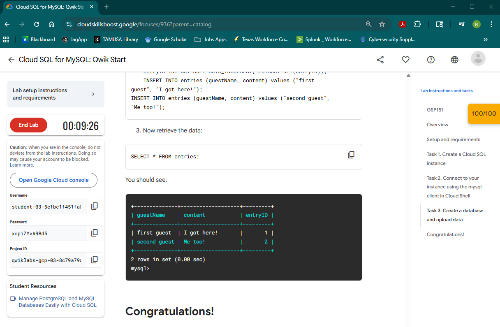
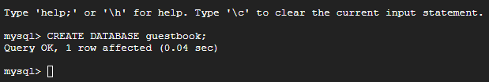

# ***Lab 3: Introduction to SQL for BigQuery and Cloud SQL***

https://www.cloudskillsboost.google/focuses/2802?parent=catalog

- Task 1: 'Test your understanding'

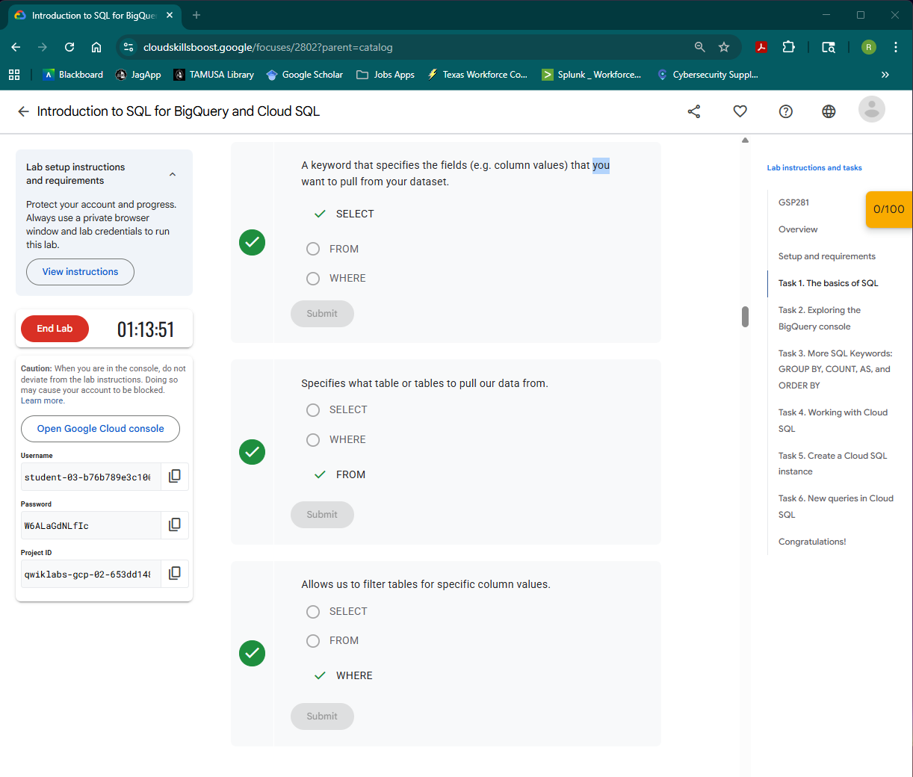

- Task 2: 'preview' screen for the data from cycle_hire table and 'Test your understanding'

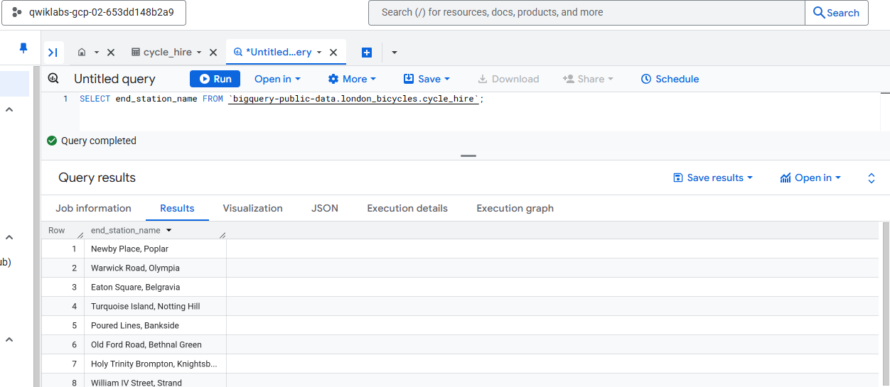    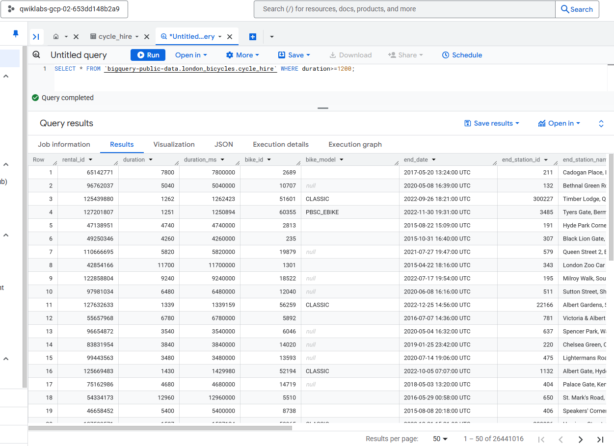    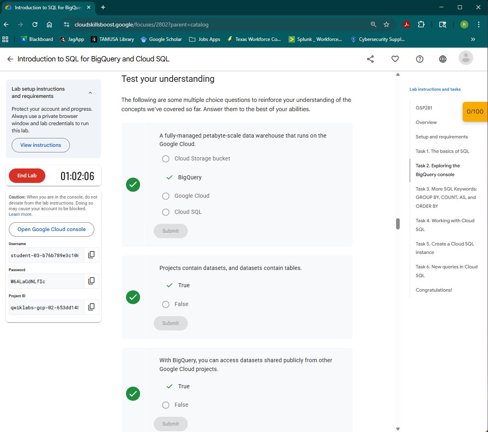

- Task 3: 'Test your understanding'

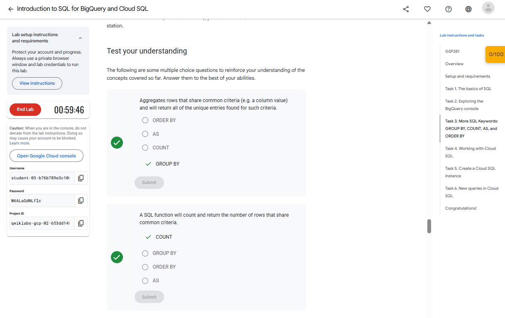   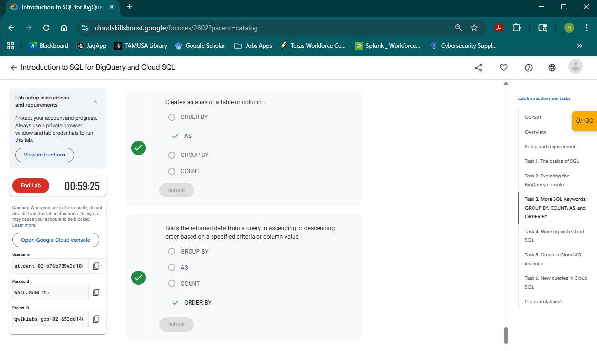

- Task 4: 'Test completed task' 

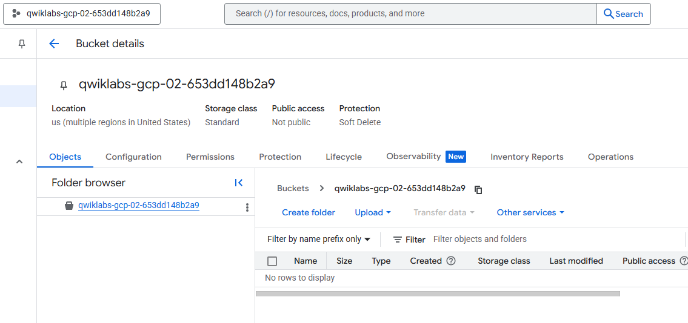   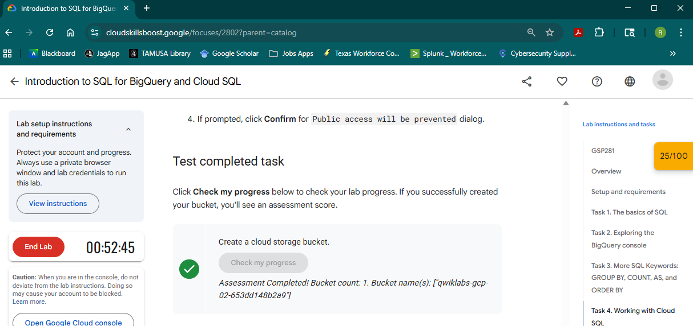

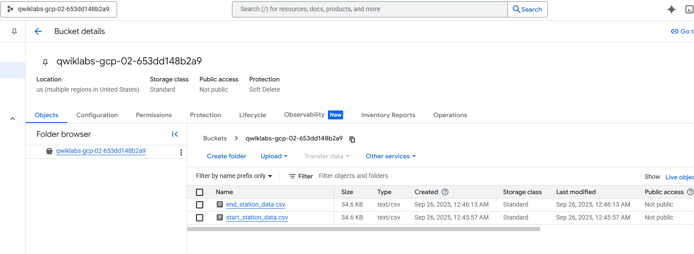   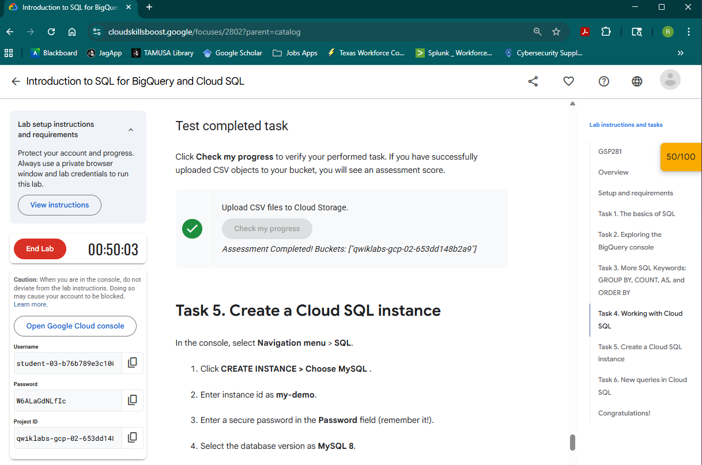

- Task 5: 'Test completed task' 

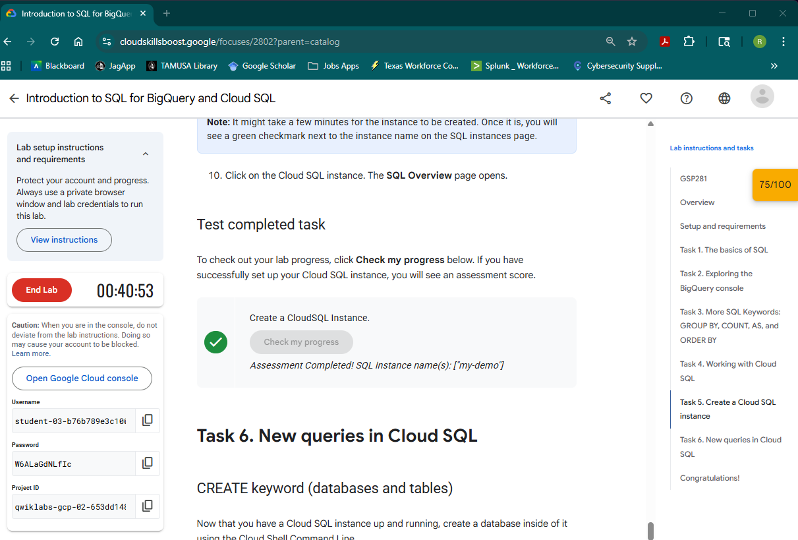

- Task 6: 'Test completed task' and 'Example Output' for 'ORDER BY top_stations DEC;

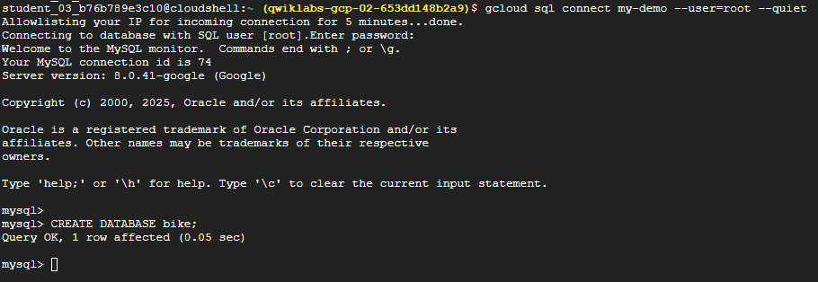   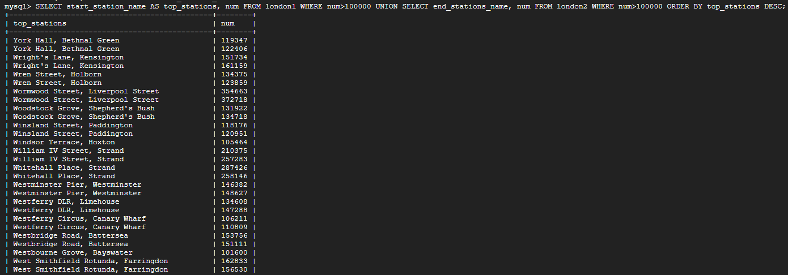   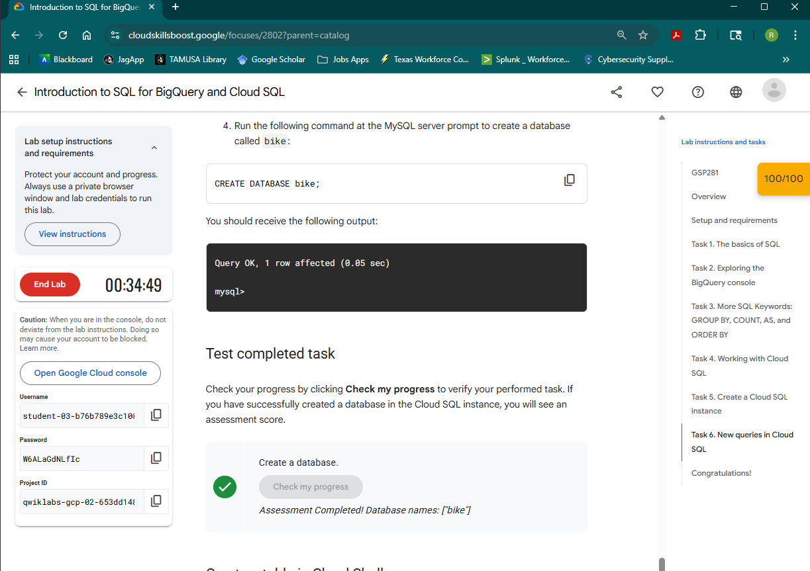

