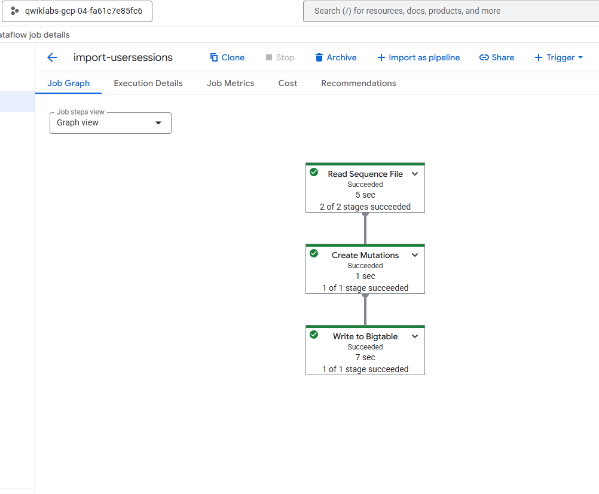

***Ruben Valdez***  
CSCI/CSEC 5372 | Cloud Computing | Thursdays @ 4pm 
Prof. Yang, Jeong  
Lab Assignment 5  
Due by midnight, Sunday, September 28

---

  

***Instructions***
Include screenshots of the above tasks, put them in a single Word or PDF, and submit the Word or PDF (preferred).  Each screenshot must include both 'Student Username' and 'Project ID'.

# ***Lab 1: Using Cloud Spanner***

https://www.cloudskillsboost.google/focuses/1774?parent=catalog

- Task 2: 'Check my progress; - Create an instance and database

    

- Task 3: 'Check my progress; - Create a schema for your database 

    

- Task 4:  After inserting 3 rows into the DB table, insert information about yourself with your first and last names, and others. Query results of 'SELECT * FROM Singers' showing your name.

        

    - Edited the table for user `Ruben Valdez` to include the DoB.

        

    - Deleting `SingerId 2`

        

    - Running query from using SQL statement in Spanner Studio

        

- Task 5: Test your knowledge

    

  

# ***Lab 2: Creating and Populating a Bigtable Instance***

https://www.cloudskillsboost.google/focuses/92497?catalog_rank=%7B%22rank%22%3A5%2C%22num_filters%22%3A0%2C%22has_search%22%3Atrue%7D&parent=catalog&search_id=54578245

   

- Task 2: 'Check my progress; - Create a Bigtable instance

    

       

- Task 3: 'Check my progress; - Load data files from Cloud Storage using a Dataflow template.  Graph with green mark from Graph View 

    

    

- TASK 5: Check my progress; - Delete a Bigtable table and instance. 

    