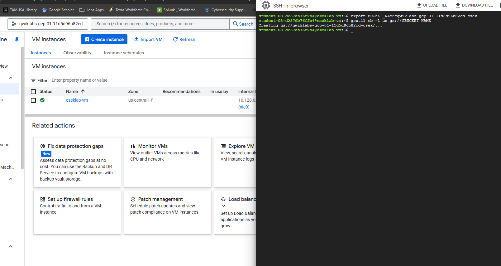
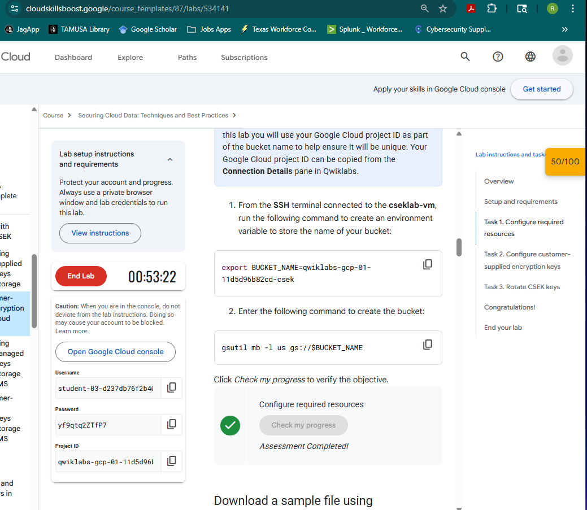
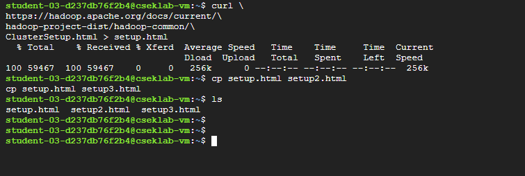
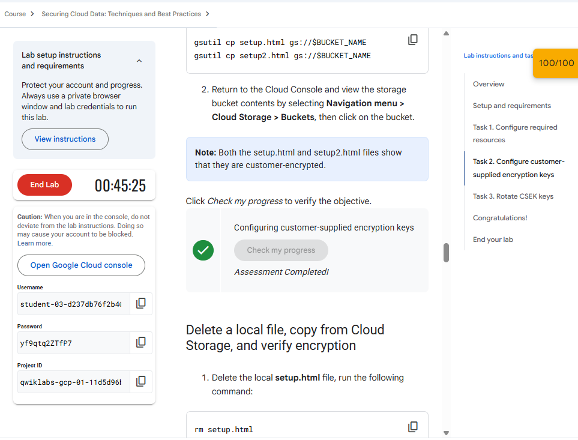
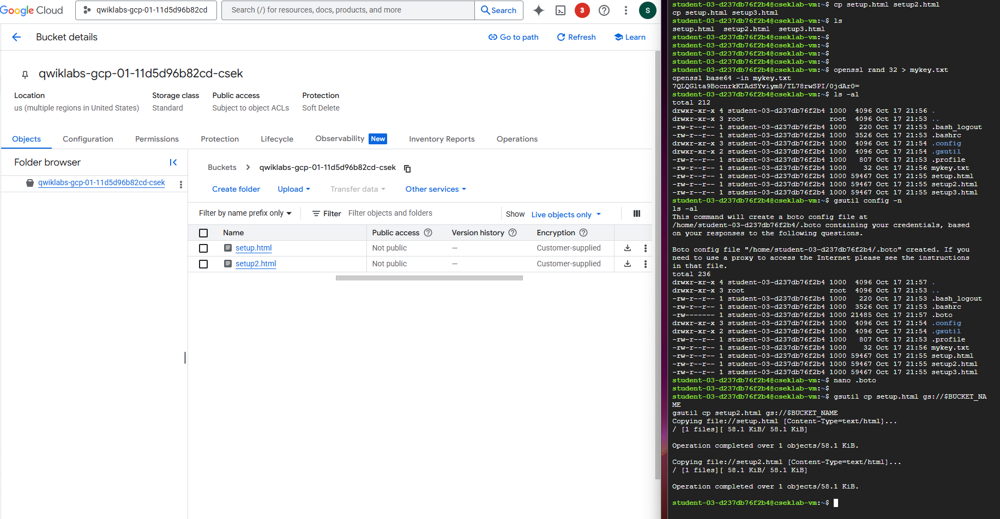
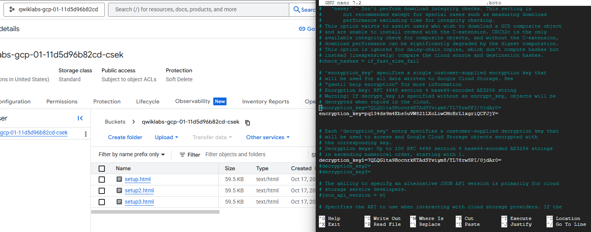
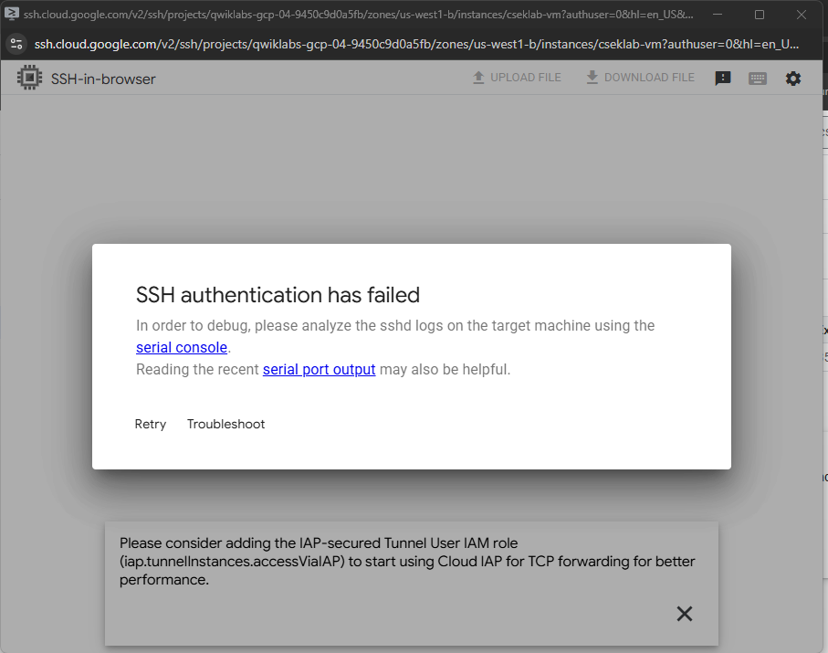

***Ruben Valdez***  
CSCI/CSEC 5372 | Cloud Computing | Thursdays @ 4pm 
Prof. Yang, Jeong  
Lab Assignment 6  
Due by midnight, Sunday, Oct. 19, 2025
---

  

***Instructions***

 

Lab: Using Customer-Supplied Encryption Keys with Cloud Storage: 
https://www.cloudskillsboost.google/course_templates/87/labs/534141

Include screenshots of the above tasks, put them in a single Word or PDF, and submit the Word or PDF (preferred).  Each screenshot must include both 'Student Username' and 'Project ID'.

 

# Task 1: 'Check my progress; - Configure required resources

  

  

# Task 2:  .boto file content with the 'encryption_key=..........' updated

- 'Check my progress; - Configuring customer-supplied encryption keys  

    

7QLQGlta9BocnrkKTAdSYviym8/TL78rwSPI/0jdAr0=

pq134ds9m4Ebs5uVW821LXoLiwOMcBrL1xgriQCFJjY=

- Bucket showing uploaded files
    
     

  

# Task 3: .boto file content with the 'encryption_key=..........' and 'decryption_key1=........' update

After getting the only screenshot i got for completing Task 3, I realized i didn't capture all the images needed and I incidently closed my browser losing all the work.  In attempting to redo the lab, I tried to get back to Task 3, but kept getting inundated with Task 2 SSH failures that plagued Thursday class.  I attempted to delete and create new instances waiting for the creation of the instance before starting the SSH, but was still unsuccessful with opening a SSH screen.   

- the result of # 8 command, 'gsutil cp gs://$BUCKET_NAME/setup2.html ./'

 

***NOTE: After getting the only screenshot i got for completing Task 3, I realized i didn't capture all the images needed and I incidently closed my browser losing all the work.  In attempting to redo the lab a few times, I tried to get back to Task 3, but kept getting inundated with Task 2 SSH failures that plagued Thursdays class.  I attempted to delete and create IAM service accounts and new instances waiting for the creation of the instance before starting the SSH, but was still unsuccessful with opening a SSH screen. Throughout the process of trying to restart the lab, I have now depleted my credits down to 39.***

