***Ruben Valdez***  
CSCI/CSEC 5372 | Cloud Computing | Thursdays @ 4pm 
Prof. Yang, Jeong  
Lab Assignment 1  
Due by Sunday midnight, September 7

---

 

***Complete today's (9/2) labs and submit screenshots of each of the completed tasks as follows:***

# Lab 1:    https://www.cloudskillsboost.google/focuses/3563?parent=catalog

- VM 'gcelab' for the 'Welcome to nginx!' page created by Console.

    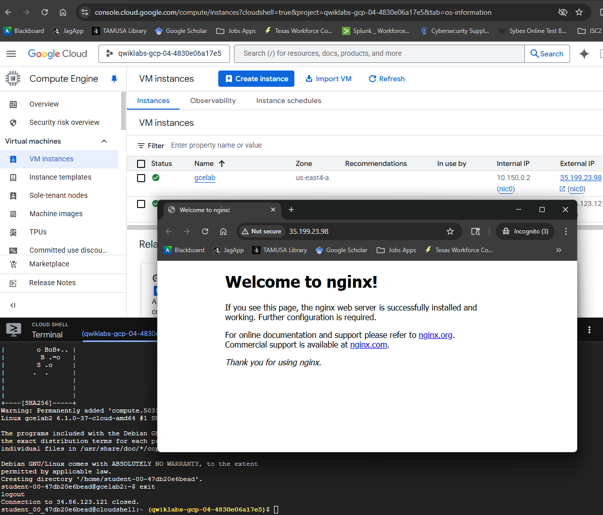

- Answer to 'Task 4. Test your knowledge'

    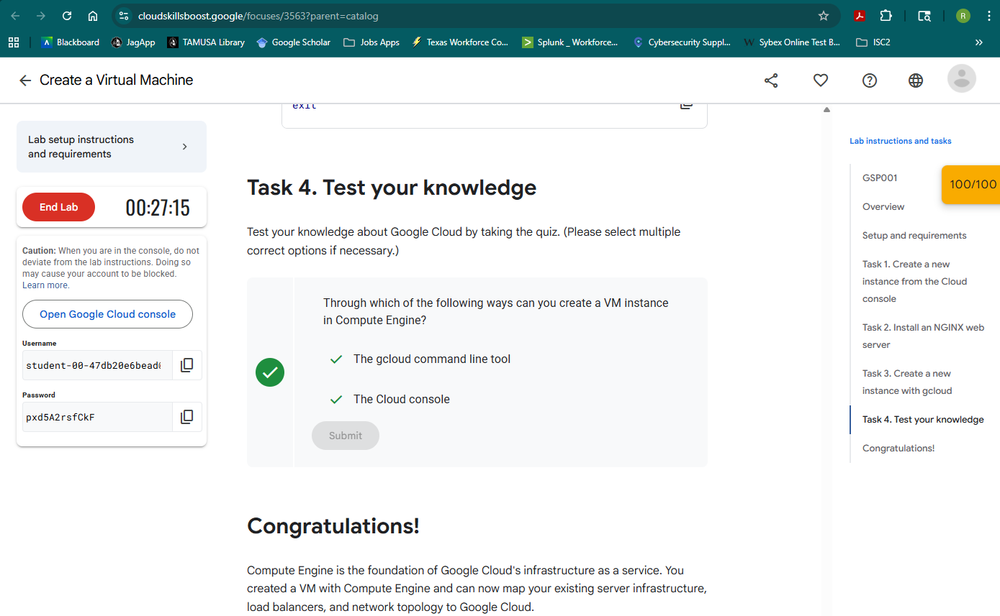

  

# Lab 2:    https://run.qwiklabs.com/focuses/1014?parent=catalog

- A deployed app (Hello World) on App Engine: Change 'Hello World' text to 'Hello Cloud Computing, and Your Name'

    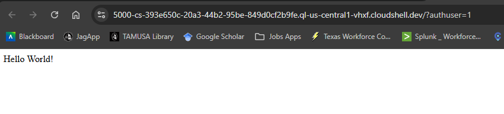 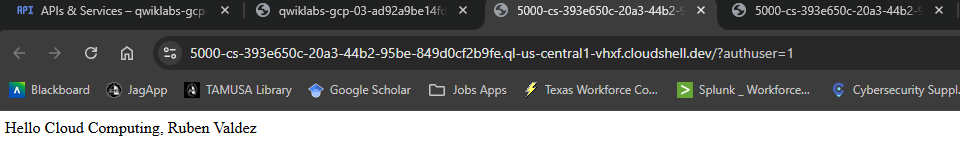 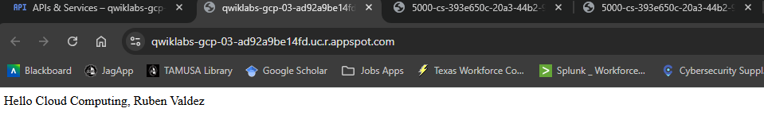
    
- Answer to 'Task 7. Test your knowledge'

    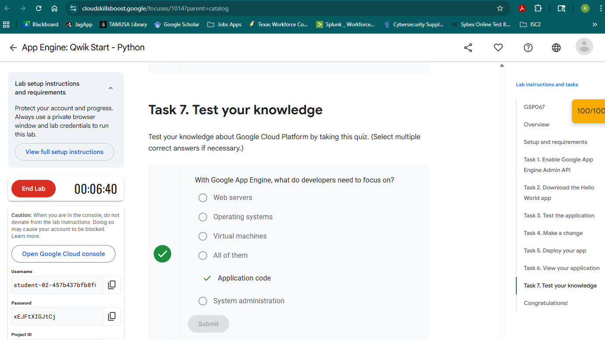 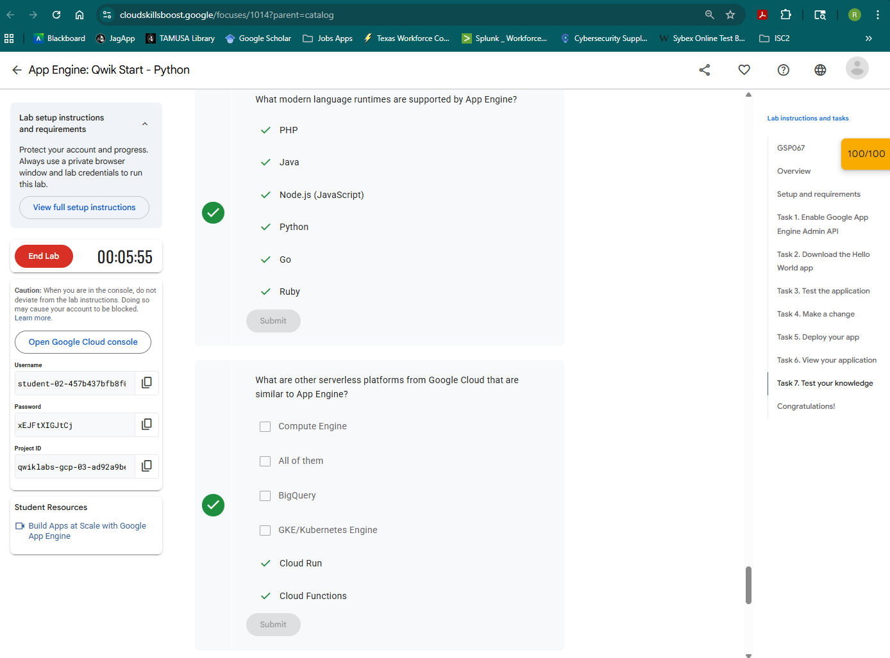

  

# Lab 3:    https://www.cloudskillsboost.google/focuses/3339?parent=catalog  

- 'Authenticate API request' Check my progress.

    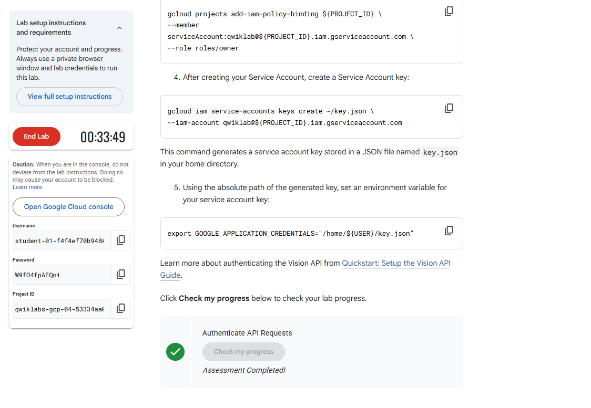

- 'Create an App Engine App and Storage Bucket' Check my progress.

    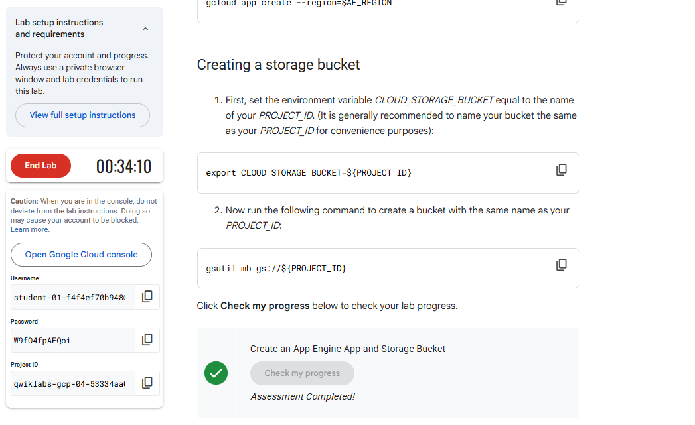

- Face Detection Sample with an image uploaded from port 8080

    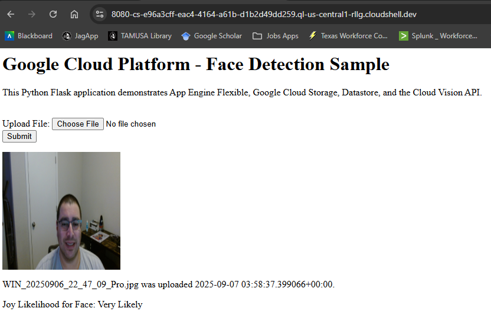 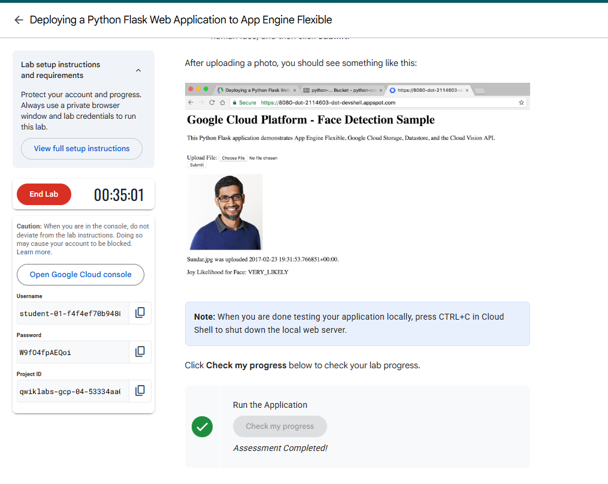

- A deployed app (Python Flask App) on App Engine, 'Run my application', and 'Deploy the app'.

    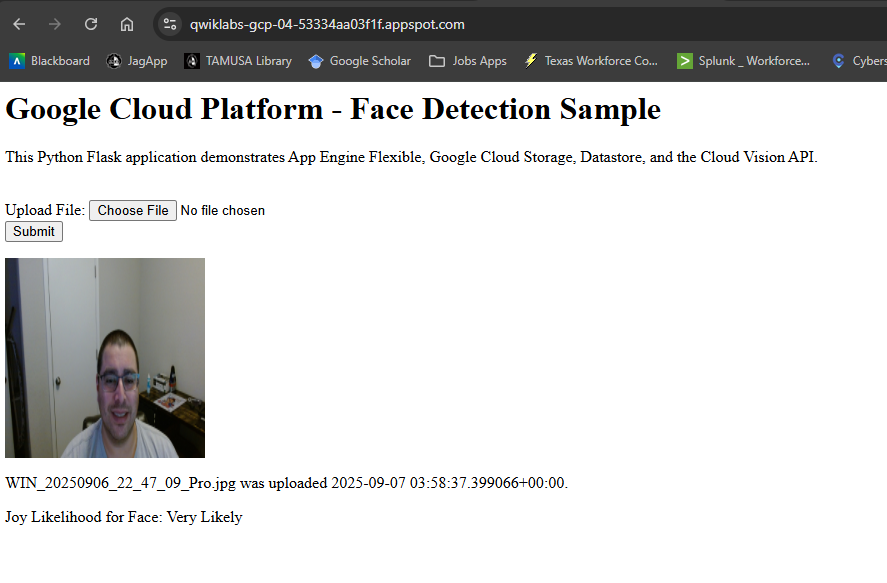 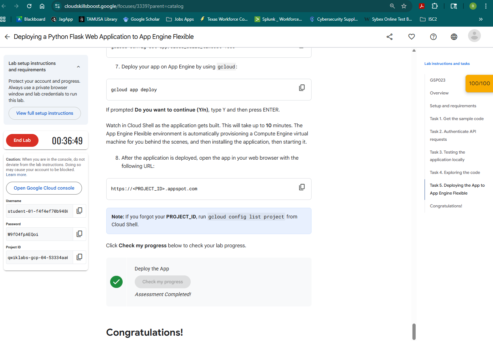

***NOTE: Include screenshots of the above tasks, put them in a single Word or PDF, and submit the Word or PDF (preferred).  Each screenshot must include both the 'Student Username' and 'Project ID'.***

