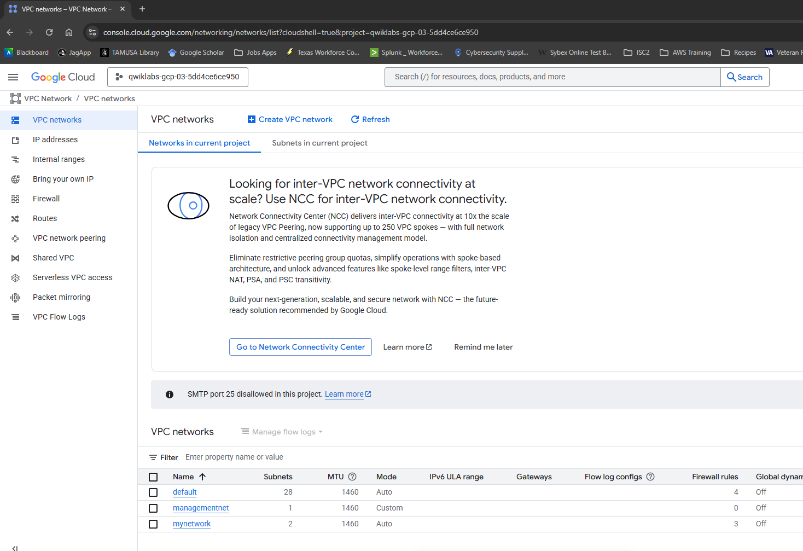
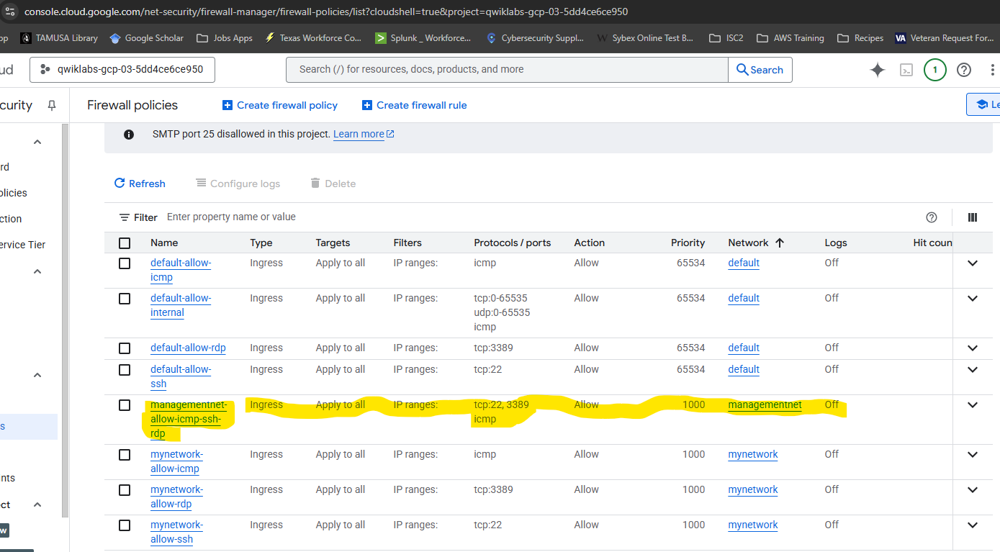

***Ruben Valdez***  
CSCI/CSEC 5372 | Cloud Computing | Thursdays @ 4pm 
Prof. Yang, Jeong  
Project Assignment 1: Lab 2 
Due by Sunday midnight, October 12, 2025

---

  

# Multiple VPC Networks

# Task 1. Create custom mode VPC networks with firewall rules

    

    

    

    

  

# Task 2. Create VM instances

       

  

# Task 3. Explore the connectivity between VM instances

Complete external ping requests from mynet-vm-1 to the following VMs

- mynet-vm-2 @ 34.81.193.151

- managementnet-vm-1 @ 35.225.175.60

- privatenet-vm-1 @ 34.28.127.196

    

Complete internal ping requests from mynet-vm-1 to the following VMs

   

  

# Task 4. Create a VM instance with multiple network interfaces

