***Ruben Valdez***  
CSCI/CSEC 5372 | Cloud Computing | Thursdays @ 4pm 
Prof. Yang, Jeong  
Project Assignment 1: Lab 2 
Due by Sunday midnight, October 12, 2025

---

  

Cloud Monitoring: Qwik Start

Task 1. Create a Compute Engine instance

    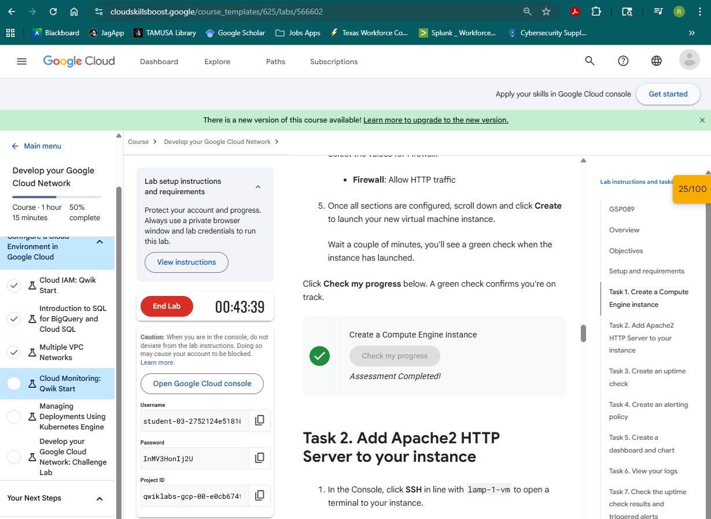

Task 2. Add Apache2 HTTP Server to your instance

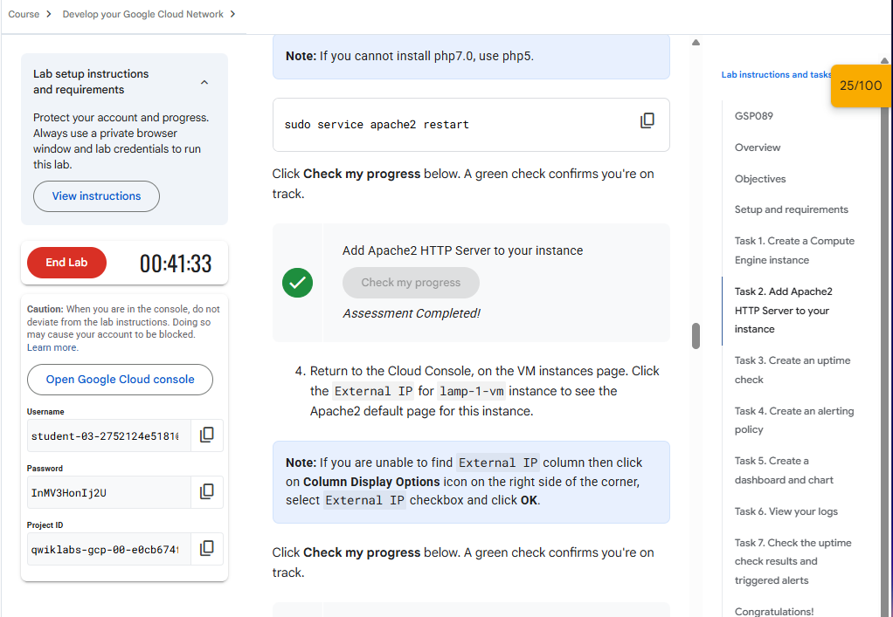
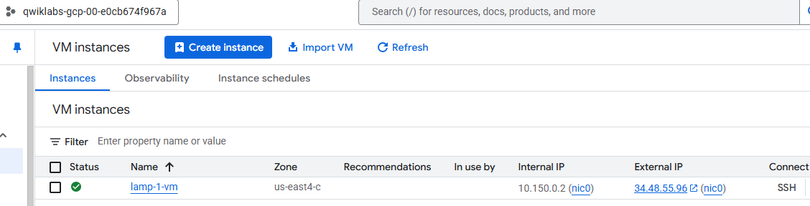    
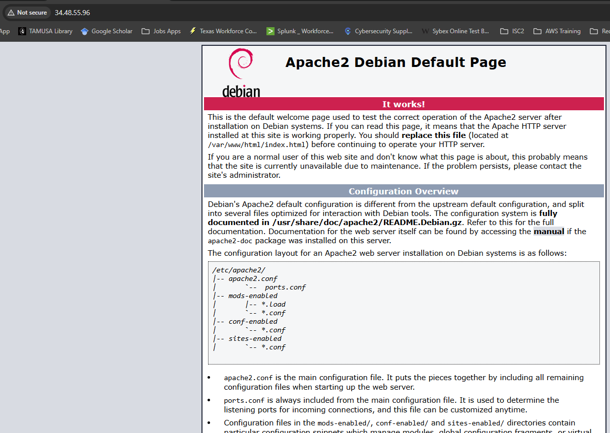    
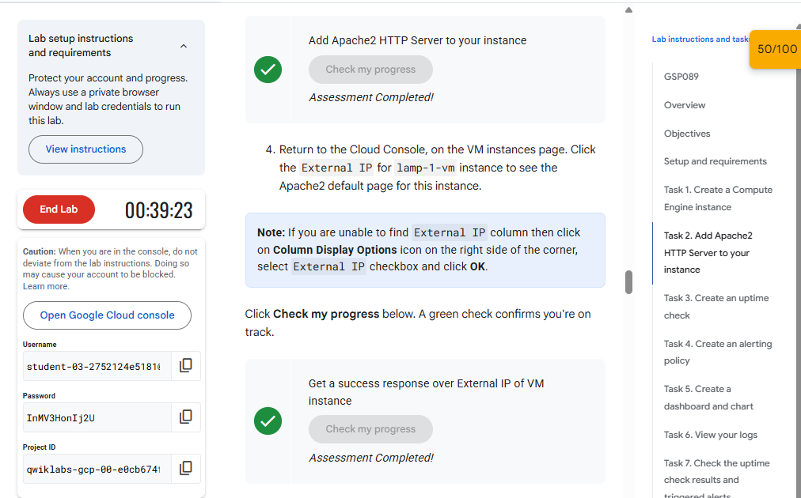

Task 3. Create an uptime check

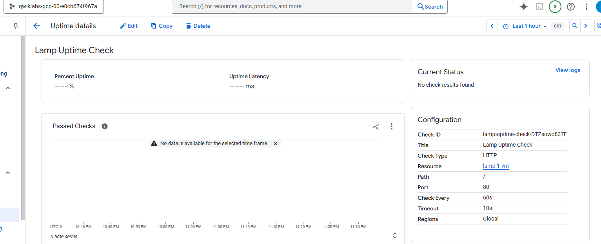

Task 4. Create an alerting policy

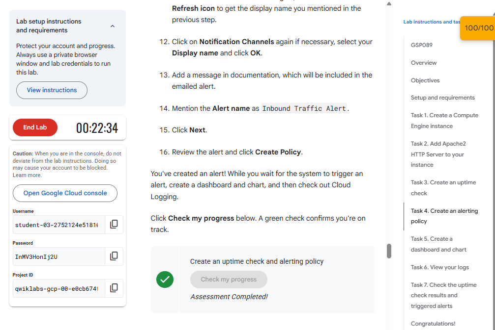
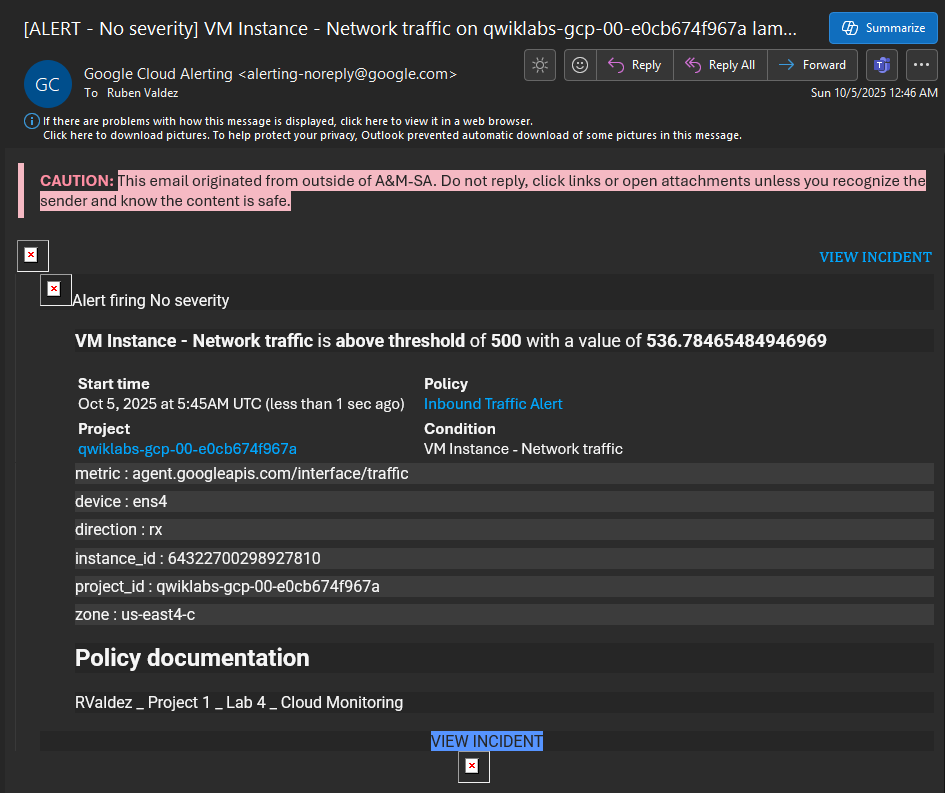

Task 5. Create a dashboard and chart

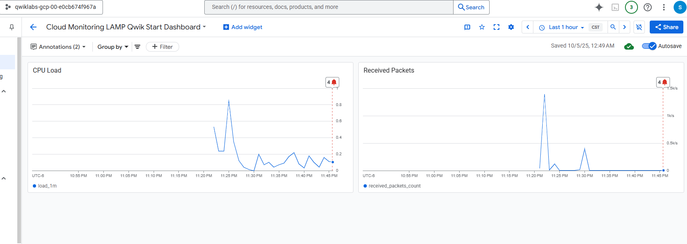

Task 6. View your logs

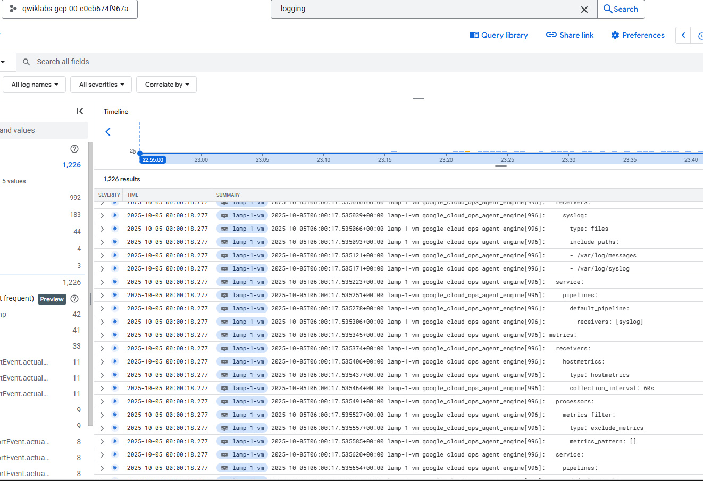

Task 7. Check the uptime check results and triggered alerts

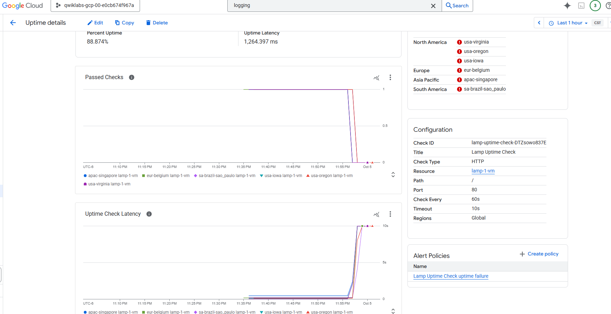

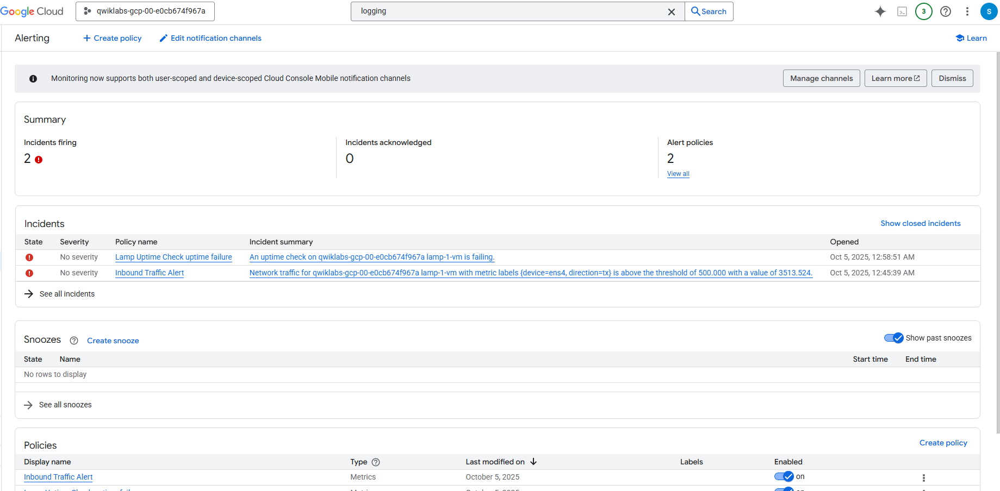

