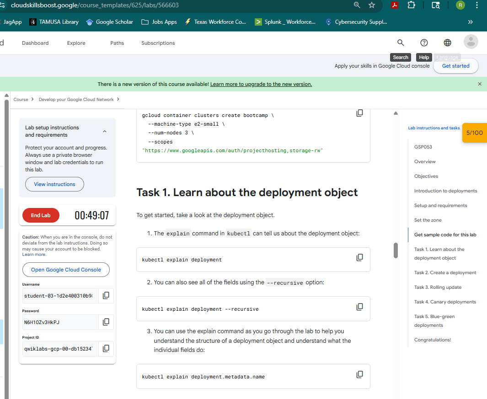
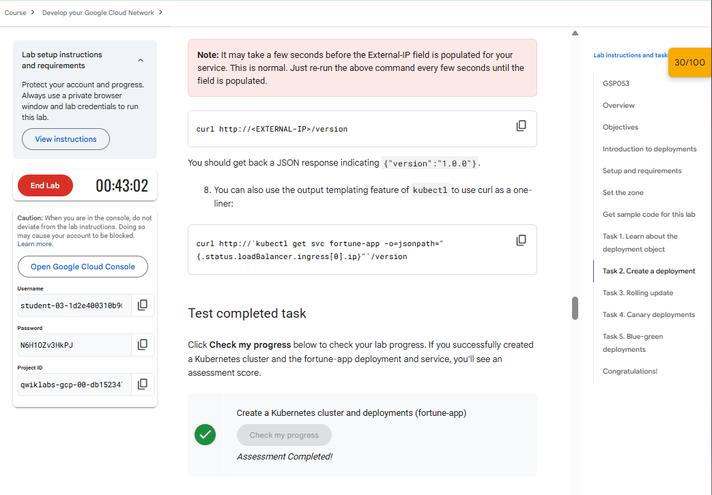
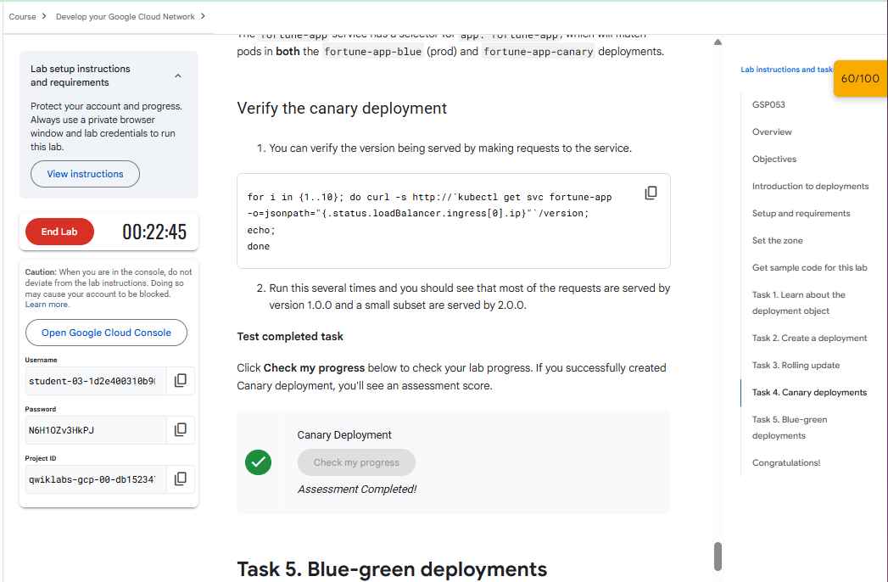
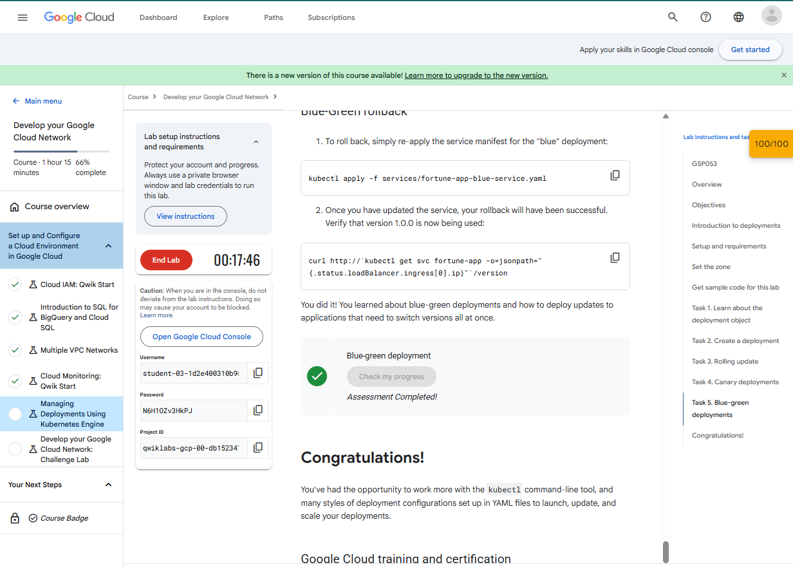

***Ruben Valdez***  
CSCI/CSEC 5372 | Cloud Computing | Thursdays @ 4pm 
Prof. Yang, Jeong  
Project Assignment 1: Lab 2 
Due by Sunday midnight, October 12, 2025

---

  

# Task 1. Learn about the deployment object

# Task 2. Create a deployment

# Task 3. Rolling update

***No task to complete***

# Task 4. Canary deployments

# Task 5. Blue-green deployments

