***Ruben Valdez***  
CSCI/CSEC 5372 | Cloud Computing | Thursdays @ 4pm 
Prof. Yang, Jeong  
Project Assignment 1  
Due by Sunday midnight, October 12, 2025

---

  

# Project:  Develop your Google Cloud Network

Labs to complete:

1. Cloud IAM: Qwik Start
2. Introduction to SQL for BigQuery and Cloud SQL
3. Multiple VPC Networks
4. Cloud Monitoring: Qwic Start
5. Managing Deployments Using Kubernetes Engine
6. Develope your Google Cloud Network: Challenge Lab

___

  

# 1. Cloud IAM: Qwik Start

In this lab, I learned:
- to use IAM to manage, edit, delete, or provision user accounts.
- to create a cloud storage and to manage a files storage bucket.  

## Task 1. Explore the IAM console and project level roles

- User 1 IAM permissions:

    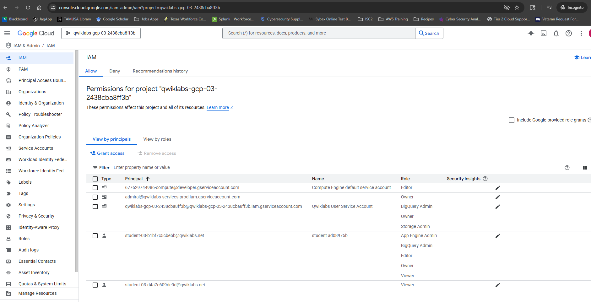

- User 2 IAM permsions, confirmation User 2 is unable to create or grant access to new user's as the Grant Access button is grayed out:
    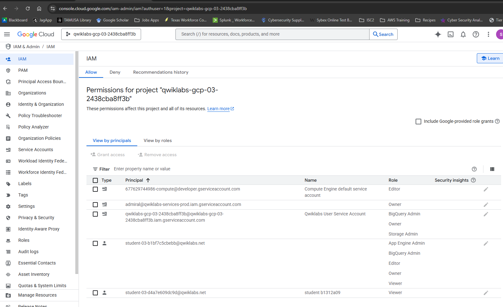

## Task 2. Prepare a Cloud Storage bucket for access testing

- Check my progress, Upload a sample file:

    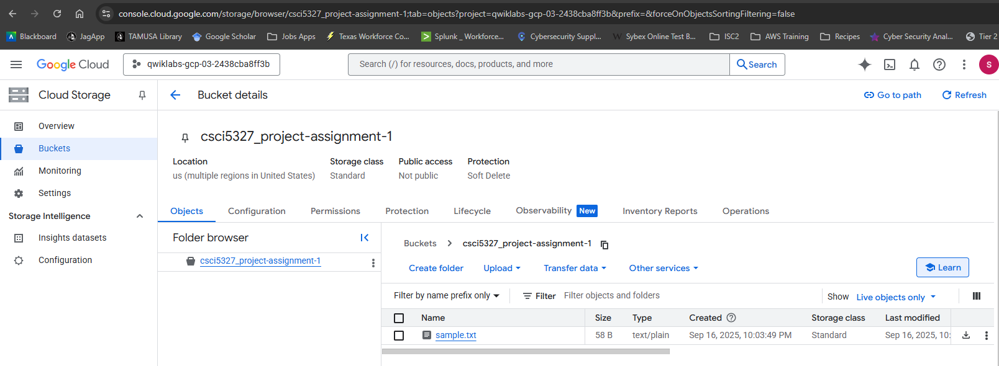

- Verified User 2 is able to view the bucket and open the authenticated URL to view the txt file.  

    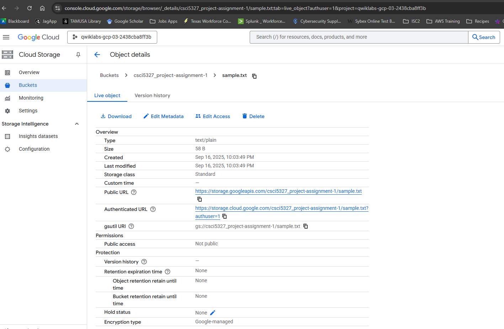 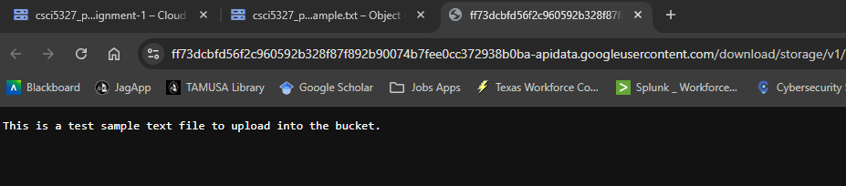

## Task 3. Remove project access

- Remove Project Viewer for Username 2

    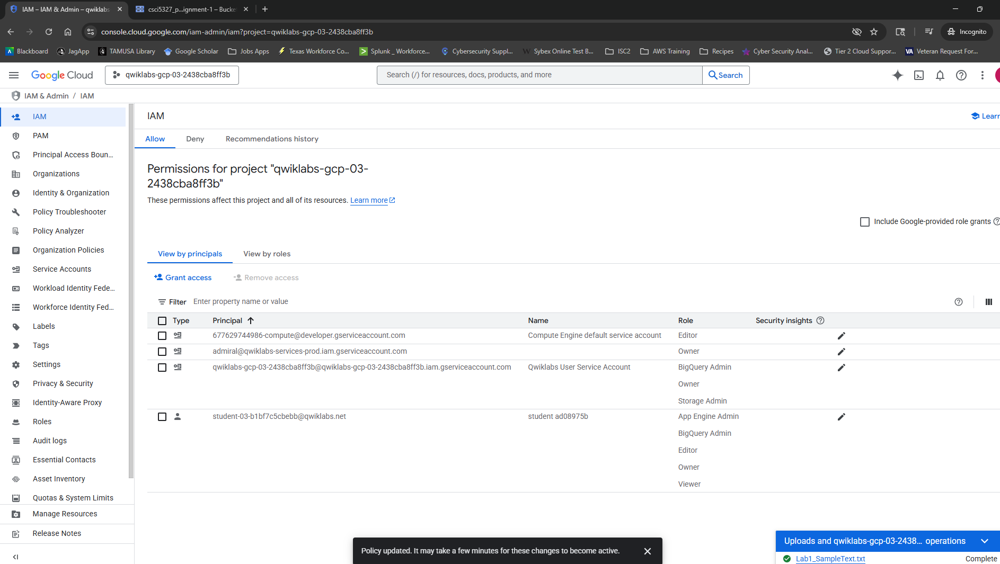

- Verify that Username 2 has lost access

    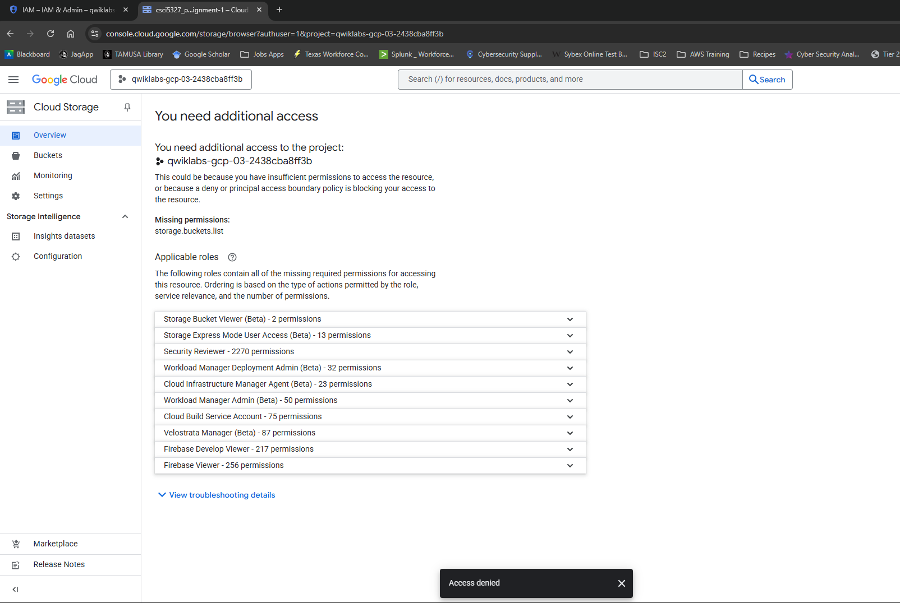

    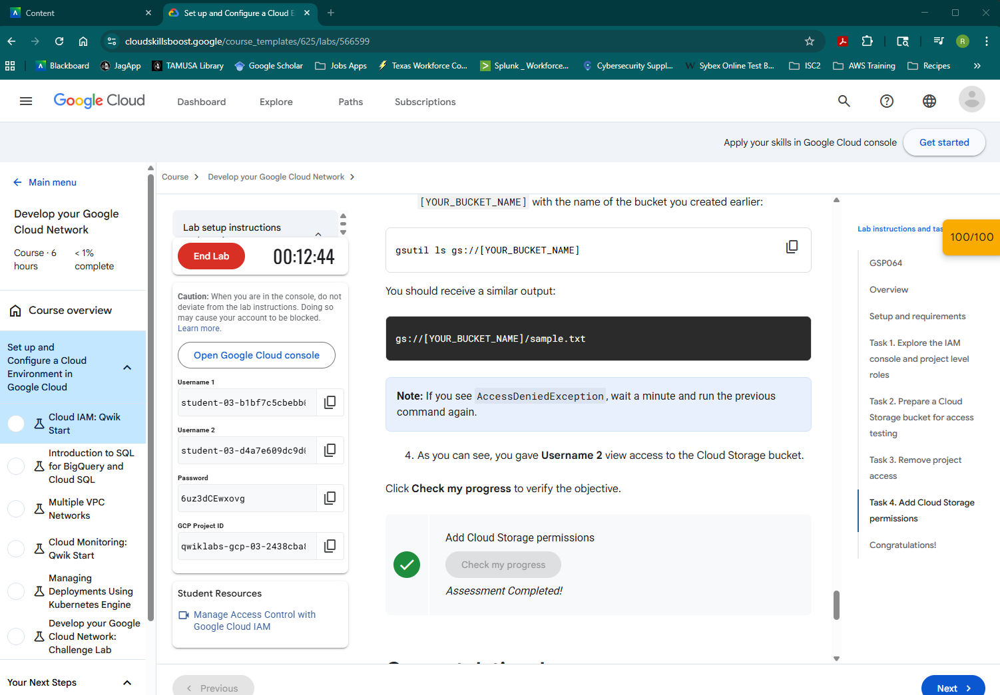

## Task 4. Add Cloud Storage permissions

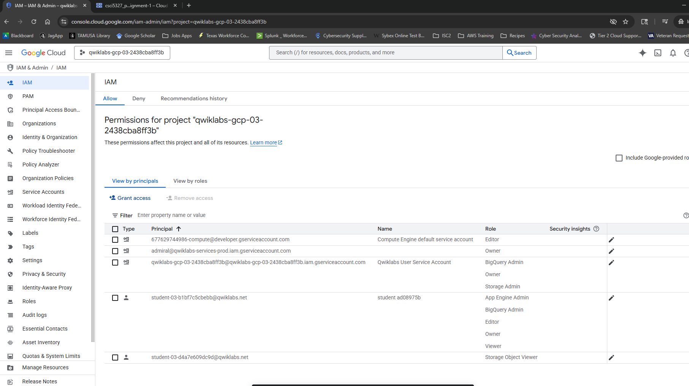

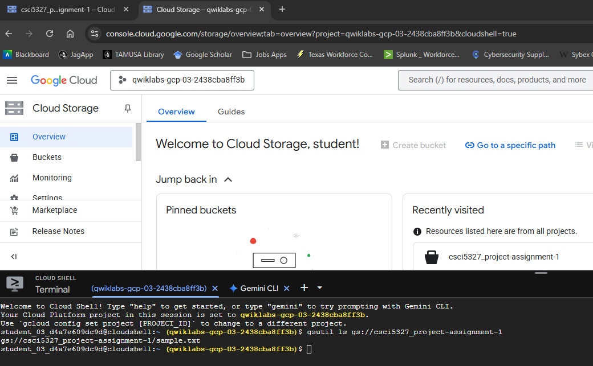

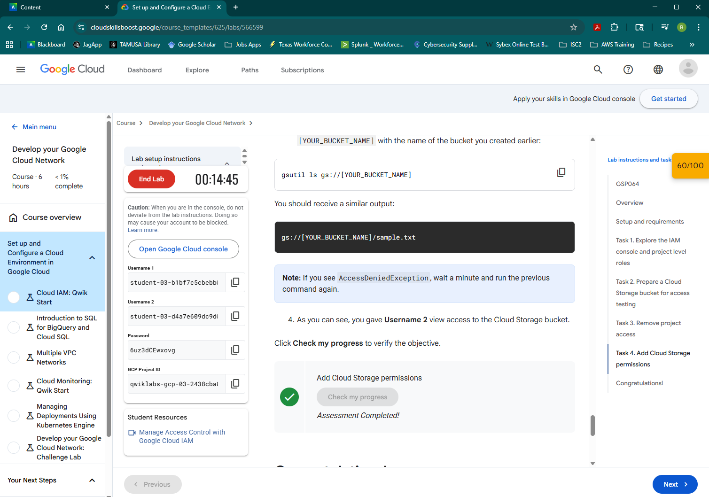

  

# 2. Introduction to SQL for BigQuery and Cloud SQL
# 3. Multiple VPC Networks
# 4. Cloud Monitoring: Qwic Start
# 5. Managing Deployments Using Kubernetes Engine
# 6. Develope your Google Cloud Network: Challenge Lab