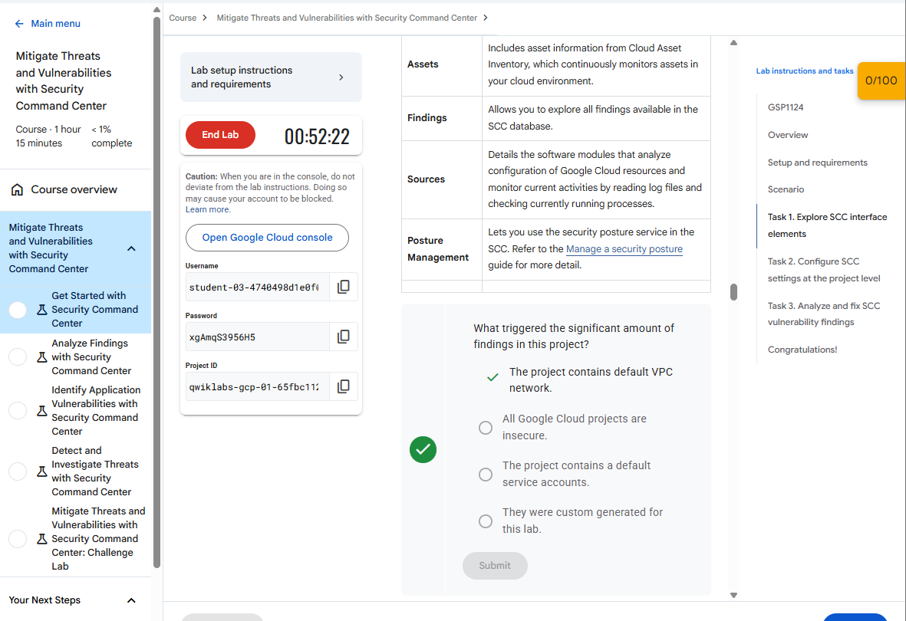
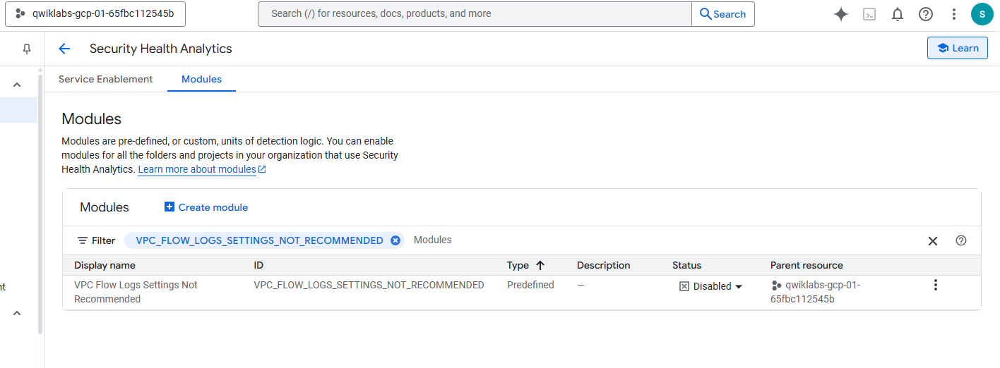
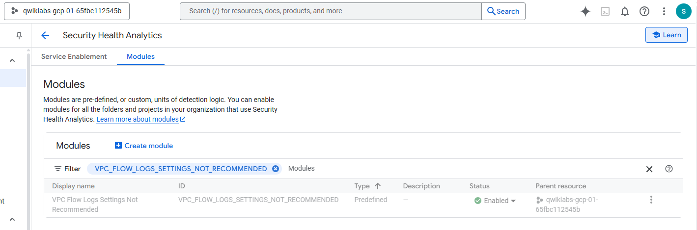
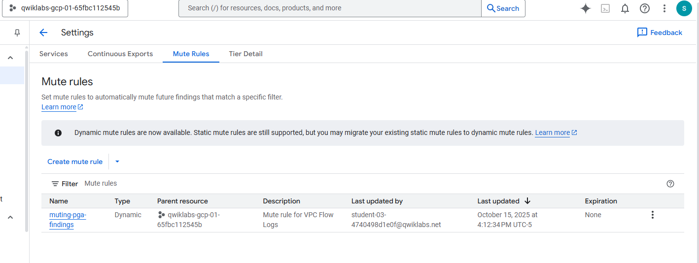
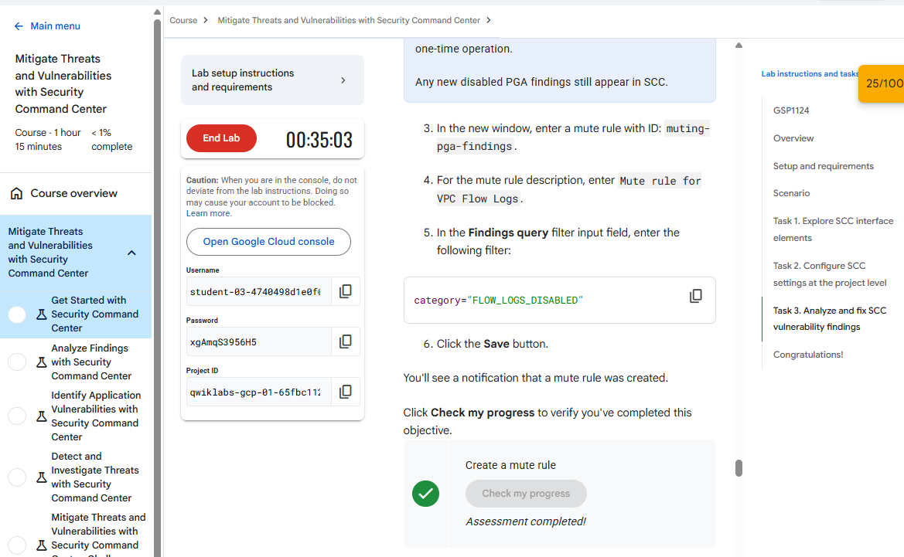
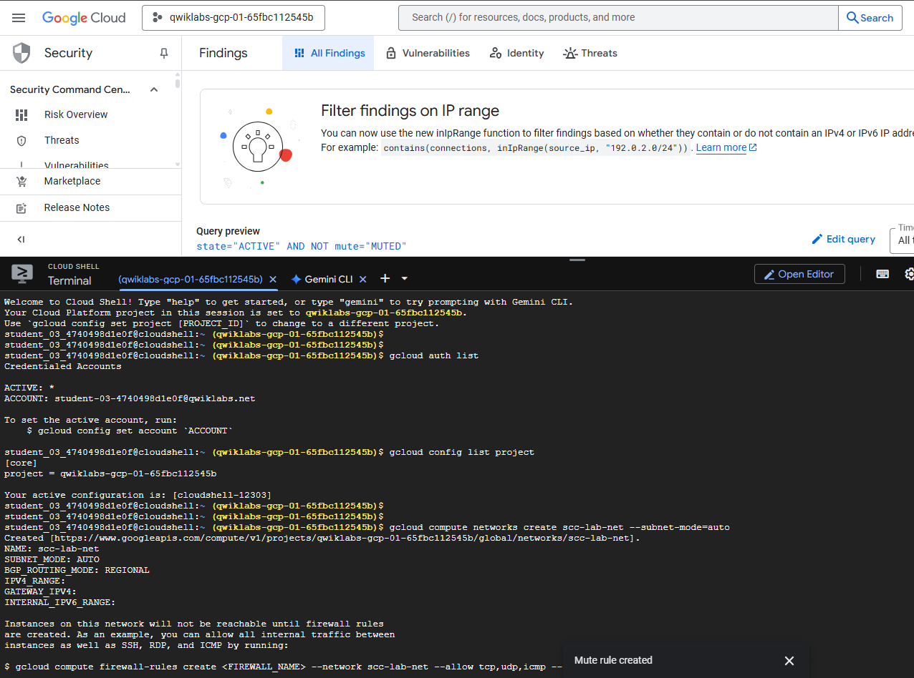
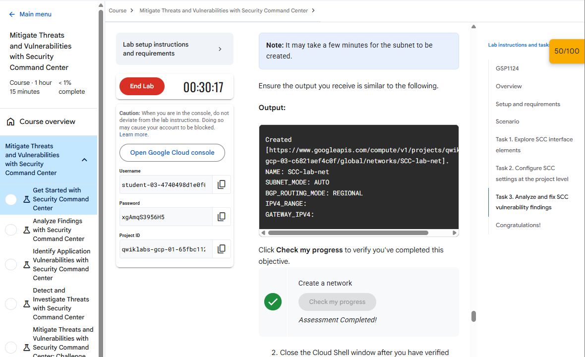
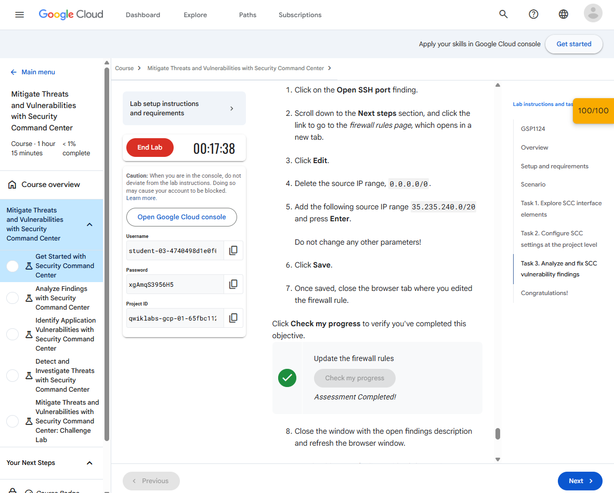

***Ruben Valdez***  
CSCI/CSEC 5372 | Cloud Computing | Thursdays @ 4pm 
Prof. Yang, Jeong  
Project Assignment 2: Mitigate Threats and Vulnerabilities with Security Command Center 
Due by Sunday midnight, Nov. 9th, 2025

---

  

# ***Lab 1 _ Get Started with Security Command Center***

## Task 1. Explore SCC interface elements

  

## Task 2. Configure SCC settings at the project level

Modify setting default from `disabled` to `enabled`.

    

  

## Task 3. Analyze and fix SCC vulnerability findings

- Create a mute rule to hide certain findings

        

- Create another VPC network to test the findings mute rule

        

- Update the firewall rules to address a finding

