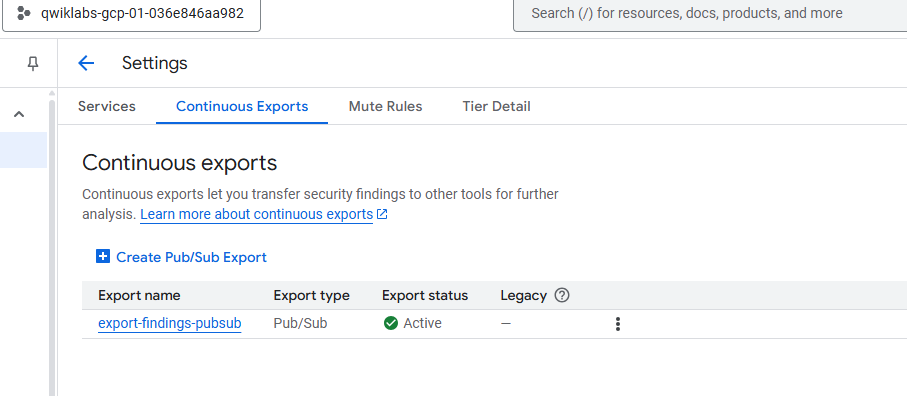
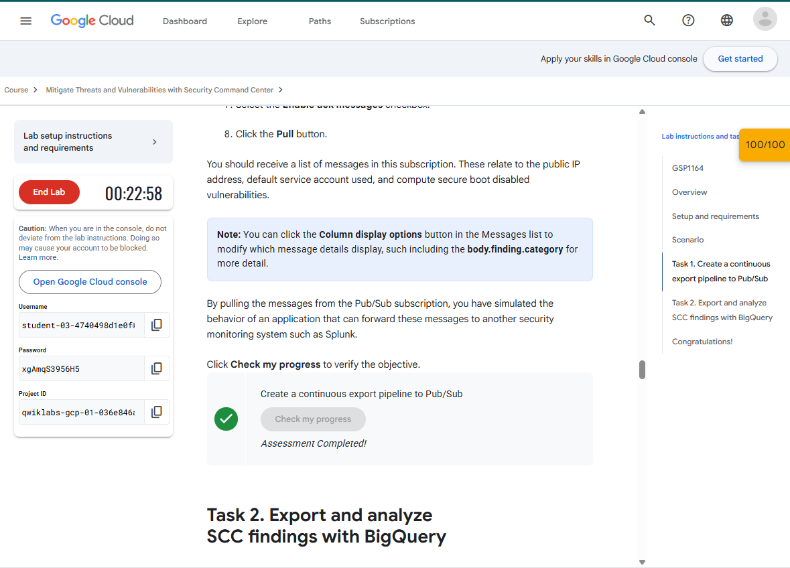
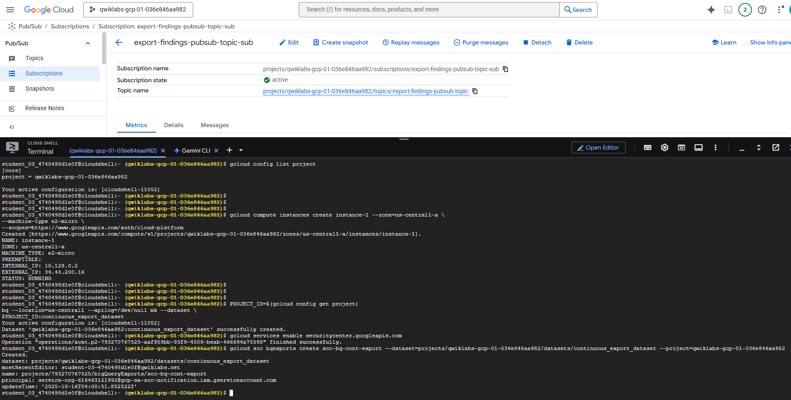
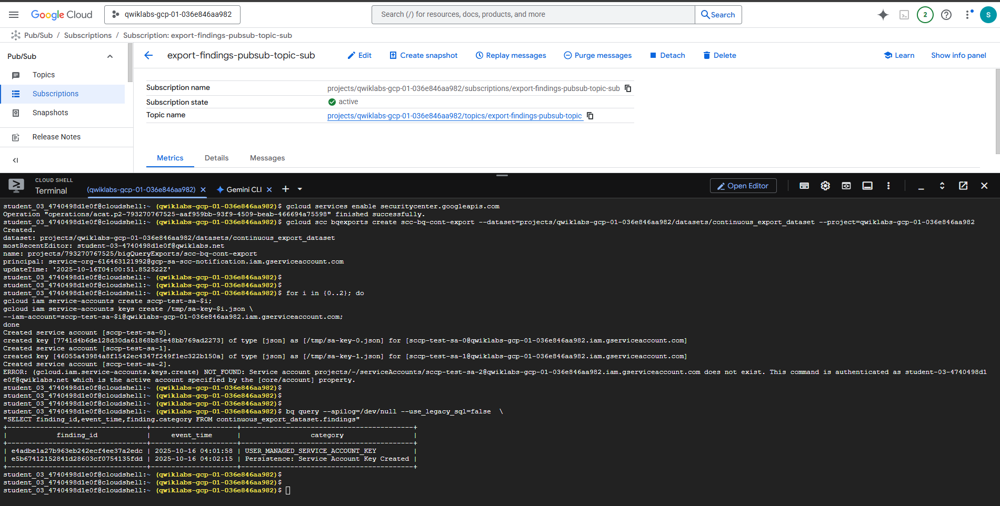
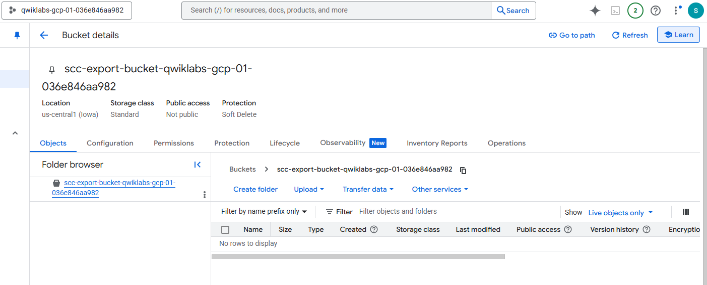
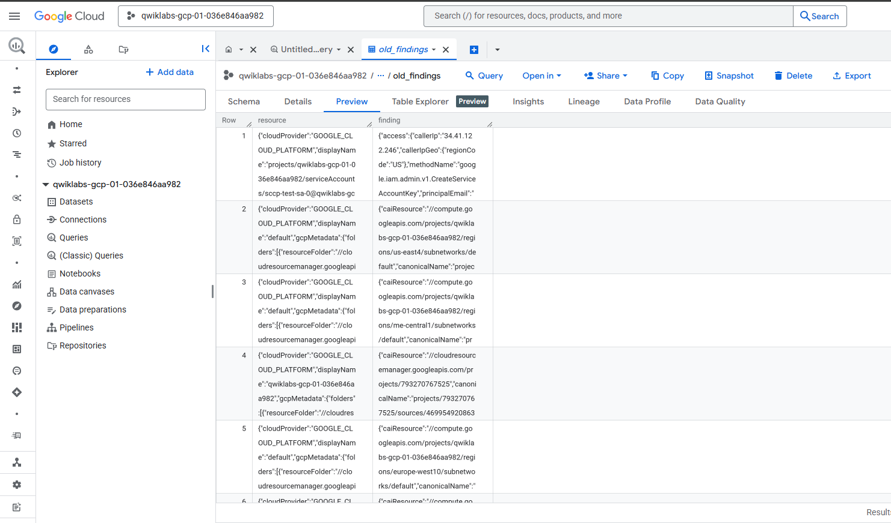
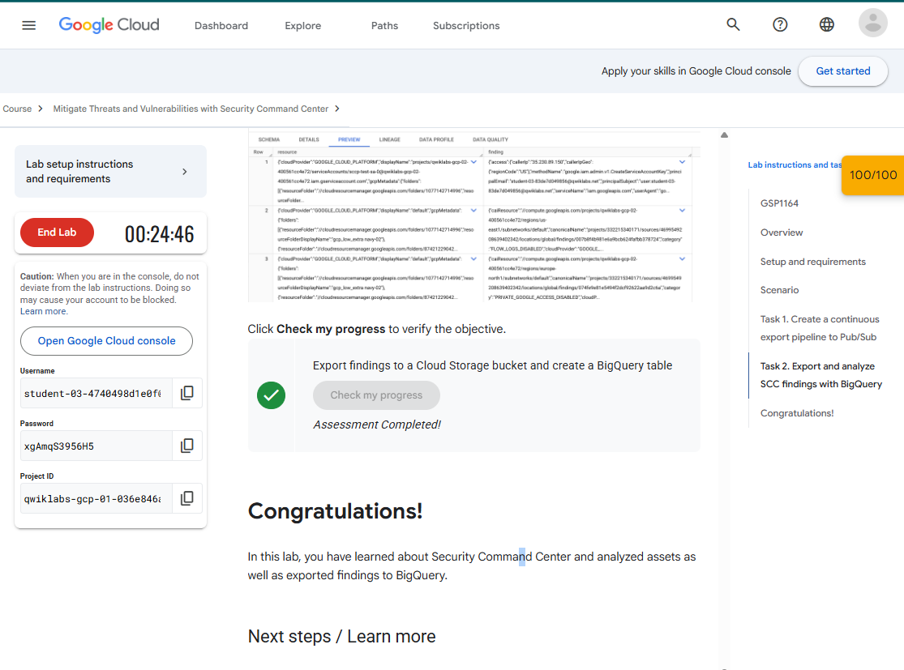

***Ruben Valdez***  
CSCI/CSEC 5372 | Cloud Computing | Thursdays @ 4pm 
Prof. Yang, Jeong  
Project Assignment 2: Mitigate Threats and Vulnerabilities with Security Command Center 
Due by Sunday midnight, Nov. 9th, 2025

---

  

# ***Lab 2 _ Analyze Findings with Security Command Center

 

## Task 1. Create a continuous export pipeline to Pub/Sub

Create a Pub/Sub topic and subscription

Create new findings to export to Pub/Sub

  

## Task 2. Export and analyze SCC findings with BigQuery

Create a Cloud Storage bucket

Export existing findings as JSONL data

