***Ruben Valdez***  
CSCI/CSEC 5372 | Cloud Computing | Thursdays @ 4pm 
Prof. Yang, Jeong  
Project Assignment 2: Mitigate Threats and Vulnerabilities with Security Command Center 
Due by Sunday midnight, Nov. 9th, 2025

---

  

# ***Lab 3 _ Identify Application Vulnerabilities with Security Command Center***

 

## Task 1. Launch a virtual machine and create a firewall rule for WSS

34.59.88.220

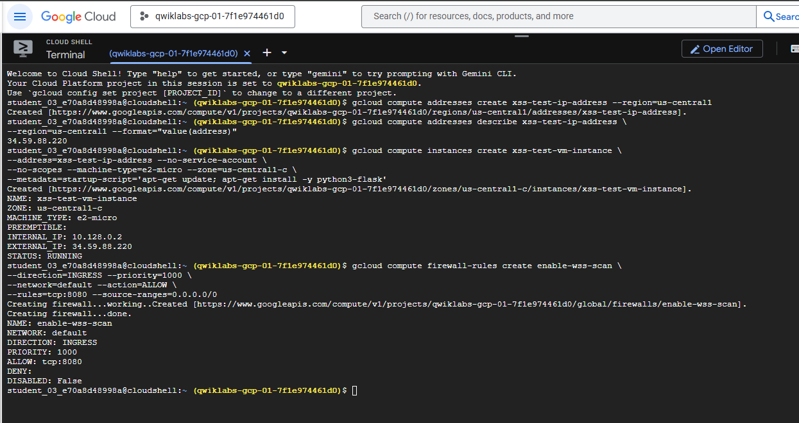    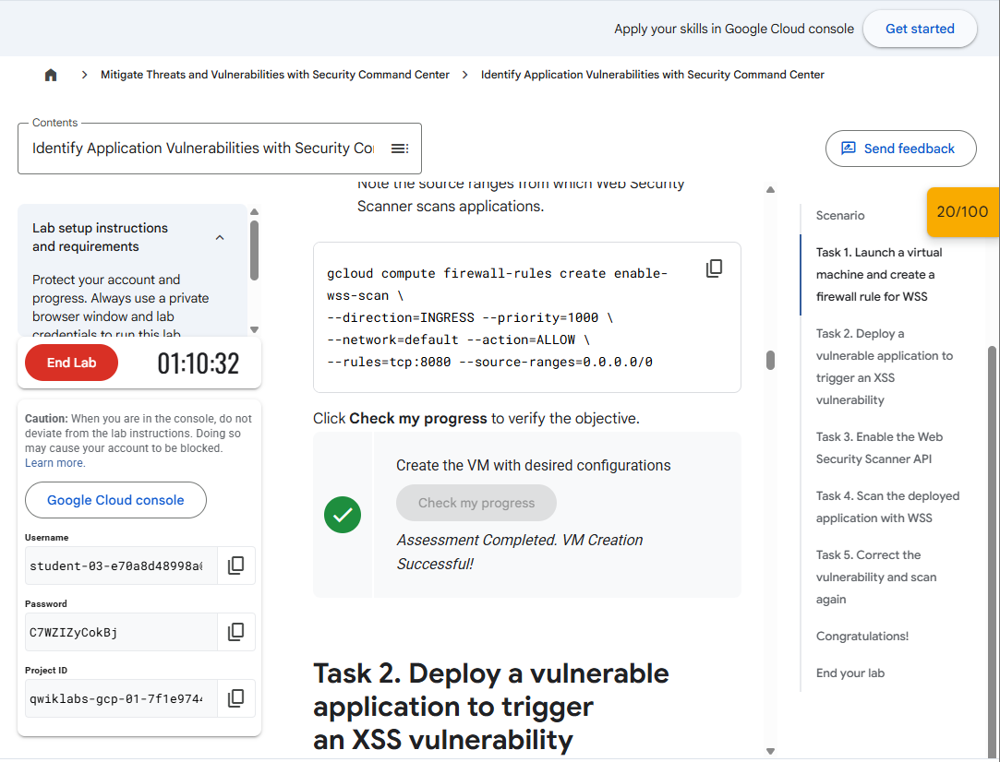

  

## Task 2. Deploy a vulnerable application to trigger an XSS vulnerability

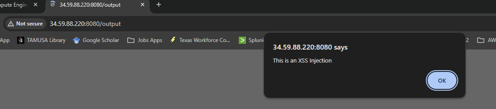    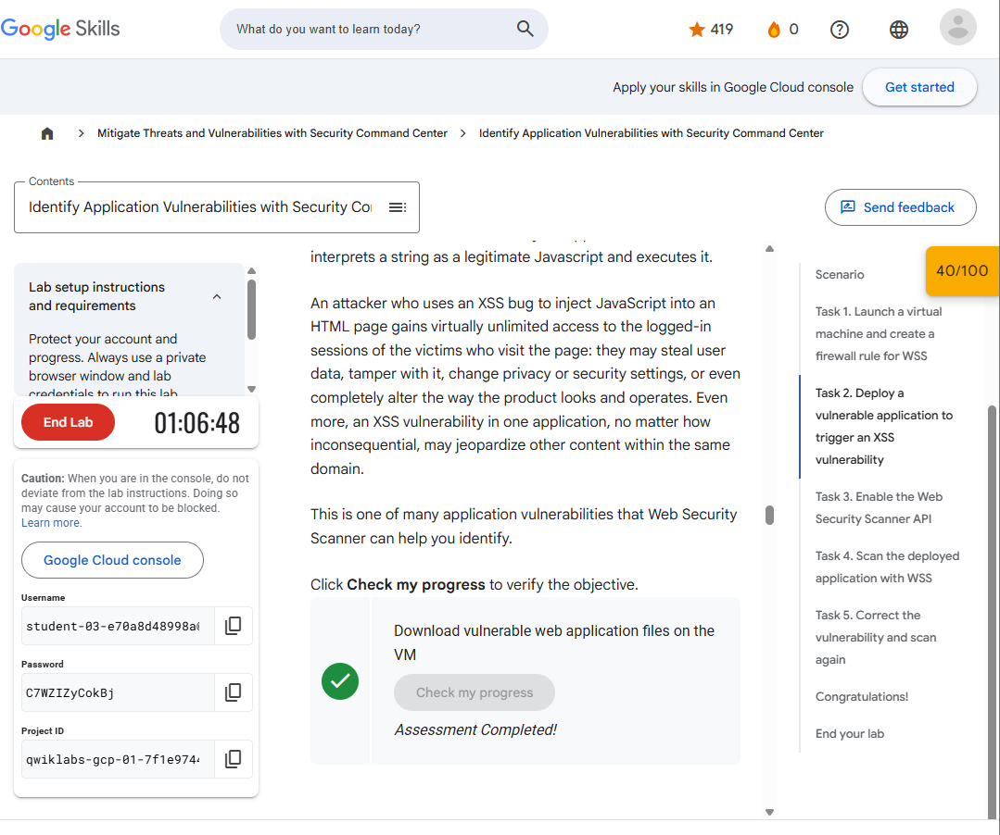

  

## Task 3. Enable the Web Security Scanner API

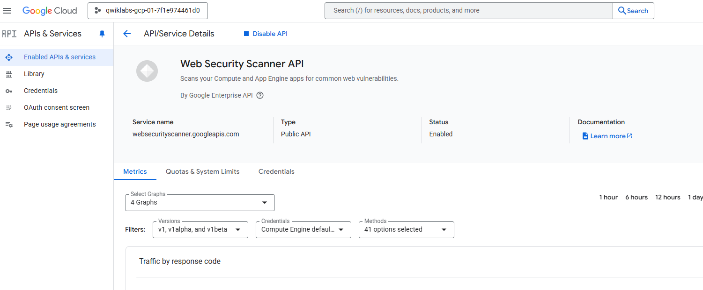    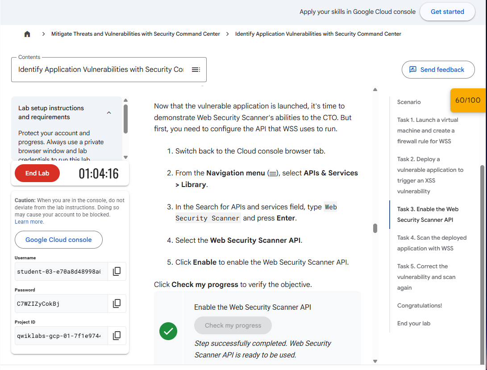

  

## Task 4. Scan the deployed application with WSS

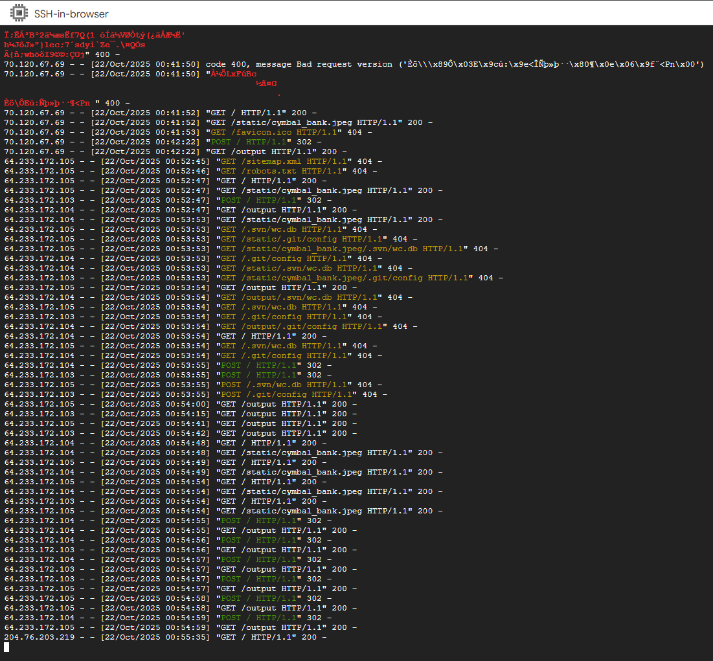   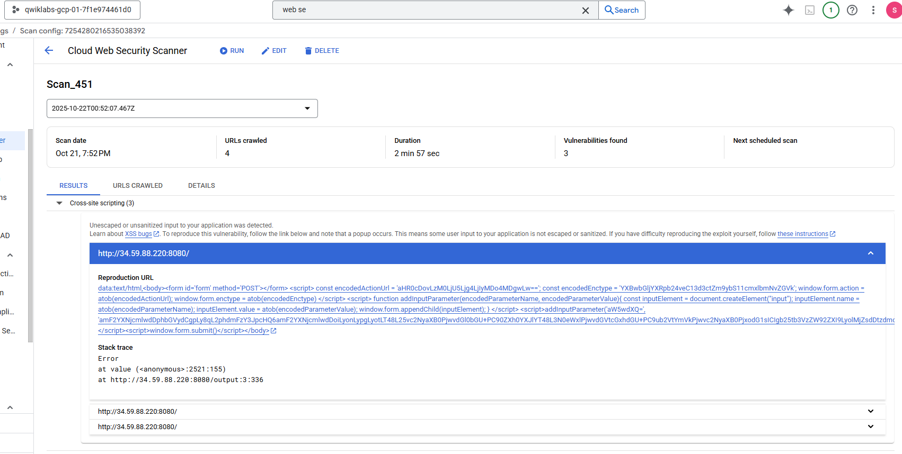    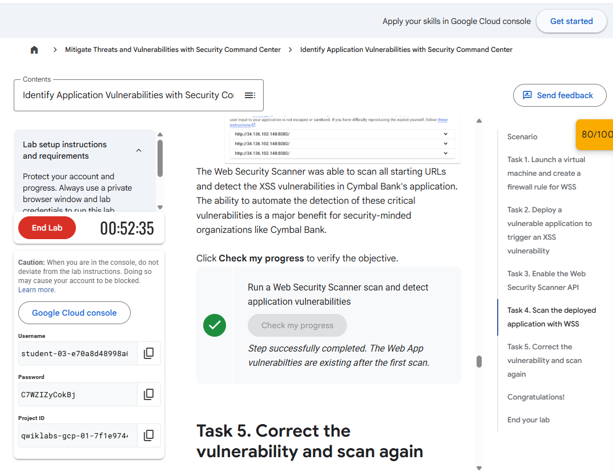

  

## Task 5. Correct the vulnerability and scan again

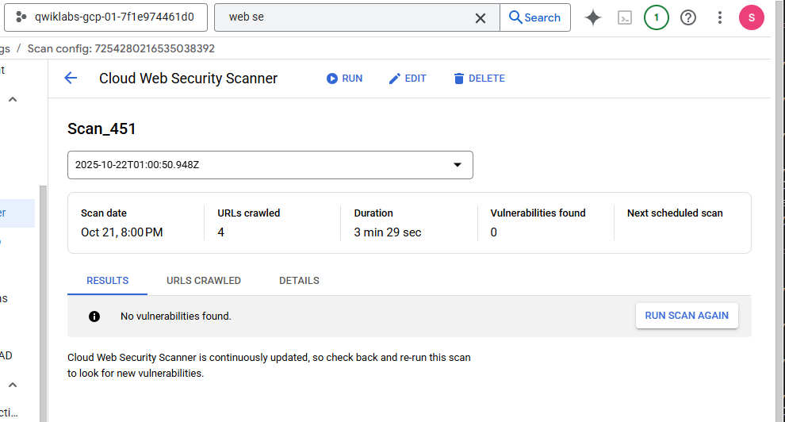   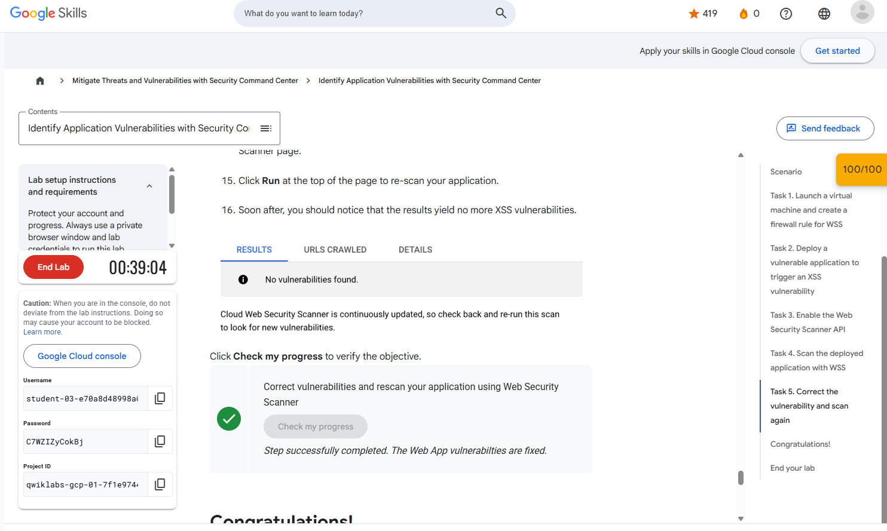

