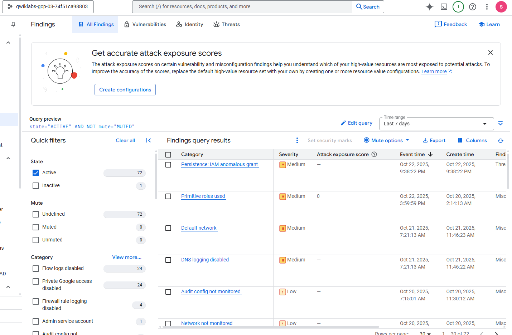
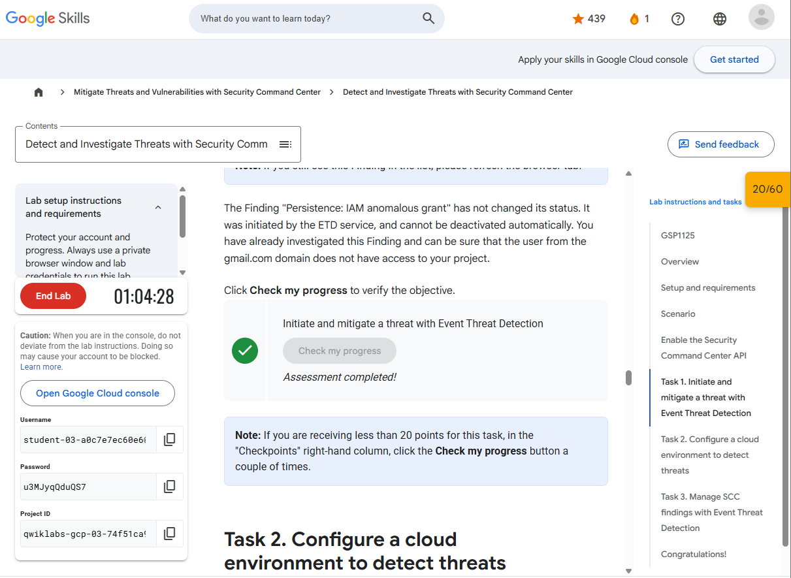
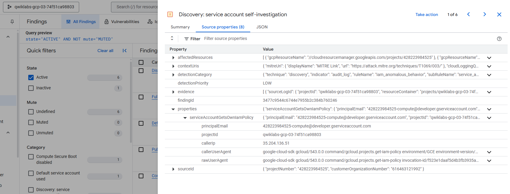
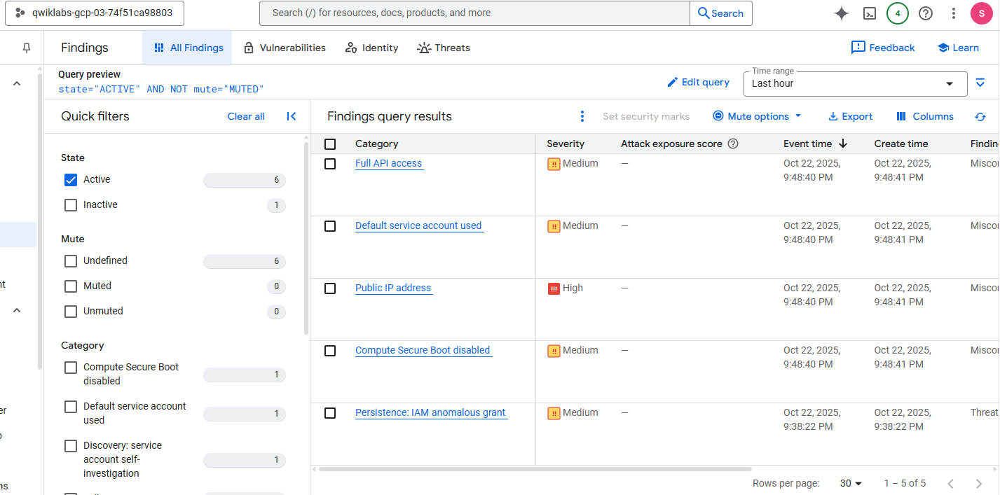
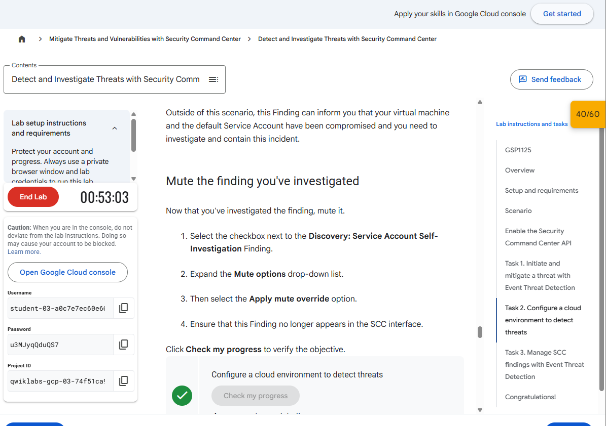
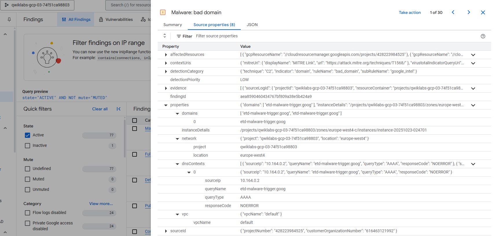
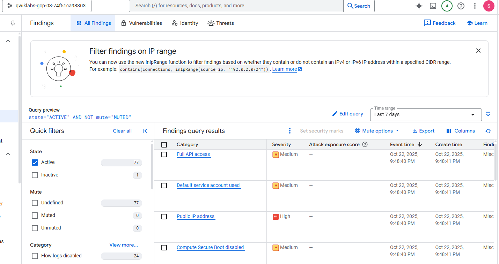
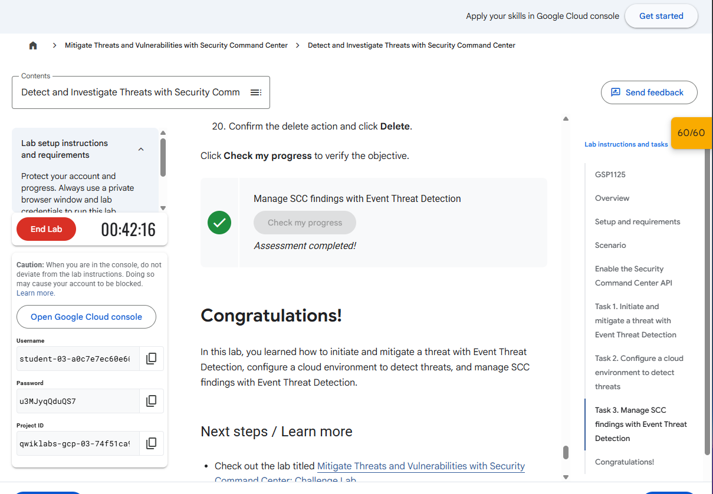

***Ruben Valdez***  
CSCI/CSEC 5372 | Cloud Computing | Thursdays @ 4pm 
Prof. Yang, Jeong  
Project Assignment 2: Mitigate Threats and Vulnerabilities with Security Command Center 
Due by Sunday midnight, Nov. 9th, 2025

---

  

# ***Lab 4: Detect and Investigate Threats with Security Command Center***

 

## Task 1. Initiate and mitigate a threat with Event Threat Detection

  

  

## Task 2. Configure a cloud environment to detect threats

    

Mute override 

  

## Task 3. Manage SCC findings with Event Threat Detection

        

