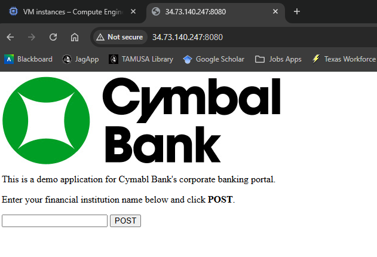

***Ruben Valdez***  
CSCI/CSEC 5372 | Cloud Computing | Thursdays @ 4pm 
Prof. Yang, Jeong  
Project Assignment 2: Mitigate Threats and Vulnerabilities with Security Command Center 
Due by Sunday midnight, Nov. 9th, 2025

---

  

# ***Mitigate Threats and Vulnerabilities with Security Command Center: Challenge Lab***

  

## Task 1. Configure the environment

  

  

## Task 2. Create mute rules for Cymbal Bank

    

  

## Task 3. Analyze and fix Cymbal Bank's high vulnerability findings

    

  

## Task 4. Identify application vulnerabilities with SCC's security scanning features

        

  

## Task 5. Export Cymbal Bank Findings to Google Cloud Storage

       

